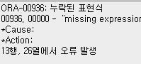
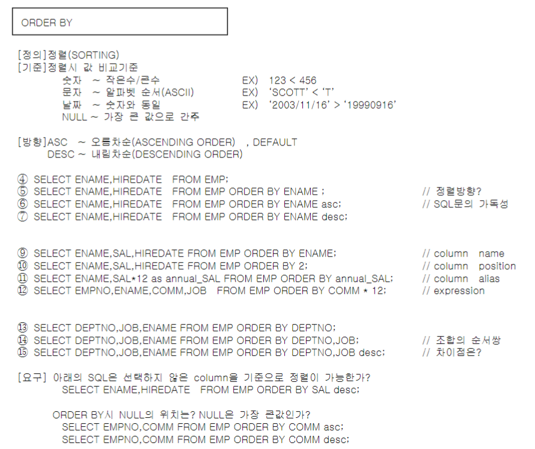
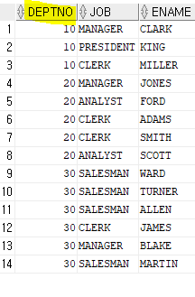
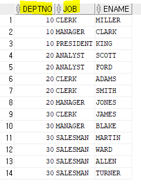
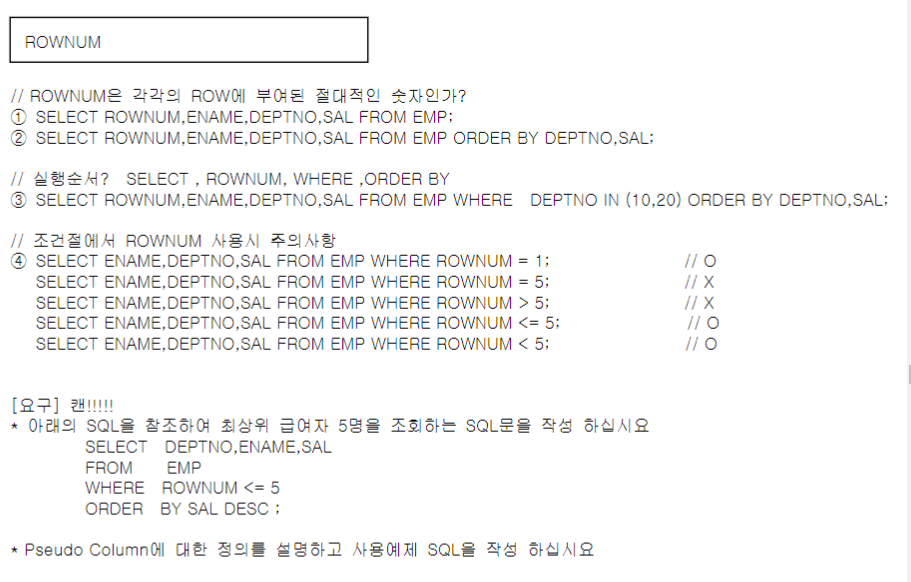
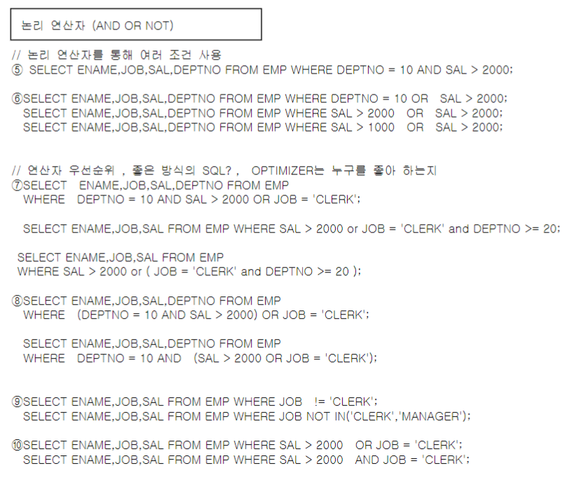
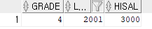

# 과제

1.

현재 시간, 분, 초, 1/100초까지 표현하는 SQL 작성

```sql
SELECT TO_CHAR(SYSDATE, 'HH:MI:SS'), TO_CHAR(SYSTIMESTAMP, 'FF2') FROM DUAL;
```

```sql
SELECT TO_CHAR(SYSTIMESTAMP, 'YYYY-MM-DD HH24:MI:SS.FF2') as TIME FROM DUAL;
```


현재 시간, 분, 초, 1/1000초까지 표현하는 SQL 작성

```sql
SELECT TO_CHAR(SYSDATE, 'HH:MI:SS'), TO_CHAR(SYSTIMESTAMP, 'FF3') FROM DUAL;
```

```sql
SELECT TO_CHAR(SYSTIMESTAMP, 'YYYY-MM-DD HH24:MI:SS.FF3') as TIME FROM DUAL;
```


=> 나와서 암기해서 SQL문 작성하기 


2. union, union all, intersect, minus를 공부한 후 각각의 예제 sql으르 만든후 결과가 왜 정렬되는지 설명하시오. 

   

   ```SQL
   SELECT * FROM DEPT;
   ```

   

   ```SQL
   SELECT * FROM EMP;
   ```

   

   => DEPT 테이블의 DEPTNO의 경우 10, 20, 30, 40이 있지만 EMP 테이블의 경우 40번 부서의 사원은 없는것을 확인할 수 있다. 이제 이 두 테이블을 가지고 UNION, UNION ALL, INTERSECT, MINUS를 해보자.

   

   + ***union***

     + 

     + ```SQL
       -- UNION
           SELECT DEPTNO FROM EMP
           UNION
           SELECT DEPTNO FROM DEPT;
       ```

     + 

     + => EMP와 DEPT 테이블의 DEPTNO의 합집합에서 중복된 교집합을 뺀 것이 나온다.

     + UNION은 중복된 값을 제거하기 위해 오라클 내부에서 정렬을 수행

     

   + ***union all***

     + 

     + ```SQL
       -- UNION ALL
           SELECT DEPTNO FROM EMP
           UNION ALL
           SELECT DEPTNO FROM DEPT;
       ```

       

     + 

     + => 중복을 제거하지 않고 사원들의 DEPTNO 14개와 DEPT의 4개의 부서번호가 모두 출력되었다.

     + 중복된 값이 없는데 굳이 UNION 써서 내부 정렬 할 필요 없음 ALL로 쓰면 정렬 안함

   + ***minus***

     + 

     + ```SQL
       SELECT DEPTNO FROM EMP
       MINUS
       SELECT DEPTNO FROM DEPT;
       ```

     + 

     + => EMP의 DEPTNO 3개가 DEPT의 DEPTNO 4개에 포함되있으므로 뺀 결과 값이 모두 사라지게 된다.

     + ```SQL
       SELECT DEPTNO FROM DEPT
           MINUS
           SELECT DEPTNO FROM EMP;
       ```

     + 

     + => 반대로 DEPT에서 EMP를 빼게되면 DEPT만 가지고있던 40이 반환된다.

       

   + ***intersect***

     + 
     + 
     + => EMP의 DEPTNO 3개가 DEPT의 DEPTNO 4개에 포함되있으므로 교집합인 3개가 출력된다.

2. sql은 embedded eql과 interactive sql로 나눌 수 있다.

   embeded : 어딘가에 매장된... 

   interactive : 우리가 하고있는 sql. dbms 서버와 상호적으로 대화한다.

   

   **내장 SQL**(Embedded SQL)은 C/C++, [코볼](https://ko.wikipedia.org/wiki/코볼), [포트란](https://ko.wikipedia.org/wiki/포트란), [파스칼](https://ko.wikipedia.org/wiki/파스칼), [에이다](https://ko.wikipedia.org/wiki/에이다), [자바](https://ko.wikipedia.org/wiki/자바_(프로그래밍_언어))([SQLJ](https://ko.wikipedia.org/w/index.php?title=SQLJ&action=edit&redlink=1)) 같은 절차적 프로그래밍에 [관계형 데이터베이스](https://ko.wikipedia.org/wiki/관계형_데이터베이스)(RDBMS)를 조작하기 위한 SQL을 통합 기법으로, 프로그래머는 소스 코드 내부에 포함 된 SQL 문을 직접 설명할 수 있게 된다. “임베디드 SQL”이라고 부르기도 한다. 

   내장 SQL은 응용 프로그램 내에 데이터베이스에서 사용하는 데이터를 정의하거나 질의하는 SQL 문장을 내포하여 프로그램이 실행될 때 함께 실행되도록 호스트 프로그램언어로 만든 프로그램에 삽입된 SQL이다.

   

   

   

3. 부서별 차등보너스 계산SQL을 작성하십시요-10번부서 급여의 0.3% , 20번 부서급여의 20%, 30번 부서급여의 10%, 나머지 모든 부서1%-

   - 부서번호,이름,직무,급여,보너스
   - 부서별,최고보너스 순으로 정렬
   - 소수점절삭 (decode, case 활용)

   ```SQL
   SELECT DEPTNO, ENAME, JOB, SAL, 
       CASE DEPTNO WHEN 10 THEN TRUNC(SAL * 0.003)
                   WHEN 20 THEN TRUNC(SAL * 0.2)
                   WHEN 30 THEN TRUNC(SAL * 0.1)
                   ELSE TRUNC(SAL * 0.01)
       END AS BONUS
   FROM EMP ORDER BY DEPTNO ASC,BONUS DESC;
   ```

   ```SQL
   SELECT DEPTNO,ENAME,JOB,SAL,
   TRUNC(DECODE(DEPTNO,10,SAL*0.003,20,SAL*0.2, 30, SAL*0.1, SAL*0.01)) AS BONUS 
   FROM EMP ORDER BY DEPTNO ASC,BONUS DESC;
   ```

   

4. ROWNUM, ORDER BY, SUBQUERY를 조합해서 TOP-N, BOTTOM-M을 뽑는 SQL 작성

   ```SQL
   SELECT ENAME, SAL
   FROM ( SELECT ENAME, SAL 
          FROM EMP
          ORDER BY SAL DESC )
   WHERE ROWNUM <= 5;
   ```

   

5. yy 포맷과 rr 포맷의 차이가 무엇일까? +

   SELECT EMPNO,HIREDATE,SAL 

   FROM EMP

   WHERE HIREDATE between '81/02/20' and '82/12/09';

   

   SELECT EMPNO,ENAME,HIREDATE 

   FROM EMP 

   WHERE HIREDATE IN('81/05/01','81/02/20');

   에서, rr과 yy중에 어떤 연산자로 바뀔까?

   + yy는 뒤에 두 년도를 입력할시 무조건 2000년대를 반환. rr은 뒤의 두자리가 50 이상일시 1900년대를 반환.

# NULL


<< 매우 중요 >>


NULL이 숫자로는 0이나 문자로는 공백문자가 아닌지 착각하는데 0이나 공백문자는 엄연히 데이터이다. NULL은 데이터 자체가 존재하지 않음을 뜻한다.

+ 함수의 연산
  + 제어불가 = 적용 불가 : 함수 안에 NULL이 들어가면 적용할 수 없다. 
  + 비교불가 - NULL은 비교연산자가 불가능하기때문에 = NULL이 아니라 IS NULL, IS NOT NULL로 표현한다. 
  + 연산불가 - NULL과 관게된 연산 결과는 무조건 NULL이다. 
+ [함수와의 관계] (중요)
  + single row : 대부분의 single row 함수는 null처리를 못하고 null을 리턴한다.
  + group row : null을 뺀 나머지를 가지고 계산한다. 


+ 적용불가

  + 1번의 length(COMM) : COMM은 숫자인데 LENGTH는 문자열 길이를 반환하는 함수. 숫자에서 문자로 묵시적 형변환이 일어난 것. 이는 좋지 않다. length(to_char(COMM)) 이렇게 명시적 형변환을 해주는것이 좋다. 
  + length 함수에 null이 적용되면 0을 리턴하는게 아니라 null을 리턴한다. 
  + 2번의 abs(SAL - COMM) : COMM에는 NULL이 있다. abs 함수에서 null값을 포함한 연산의 결과는 null로 리턴한다.

+ NULL을 무시하는 함수

  + CONCAT : 문자열 합성 메소드
  + nvl (중요)(null value) : null값을 특정 숫자로 바꿔준다. 
  + decode(중요) : if와 같은 기능. 만약 comm이 null이면 -999를 리턴하고 그 외엔 comm을 리턴한다. 

  

#### 실습

```sql
SELECT 300+400, 300/0 FROM DUAL;
```


```sql
SELECT 300+400, 300+NULL, 300/NULL FROM DUAL;
```


주의> sql에 뜨는 (null)을 보고 null이 보인다고 생각하면 안된다. dbms 서버는 (null)로 출력하라고 하지 않았다. 그저 이건 널이야~ 했을 뿐. client인 sql developer가 헷갈리지 말라고 (null)로 표시해주는것이다.

```sql
SELECT ENAME, SAL, COMM, COMM+SAL*0.3 AS BONUS FROM EMP;
```


=> 원래는 COMMISSION을 한푼도 못받는 사람까지 월급의 30%씩 주려고 했으나, COMM에 NULL이 있기때문에 위 시행 결과로는 COMMISSION을 받는사람만 더 보너스를 받을 수 있게된다. 이를 해결하기위해선 아래의 코드로 실행한다.

```SQL
SELECT ENAME, SAL, COMM, NVL(COMM, 0) + SAL * 0.3 AS BONUS FROM EMP;
```


=> NVL을 통해 NULL을 0으로 바꿔주면 0에 월급의 30퍼를 더하기 때문에 정상 계산이 가능해진다. 

```sql
SELECT EMPNO, SAL, COMM FROM EMP;
```


```sql
SELECT ENAME, SAL, COMM FROM EMP WHERE SAL > 1000;
```


```sql
SELECT ENAME, SAL, COMM FROM EMP WHERE COMM > -1;
```


```sql
SELECT ENAME, SAL, COMM FROM EMP WHERE COMM = NULL;
```


```sql
SELECT ENAME, SAL, COMM, FROM EMP WHERE COMM <> NULL;
```



```sql
SELECT ENAME, SAL, COMM FROM EMP WHERE COMM IS NULL;
```


```sql
SELECT ENAME, SAL, COMM FROM EMP WHERE COMM IS NOT NULL;
```


```sql
SELECT ENAME, LENGTH(ENAME), COMM, LENGTH(COMM) FROM EMP;
```

=> 숫자인 comm 변수를 문자로 묵시적 형변환이 일어나, 300의 경우 세 자리 수이기 때문에 3을 반환한다. 

=> null은 아무것도 없으니 length로 0을 리턴할거라 착각할 수 있지만, null을 반환한다. 

=> LENGTH가 단일행 함수이기 때문. COUNT, SUM, AVG와 같은 그룹행 함수는 NULL을 무시하고 값을 계산해서 반환한다.


```sql
SELECT SAL-EMPNO, ABS(SAL-EMPNO), ABS(SAL-COMM)+100 FROM EMP;
```


=> comm에 null이 있기 때문에 null을 반환

```SQL
SELECT COUNT(*) FROM SCOTT.EMP;
```


```SQL
SELECT COUNT(*) FROM SCOTT.EMP WHERE 1 = 1;
```


```SQL
SELECT COUNT(*) FROM SCOTT.EMP WHERE EMPNO = EMPNO;
```


```SQL
SELECT COUNT(*) FROM SCOTT.EMP WHERE MGR = MGR;
```


```SQL
SELECT COUNT(*) FROM SCOTT.EMP WHERE COMM = COMM;
```


=> COMM에는 NULL값이 있어 NULL이 아닌것만 세어줌. 

# ORDER BY




#### 실습

```SQL
SELECT ENAME, HIREDATE FROM EMP;
```


```SQL
SELECT ENAME, HIREDATE FROM EMP ORDER BY ENAME;
```


```SQL
SELECT ENAME, HIREDATE FROM EMP ORDER BY ENAME ASC;
```


```SQL
SELECT ENAME, HIREDATE FROM EMP ORDER BY ENAME DESC;
```


```SQL
SELECT ENAME, SAL, HIREDATE FROM EMP ORDER BY ENAME;
```


```SQL
SELECT ENAME, SAL, HIREDATE FROM EMP ORDER BY 2;
```


=> select_list의 두번째 컬럼을 기준으로 정렬.

1을 선택시 ENAME을 기준으로 정렬된다. 

```SQL
SELECT ENAME, SAL*12 AS ANNUAL_SAL FROM EMP ORDER BY ANNUAL_SAL;
```

=> ORDER BY 뒤에 COLUMN ALIAS가 올 수 있다.


```SQL
SELECT EMPNO, ENAME, COMM, JOB FROM EMP ORDER BY COMM*12;
```

=> ORDER BY 뒤에 EXPRESSION(계산식)이 올 수 있다.


```SQL
SELECT DEPTNO, JOB, ENAME FROM EMP ORDER BY DEPTNO;
```



```SQL
SELECT DEPTNO, JOB, ENAME FROM EMP ORDER BY DEPTNO, JOB;
```



```SQL
SELECT DEPTNO, JOB, ENAME FROM EMP ORDER BY DEPTNO, JOB DESC;
```

=> DEPTNO로 ASC 정렬 후 JOB으로 DESC 정렬


```SQL
SELECT EMPNO, COMM FROM EMP ORDER BY COMM ASC;
```

=> ORDER BY는 NULL을 가장 큰 값으로 여긴다. 애초에 NULL은 비교 정렬자체가 불가능하지만 ORDER BY를 수행하기 위해 가장 큰 값으로 여긴다.


```SQL
SELECT EMPNO, COMM FROM EMP ORDER BY COMM DESC;
```


# DISTINCT


+ DISTINCT : ANSI SQL

+ UNIQUE : ORACLE


* 오라클의 변화

  9i -> 10g -> 11g(grid) -> 12C(cloud) - 우리가 쓰는 버전.

  10g 이후부터는 자동정렬이 안되고 뒤에 order by를 붙여야 한다.  

  

#### 실습

NULL과 DISTINCT

```SQL
SELECT DISTINCT COMM FROM EMP;
```


=> NULL도 포함했다. 

```SQL
SELECT COUNT(DISTINCT COMM) FROM EMP;
```


=> COUNT는 null을 무시하고 세기때문에 null을 뺀 중복되지않는 4개의 값이다. 


# DECODE, CASE


```SQL
SELECT DEPTNO,ENAME,SAL,
       DECODE(GREATEST(SAL,5000),SAL,'HIGH',
       DECODE(GREATEST(SAL,2500),SAL,'MID','LOW'))
FROM EMP
ORDER BY DEPTNO;
```

=> 범위연산

DECODE만 가지고 범위연산을 할 수 없으니 GREATEST와 LEAST를 함께 썻지만, DECODE의 확장형인 CASE가 나오면서 이 두 연산자가 필요없게되었다.


```SQL
SELECT DEPTNO,ENAME,SAL,COMM,
CASE WHEN COMM >= 5000 THEN 'HIGH'
	   WHEN COMM >= 2500 THEN 'MID'
	   WHEN COMM BETWEEN 300 AND 2500 THEN 'LOW'
ELSE
	'UNKNOWN'
END
FROM EMP ORDER BY DEPTNO;
```

=> comm에 null은 어떻게될까? 고민해봐라.


=> null도 else에 포함되어 unknown으로 출력됨 확인. 

```sql
SELECT DEPTNO,ENAME,SAL,
CASE WHEN SAL >= 5000 THEN 'HIGH'
	 	 WHEN SAL >= 2500 THEN 'MID'
	   WHEN SAL < 2500 THEN 'LOW'
ELSE
	'UNKNOWN'
END//alias가 필요 
FROM EMP
ORDER BY DEPTNO;

SELECT DEPTNO,ENAME,SAL,
CASE WHEN SAL >= 5000 THEN 'HIGH'
	 WHEN SAL >= 2500 THEN 'MID'
	 WHEN SALBETWEEN 300 AND 2500 THEN 'LOW'
ELSE
	'UNKNOWN'
END
FROM EMPORDER BY DEPTNO;

// ELSE에서NULL ??
SELECT DEPTNO,ENAME,SAL,COMM,
CASE WHEN COMM>= 5000 THEN 'HIGH'
	   WHEN COMM>= 2500 THEN 'MID'
	   WHEN COMM BETWEEN 300 AND2500 THEN 'LOW'
ELSE
	'UNKNOWN'
END
FROM EMPORDER BY DEPTNO;
```

=> 세번째 쿼리에서 null은 어떻게할까? 고민

=> null도 unknown으로 처리된다. 

```sql
SELECT SAL, 
	CASE WHEN SAL >= 1000 THEN 1 
			 WHEN SAL >= 2000 THEN 2
			 WHEN SAL >= 3000 THEN 3
			 WHEN SAL >= 4000 THEN 4
			 WHEN SAL >= 5000 THEN 5
			 ELSE 0 
			 END AS SAL_CHK 
FROM EMP ORDER BY SAL;
```

=> 첫 번째 when에서 다 걸려버린다. 1000만 넘으면 모두 1로 수행하고, 아래 when절은 수행하지 않는다.


```sql
SELECT SAL, 
	CASE WHEN SAL >= 5000 THEN 5 
			 WHEN SAL >= 4000 THEN 4
			 WHEN SAL >= 3000 THEN 3
			 WHEN SAL >= 2000 THEN 2
			 WHEN SAL >= 1000 THEN 1
			 ELSE 0 
			 END AS SAL_CHK 
FROM EMP ORDER BY SAL;
```


=> 하지만, 가장 좁은 범위부터 차례대로 when절을 내려오면 제대로 할당된다. sql은 기본적으로 위에서 아래로 진행되기 때문. 

# ROWNUM




+ ROWNUM은 절대적인 번호가 아니다. WHERE절이 수행되며 레코드가 결정되고 난 후 ROWNUM이 부여된다.
+ RESULT SET (결과 집합) : WHERE절이 실행되면 result set이 만들어진다. 이 result set에 rownum이 만들어지는 것이다. 
+ 그래서 where절에 rownum과 관련된 절이 오면 수행이 불가능하지만, 그나마 첫번째 행만 반환하기때문에 where rownum = 1은 가능하지만 where rownum = 5 는 불가능한것이다. 
+ PSEUDO COLUMN : 거짓 칼럼. 실제로 존재하지 않지만 테이블에 존재하는것처럼 쓸 수 있다. ROWNUM은 PSEUDO COLUMN의 일종이다. 
+ ROWNUM도 PSEUDO COLUMN으로서 SELECT LIST에 포함이 된다. 


#### 실습

```sql
SELECT ROWNUM, ENAME, DEPTNO, SAL FROM EMP;
```


```sql
SELECT ROWNUM, ENAME, DEPTNO, SAL FROM EMP ORDER BY DEPTNO, SAL;
```


=> ROWNUM이 먼저 시행되고 ORDER BY가 시행된다.

```sql
SELECT ROWNUM, ENAME, DEPTNO, SAL FROM EMP WHERE DEPTNO IN (10, 20) ORDER BY DEPTNO, SAL;
```


```sql
SELECT ENAME, DEPTNO, SAL FROM EMP WHERE ROWNUM = 1;
```


```sql
SELECT ENAME, DEPTNO, SAL FROM EMP WHERE ROWNUM = 5;
```


=> ROWNUM은 작다, 작거나 같다만 가능하고 크다, 크거나 같다는 안된다. DBMS에서 우리에게 보여줄 RESULT SET이 먼저 결정되고, 그 후 번호를 붙여준채로 우리에게 던져준다. 

```sql
SELECT ENAME, DEPTNO, SAL FROM EMP WHERE ROWNUM > 5;
```


```sql
SELECT ENAME, DEPTNO, SAL FROM EMP WHERE ROWNUM <= 5;
```


```sql
SELECT ENAME, DEPTNO, SAL FROM EMP WHERE ROWNUM < 1;
```


```SQL
SELECT DEPTNO, ENAME, SAL
FROM EMP
WHERE ROWNUM <= 5
ORDER BY SAL DESC;
```

=> 첫번째 요구의 문제점 : WHERE절이 먼저 시행되고 ORDER BY가 가장 나중에 시행되므로 먼저 숫자를 부여한 다섯명을 뽑고 이들을 가지고 정렬하게되어 실제로 전체에서 최상위 급여자가 나오지 않음.


```SQL
SELECT DEPTNO, ENAME, SAL
FROM EMP
ORDER BY SAL DESC;
```

=> 실제로 모든 직원의 급여를 내림차순해보면 위의 다섯명이 최상위가 아니라는것을 알 수 있음. 


# 논리 연산자 (AND OR NOT)




+ OPTIMIZER : 최적화기

  모든 DBMS는 OPTIMIZER를 가지고 있다. CLIENT로부터 명령문을 받으면 최적으로 수행할수있는 방법을 먼저 찾고 그 후 실행한다. OPTIMIZER는 OR보다 AND를 더 좋아해서 AND를 더 먼저 실행한다. 왜? OR가 AND보다 일 량이 더 많아서. 그래서 OR를 많이 쓴 쿼리는 성능이 느릴수밖에 없다. 

#### 실습

```sql
SELECT ENAME, JOB, SAL, DEPTNO FROM EMP WHERE SAL > 2000 OR SAL > 2000;
```

=> 같은 조건을 or절로 두번 쓰면 결과는 한번만 나온다. 왜? 집합연산자 생각해보기. 


```sql
SELECT ENAME, JOB, SAL, DEPTNO FROM EMP WHERE SAL > 1000 OR SAL > 2000;
```

=> 얘도 마찬가지. 결국 or 연산자는 중복된 데이터를 넘어간다. WHERE SAL > 1000 쿼리와 같은 결과를 반환한다. 


```sql
SELECT ENAME, JOB, SAL, DEPTNO FROM EMP
WHERE DEPTNO = 10 AND SAL > 2000 OR JOB = 'CLERK';
```

=> A and B or C일 경우, 어떤 연산자가 먼저 수행될까 생각해보기.

​	사실 이런 코드는 좋지 않다. 명료하지 않기 때문. ()를 이용해 명료하게 만드는게 낫다.


=> AND가 OR보다 연산 순위가 더 높다.

```SQL
SELECT ENAME, JOB, SAL FROM EMP WHERE SAL > 2000 OR JOB = 'CLERK' AND DEPTNO >= 20;
```


```SQL
SELECT ENAME, JOB, SAL FROM EMP WHERE SAL > 2000 OR (JOB = 'CLERK' AND DEPTNO >= 20);
```

=> 괄호를 이용하여 명료하게 쓴 코드. 이렇게 짜라.


```SQL
SELECT ENAME,JOB,SAL,DEPTNO FROM EMP
WHERE (DEPTNO = 10 AND SAL > 2000) OR JOB = 'CLERK';   
```


```SQL
SELECT ENAME,JOB,SAL,DEPTNO FROM EMP 
WHERE DEPTNO = 10 AND    (SAL > 2000 OR JOB = 'CLERK');
```


```SQL
SELECT ENAME,JOB,SAL FROM EMP WHERE JOB != 'CLERK';
SELECT ENAME,JOB,SAL FROM EMP WHERE JOB NOT IN('CLERK','MANAGER');
```


```SQL
SELECT ENAME,JOB,SAL FROM EMP WHERE SAL > 2000 OR JOB = 'CLERK';
SELECT ENAME,JOB,SAL FROM EMP WHERE SAL> 2000 AND JOB = 'CLERK';
```


# BETWEEN


+ 연산자
  + 산술 연산자
  + 비교 연산자
  + 논리 연산자
  + SQL 연산자 (BETWEEN, IN, LIKE...)


#### 실습

```SQL
SELECT EMPNO,ENAME,SAL FROM EMP WHERE SAL BETWEEN 1000 AND 2000;
```


```SQL
SELECT EMPNO,ENAME,SAL FROM EMP WHERE SAL >= 1000 and SAL <= 2000;
```


=> BETWEEN 연산을 해도 DBMS 내부에선 두 번째 AND 연산자 코드로 바꿔서 시행한다.

```SQL
SELECT EMPNO,ENAME,HIREDATE,SAL FROM EMP WHERE SAL between 2000 and 1000;
```

=> BETWEEN 연산자는 항상 작은 수가 큰 수보다 먼저 나와야한다. BETWEEN 연산자는 DBMS에서 SAL >= 2000 AND SAL <= 1000으로 바뀌고, 이들의 교집합이 없기때문에 결과값이 안나온다.


```SQL
SELECT EMPNO,ENAME,HIREDATE,SAL FROM EMP WHERE ENAME between 'C' and 'K';
```

=> 문자열 비교는 문자의 첫 자를 가지고 비교한다.


```SQL
SELECT EMPNO,HIREDATE,SAL FROM EMP WHERE HIREDATE between '81/02/20' and '82/12/09';
```

=> '81/02/20'은 문자이다. HIREDATE는 날짜다. 형이 다르므로 묵시적 형변환이 일어난다.


```SQL
SELECT ENAME,HIREDATE,SAL FROM EMP WHERE HIREDATE between to_date('81/02/20','yy/mm/dd') and to_date('82/12/09','yy/mm/dd');
```

=> 문자를 날짜형으로 명시적 형변환해줬다.  '81/02/20'은 문자, 'YY/MM/DD'는 날짜를 표시하는 포맷이다. ***데이터타입을 명시적으로 항상 맞춰주는 습관을 들여라.***

근데 연도를 yy포맷을 쓰면 결과가 나오지 않는다. 왜? yy 포맷과 rr 포맷의 차이가 무엇일까? yy를 사용했을시 1981로 연도를 네자리로 표현하면 결과가 나온다. 


```SQL
SELECT ENAME,HIREDATE,SAL FROM EMP WHERE HIREDATE between to_date('81/02/20','rr/mm/dd') and to_date('82/12/09','rr/mm/dd');
```


```sql
SELECT * FROM SALGRADE WHERE 3000 BETWEEN LOSAL AND HISAL;
```




# IN


+ IN () 안의 숫자들끼리는 or 관계다. 
+ IN 연산자는 BETWEEN처럼, 인간을 위한 연산자다. IN을 쓰더라도 9번 쿼리문처럼 DBMS가 바꿔서 계산한다. 

#### 실습

```SQL
SELECT EMPNO,ENAME,JOB FROM EMP WHERE EMPNO IN(7369,7521,7654);
```


```SQL
SELECT EMPNO,ENAME,JOB FROM EMP WHERE EMPNO = 7369 or EMPNO = 7521 or EMPNO=7654;
```

=> 1번 쿼리랑 같은 결과가 나온다. DBMS가 IN을 사용할시 2번 쿼리처럼 내부적으로 바꿔서 계산한다.


```SQL
SELECT EMPNO,ENAME,JOB FROM EMP WHERE JOB in ('clerk','manager');
```

=> 문자는 대소문자를 구별하기때문에 결과가 안나온다.

```SQL
SELECT EMPNO,ENAME,HIREDATE FROM EMP WHERE HIREDATE IN('81/05/01','81/02/20');
```

=> HIREDATE는 날짜형이고, '81/05/01'은 문자형이라 묵시적 형변환이 일어난다.


cf) 날짜는 내부에선 숫자랑 똑같이 저장되는데, 정렬된 방향을 봤을땐 좌측으로, 문자열처럼 나타난다. 이는 나타나는것만 이럴뿐이지, 내부적으론 숫자처럼 저장된다. 

```SQL
SELECT EMPNO,ENAME,JOB,DEPTNO FROM EMP WHERE(JOB,DEPTNO) in (('MANAGER',20),('CLERK',20));
```

=> 다중컬럼리스트도 가능하다. JOB이 MANAGER이고 DEPTNO가 20인 사람이거나 JOB이 CLERK이고 DEPTNO가 20인 사람이 검색된다.


```SQL
SELECT EMPNO,ENAME,JOB FROM EMP WHERE EMPNO IN (7369,7369,7654);
```

=> 7369가 중복되었다. 결과는 중복되어 나올까? 아니다.


# ANY(=SOME),ALL


# LIKE


#### 실습

```sql
SELECT ENAME FROM EMP WHERE ENAME like 'A%';
```

=> 이름이 A로 시작


```sql
SELECT ENAME FROM EMP WHERE ENAME like '_A%';
```

=> 두번째 글자가 A


```sql
SELECT ENAME FROM EMP WHERE ENAME like '%L%E%';
```

=> 문자에 L과 E가 들어간 사람


```sql
SELECT ENAME FROM EMP WHERE ENAME like '%LE%';
```

=> 문자에 LE가 (붙어서) 들어간 사람


```sql
SELECT ENAME FROM EMP WHERE ENAME like '%A%';
```

=> 문자에 위치에 상관없이 A가 들어가는 사람들


```sql
SELECT ENAME FROM EMP WHERE ENAME NOT like '%A%';
```

=> 문자 위치에 상관없이 A가 안들어가는 사람들


```sql
SELECT ENAME,HIREDATEFROM EMP WHERE HIREDATE like '81%';
```

=> 81은 문자. 에러가 남. 날짜와 숫자가 만난다면 어떻게 형변환이 이뤄질까? 고민해보도록.

```sql
SELECT ENAME,SAL FROM EMP WHERE SAL like 2%;
```

=> 에러난다. 왜? like는 문자패턴 매칭 연산자다. like다음에는 항상 문자열이 와야한다.

```sql
SELECT ENAME,SAL FROM EMP WHERE SAL like '2%';
```

=> WHERE절로 사용하면 RVALUE가 LVALUE의 형으로 바뀌지만, LIKE 연산자의 경우 LIKE 다음에는 문자형이 와야하기 때문에 SAL이 숫자에서 문자로 바꾸어 LIKE 연산자를 수행한다. 보통 데이터 타입을 변형할 때, 숫자 > 문자, 날짜 > 문자 우선순위를 가지기때문에 2%가 숫자로 바뀌는게 맞지만, like연산자가 문자형 비교연산자기때문에 부득이하게 sal을 문자로 바꾼다.

ㅁ

```SQL
SELECT EMPNO, ENAME FROM EMP WHERE EMPNO = '7369';
```

=> '7369'는 문자. EMPNO는 숫자. 문자에서 숫자로 묵시적 형변환이 일어남. 그런데, 이 때 OPTIMIZER은 7369를 바꿀까, EMPNO를 바꿀까?  7369가 바뀌는게 맞다. 왜? 7369를 바꾸면 하나만 바꾸면 되지만, EMPNO를 전부다 문자형으로 바꿀경우 일처리가 많아지기 때문이다.

EMPNO = '7369'

LVALUE	RVALUE

RVALUE가 바뀌면 한번만 바뀌면 되지만, LVALUE가 바뀌면 EMP 테이블에 있는 데이터의 개수만큼 바뀌게 된다.

인간은 숫자보다 문자에 더 익숙해있지만 컴퓨터는 숫자와 더 친하다. 연산이 쉽기 때문. 


# 함수


## 단일행 함수


## 그룹행 함수


## 단일행 - 문자함수

