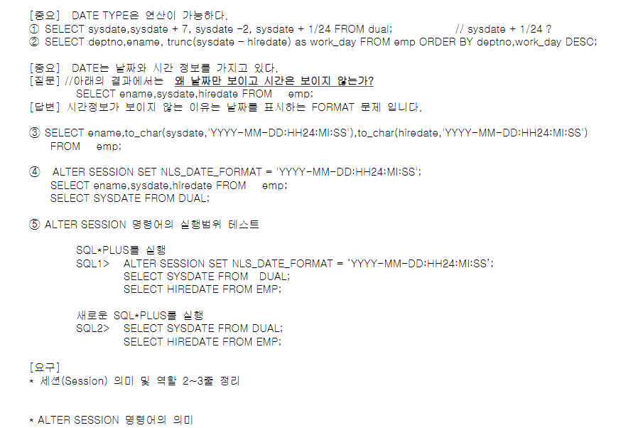
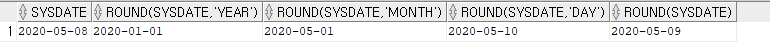

# 과제 피드백

1. 현재 시간, 분, 초, 1/100초까지 표현하는 SQL 작성

   FF가 무엇의 약자인가?

   Fractional seconds? FRAME?

   

2. union, union all, intersect, minus를 공부한 후 각각의 예제 sql으르 만든후 결과가 왜 정렬되는지 설명하시오.

   왜 UNION ALL만 빼고 정렬되는가?

   나머지 세 연산자는 중복을 제거하는 과정에서 SORT 알고리즘이 수행되기 때문에.

   데이터간의 수직적 결합을 하는 연산자가 집합 연산자이다. 두개의 테이블을 수직적으로 결합시킨다. 두 테이블을 수평적으로 결합하는 연산자가 조인 연산자이다. 

   + UNION ALL : A + B
   + UNION : A + B - A 교집합 B
   + INTERSECT : A 교집합 B
   + MINUS : A - A 교집합 B
     + => UNION ALL 을 빼고는 모두 중복된 것을 찾아낸다. 이 때 SORT 알고리즘을 활용한다. SORT를 하면 같은것끼리 붙게되니까 위에서부터 읽어내려가며 같은것을 버리면 중복된것을 걸러낼 수 있다. 
   + cf) select syntax 그림을 보고 집합연산자의 기준을 다른 기준으로 정렬하고싶을때 order by를 어떻게 써야하는지 고민해보아라.

3. EMBEDDED SQL, INTERATCTIVE SQL의 차이

   + embedded sql은 호스트 언어 안에서 sql의 dbms와 연결(connection)하여 db의 데이터를 활용하는것을 뜻한다. 

   + 경력이 많은 개발자는 내가 필요한 sql을 sql developer에서 interactive하게 만들고, 그 후 host language에서 connect 한다. 초보 개발자는 바로 embedded sql을 사용한다. 왜? sql 하나가 수백줄 수천줄이 되는 경우가 많다. 이 때, embedded sql 하나로 프로그래밍을 하면 에러의 원인이 host language인지 sql인지 그 접점에 있는건지 알기가 쉽지 않다. 하지만, interactive sql에서 sql이 제대로 동작하는것을 확인해가며 짜게되면 sql에 대한 기능검증을 할 수 있다. 

   + 경력 많은 개발자는 기능 검증을 끝내면 성능 검증을 한다. 

4. distinct 9i 10g

   + 실행계획이 뭔진 몰라도 된다. 

   + 9i에선 SORT (UNIQUE) 알고리즘, 10g에선 HASH UNIQUE 알고리즘을 썼다. 

   + SELECT DISTINCT JOB FROM EMP; 를 수행할 때 9i에선 이진분류를 써서 sort를 써야했다. 

   + hash 
     + arraylist는 인덱스를 기반으로 해당 데이터가 나올때까지 계속 탐색해서 시간이 오래걸린다.
     + Value to Adress : 값을 주소로 바꿔준다.
     + index = h(k) ( k = key )
     + 용도
       + 무결성 검증
       + DAM (Direct Access Method) : 내가 원하는 데이터에 바로 접근한다.
         + <-> sequence access : 처음부터 해당 데이터까지 쭉 흝으며 찾는다.
       + 보안 (개인정보 암호화처리를 프로젝트에 하고싶은사람은 hash기술을 사용해봐라. )
     + grid computing(분산 컴퓨팅) : 10g부터 grid computing으로 넘어가면서 효율성을 위해 hash를 택했다. 

5. subquery

   + subquery는 다른 sql 문장 안에 포함되있는 select문장을 말한다. 바깥 sql 문장을 main query라 하고, 내포된 sql 문장을 subquery라고 한다. 
   + main sql은 SELECT, INSERT, DELETE, UPDATE 등이 올 수 있지만, SUBQUERY에는 SELECT만 올수있다. 
   + 왜 SUBQUERY가 활용도가 높을까 고민해보기. 
   + main query와 subquery가 있을때 subquery가 먼저 실행된다. subquery의 select가 실행되면 result set(결과집합)이 만들어진다. 이를 가지고 main query가 실행된다. 
   + 데이터 량이 많아지면 subquery가 포함된 쿼리는 느려질 수 있다. 


# 0508 과제

1. EXTRACT 함수의 결과 데이터타입이 무엇인지 오라클매뉴얼을 검색하여 설명하십시오.

2. 날짜포맷 암기 후 설명하시오.

3. 아래 SQL을 참고하여 해당 월의 마지막 법정 영업일자를 구하는 SQL을 작성하십시오(법정영업일은월~금요일)

   SELECT    TO_CHAR(SYSDATE,'DDD'),TO_CHAR(SYSDATE,'DD'),TO_CHAR(SYSDATE,'D')FROM DUAL;SELECT    LAST_DAY(SYSDATE) FROM DUAL;


# 과제 수행

1. extract 함수의 결과 데이터 타입은 숫자형이다. extract한 결과값에 숫자를 더했을시, 년 월 일로 계산되지 않고 숫자 자체에 더해지게 되는것을 통해 확인했다. 

https://docs.oracle.com/cd/E11882_01/server.112/e41084/functions059.htm#SQLRF00639


메뉴얼에도 정수형으로 리턴한다고 나와있다.


2. 

   

+ PM : 오후

+ HH : 시간

  HH24 : 24시간 기준 시간

+ MI : 분

+ SS : 초

+ SSSSS : 시간, 분, 초를 모두 초로 바꾼것.

+ FF[1...9] : 10분의 1초, 100분의 1초, 1000분의 1초 ... 씩 보여줌

+ D, d : 주중 일로 표현

+ DD, dd : 월중 일로 표현

+ DDD, ddd : 연중 일로 표현

+ DAY , day : 요일의 영문표기 모두 표시 

+ DY : 3문자로 된 요일표기

+ FM : 공백제거

+ MM : 월을 숫자로 표시 / MON : 3문자로 된 달의 이름 / MONTH : 달의 영문표기 모두 표시

+ YYYY : 4자리 년도 표시 / YYY : 년도를 세자리로 표시 / YY : 년도를 두자리로 표시 / Y, y : 년도를 한자리로 표시 

+ RRRR : 년을 2자리, 또는 4자리로 표기

+ YEAR, year : 년도 영문으로 표기

https://jang8584.tistory.com/160

3. 아래 SQL을 참고하여 해당 월의 마지막 법정 영업일자를 구하는 SQL을 작성하십시오(법정영업일은월~금요일)

   SELECT    TO_CHAR(SYSDATE,'DDD'),TO_CHAR(SYSDATE,'DD'),TO_CHAR(SYSDATE,'D')FROM DUAL;SELECT    LAST_DAY(SYSDATE) FROM DUAL;

```sql
SELECT DECODE (TO_CHAR(LAST_DAY(SYSDATE),'D'), 7, LAST_DAY(SYSDATE)-1,

     											1, LAST_DAY(SYSDATE)-2,

        										LAST_DAY(SYSDATE)) AS "LAST BUSINESS DAY OF THE MONTH" 

FROM DUAL;
```


# 함수


하나은행같은 대기업에는 조직 전체가 쓰는 함수를 라이브러리화하는 팀이 있다. 나머지사람들은 이들이 만든 라이브러리를 활용하며 생산성을 높인다. 공통 아키텍쳐팀, 선행사업팀등이 그러하다. 


## 단일행 함수


## 그룹행 함수


## 단일행 - 문자함수


cf) ASCII, UNICODE 틈틈이 공부하기. 


#### 실습

```sql
SELECT ENAME,lower(ENAME),upper(ENAME),initcap(ENAME) FROM EMP;
```


```sql
SELECT ENAME,substr(ENAME,1,3),substr(ENAME,4),substr(ENAME,-3,2) FROM EMP;
```


=> substring에 음수가 나올경우 맨 마지막 글자에서 왼쪽으로 숫자만큼 간 수를 의미한다. 

​	두번째 수는 자를 문자의 개수를 말한다. 

​	즉, substr(ENAME, -3, 2) 는 오른쪽에서부터 3번째 문자에서부터 문자 2개를 자른다.

```sql
SELECT ENAME,instr(ENAME,'A'),instr(ENAME,'A',2),instr(ENAME,'A',1,2) FROM EMP;
```


```sql
SELECT ENAME,rpad(ENAME,10,'*'),lpad(ENAME,10,'+') FROM EMP;
```


```select
SELECT rpad(ENAME,10,' ')||' ''sJOB is '||lpad(JOB,10,' ') as JOB_list FROM EMP;
```


```sql
SELECT ENAME,REPLACE(ENAME,'S','s') FROM EMP;
```


```sql
SELECT ENAME, concat(ENAME,JOB), ENAME||JOB FROM EMP;
```


```sql
SELECT ltrim(' 대한민국'), rtrim(' 대한민국'), trim(' 대한민국') FROM dual;
```


```sql
SELECT trim('장' from '장발장'), ltrim('장발장','장'), rtrim('장발장','장') FROM dual;
```


```sql
SELECT length('abcd'), substr('abcd',2,2), length('대한민국'), substr('대한민국',2,2) FROM dual;
```

영어 'A' 한글자 : 1byte

한글 '대' 한글자 : 2 ~ 3 byte

그렇지만 length() 함수 자체는 문자수의 길이를 리턴하지, 바이트를 리턴하진 않으므로 '대한민국'의 경우 4를 리턴한다. 


```sql
SELECT lengthb('abcd'), substrb('abcd',2,2), lengthb('대한민국'), substrb('대한민국',2,2) FROM dual;
```

substrb에서 b는 바이트를 의미한다. 영어에서는 길이와 바이트수가 같으니 같은 값을 리턴한다.

lengthb('대한민국')의 경우 12나 8을 리턴한다. DBA가 한글 한 글자를 몇 바이트로 설정하느냐에 따라 달라진다. DBA가 한글 한 자를 3byte로 설정했을경우 12, 2byte로 설정했을경우 8을 리턴한다.


```sql
SELECT length('abcd’),vsize('abcd'),length('대한민국'), vsize('대한민국') FROM dual;
```

vsize : 해당 데이터의 byte size를 리턴한다. 


# 단일행 - 숫자함수


trunc(45.923, -1) : 은행같은 큰 숫자를 다루는 집단은 일의자리도 볼 필요가 없다.


#### 실습


```sql
SELECT round(45.923,2),round(45.923,1),round(45.923,0),round(45.923),round(45.923,-1)FROM dual;
```


```sql
SELECT trunc(45.923,2), trunc(45.923,1), trunc(45.923,0), trunc(45.923), trunc(45.923,-1) FROM   dual;
```


```sql
SELECT mod(100,3), mod(100,2) FROMdual;// 나머지
```


```sql
SELECT ENAME,SAL,SAL*0.053 as tax,round(SAL*0.053,0) as r_tax FROM EMP;--급여의5.3%세금,원단위
```


```sql
SELECTCEIL(-45.594),CEIL(-45.294),CEIL(45.294),ROUND(-45.594),ROUND(-45.294),ROUND(45.594) FROM DUAL;   // 절대값연산
```


```sql
SELECT FLOOR(45.245),FLOOR(-45.245),FLOOR(45.545),FLOOR(-45.545) FROM DUAL;
```


#### 


# date type 실습




Date

1. 날짜 & 시간 반환

2. 고정된 7bytes 할당

   ex) 20200508132144 -> yyyymmddHHMISS

   ​	  두개의 숫자를 1byte에 저장한다.  이를 packed decimal이라 부른다. 한 바이트에 하나가 아니라 두 숫자를 저장하기때문에 packed. 그렇기때문에 7byte를 저장해도 안에서는 14개의 숫자를 저장한다. number라는 타입또한 내부에서 packed로 저장한다. 그렇기때문에 날짜와 숫자 데이터는 오라클 내부에서 똑같이 저장된다.

   ​	***날짜는 숫자 데이터타입처럼 연산이 가능하다.***

   ​	***비교 기준이 숫자와 같다.***

3. round(sysdate, 'day') : 수요일을 기준으로 월, 화, 수일경우 그 전주 일요일 리턴, 목, 금, 토의 경우 그 주의 일요일을 리턴.

#### 실습

```sql
SELECT sysdate,sysdate + 7, sysdate –2, sysdate + 1/24 FROM dual;// sysdate + 1/24?
```

=> sysdate + 1/24 : 하루를 더 추가


```sql
SELECT deptno,ename, trunc(sysdate –hiredate) as work_day FROM emp ORDER BY deptno,work_day DESC;
```

=> sysdate - hiredate : 내가 근무한 날 수

근데 왜 굳이 trunc를 씌웠을까? 


```sql
SELECT ename,to_char(sysdate,'YYYY-MM-DD:HH24:MI:SS'),to_char(hiredate,'YYYY-MM-DD:HH24:MI:SS')FROM emp;
```


```sql
ALTER SESSION SET NLS_DATE_FORMAT = 'YYYY-MM-DD:HH24:MI:SS';
SELECT ename,sysdate,hiredate FROM emp;   
SELECT SYSDATE FROM DUAL;
```

sql 카테고리 (ddl, dml, ...) 와 그 안의 명령어드르 시험에 나오니 공부할것.

connect와 session을 그리고 설명하시오 - 시험.

session : 시간의 기간을 의미한다.

NLS : National Language Support - 전 세계 모든 다양한 국가들을 지원해주겠다. 그러다보니 내부에 데이터를 저장하는 방식과 외부에 표현하는 방식을 분리해놨다. 아시아는 yy/mm/dd 를 선호하지만, 서구 국가들은 dd/mm/yy를 선호한다. 보통 dba가 디폴트로 정해놓는데, 만약 바꾸고싶다면 SET NLS_DATE_FORMAT으로 바꿀 수 있다.

짝궁과 함께 alter session을 했을 때, 짝궁의 alter session은 내 db에 영향을 미치지 않는다. 


# session

User가 log in 해서 log out 할때까지의 status를 의미한다. session은 엄밀히 말해 메모리덩어리를 의미한다. 유저의 이러한 정보를 memory 덩어리에서 관리한다. 즉, 세션이 종료되었다는건 메모리를 날려버렸다는 이야기이다.

connection : clinet와 server 사이의 연결 통로. 이 통로를 통해 request와 response가 왔다갔다한다. connection이 이뤄지는순간 dbms에 session이라는 메모리덩어리가 생기고, 여기서 유저의 상태정보를 저장한다. 

나와 나의 짝꿍은 서로 다른 세션이다. "세션이 종료되었습니다"라는것은 서버에서 쫒겨난것이다. connection을 물고있어도 세션이 종료되면 더이상 다른 일을 할 수 없다. 

옆방의 서버실에는 22개의 connection과 각각 session이 들어와있다. 

짝꿍과 나의 세션이 서로 다르기때문에 같은 아이디를 써도 세션과 커넥션은 다르게 부여된다.

모든 세션은 고유한 세션 아이디를 할당해준다. dbms 내부에서는 고유한 세션 아이디로 관리를 하고 connection은 os의 물리적인 연결을 뜻한다.

SQL DEVELOPER에서 워크시트는 여러개를 만들어도 한 세션이다.


## SCOPE & LIFETIME

LIFETIME : 명령어의 지속시간

ALTER SESSION : 지금 내 세션만 영향을 미치는 것

​	LIFETIME : 내가 로그아웃을 할 때까지의 시간

​	내가 로그인하면 새로운 세션 메모리가 생기고, 내가 로그아웃하면 세션이 사라진다. 

ALTER SYSTEM : DB 전체를 변환. DB를 공유하는 사람중 한명이 바꾸면 모두의 DB에서 바꾸게됨.


# 단일행 - 날짜 함수


+ 9번 쿼리 : 'year', 'month', 'day'를 기준으로 round해라. 


#### 실습

```sql
SELECT HIREDATE, months_between (sysdate,HIREDATE), months_between(HIREDATE,sysdate) FROM EMP;
```


months를 기준으로 했기 때문에 예를들어 1번째 행의 경우 472달 73일 이하 시간만큼 일한것이 된다. hiredate가 sysdate보다 작기때문에 세번째 컬럼은 음수가 나오게 된다.


```sql
SELECT sysdate,add_months(sysdate,3),add_months(sysdate,-1) FROM dual;
```


```sql
SELECT sysdate, last_day(sysdate), next_day(sysdate,'일요일'), next_day(sysdate,1),next_day(sysdate,2) FROM DUAL;
```


=> last_day는 현재 달의 마지막 달

=> next_day는 내일인데, 두번째 파라미터에 내가 알고싶은 돌아오는 요일을 적는다.

=> next_day 내일에 하루를 더 더한 5월 10일

=> next_day 내일에 이틀을 더한 5월 11일


```sql
SELECT sysdate,round(sysdate,'YEAR'),round(sysdate,'MONTH'),round(sysdate,'DAY'),round(sysdate) FROM dual;
```



+ round(sysdate, 'year') : round에서 두번째 파라미터는 '의미있는 숫자로 만든다'는 뜻. year에서 반올림한다는것이 아니라, year까지만 의미있는 숫자를 만들기위해 월 단위를 본다. 5월이기때문에 반올림을 하는 기준인 7보다 작기때문에 2020을 반올림하지않고 그대로 둔다.
+ round(sysdate, 'month') : 달을 의미있게 만들기위해 일 날짜를 본다. 10이기때문에 15 미만이라 반올림하지않고 그대로 둔다.
+ round(sysdate, 'day') : day를 의미있게 만들기위해 day까지 모두 출력한다.


```sql
SELECT sysdate+60,round(sysdate+60,'YEAR'),round(sysdate+60,'MONTH'),round(sysdate+60,'DAY'),round(sysdate+60) FROM dual;
```


+ sysdate에 60일을 더해 현재날짜를 2020-07-07로 바꾼 후 똑같이 수행해보면 반올림이 수행됨을 알수있다.

```SQL
SELECT sysdate,trunc(sysdate,'YEAR'),trunc(sysdate,'MONTH'),trunc(sysdate,'DAY'),trunc(sysdate)FROM dual;
```


+ trunc : 절삭 (버림)

```sql
SELECT sysdate+75,trunc(sysdate+75,'YEAR'),trunc(sysdate+75,'MONTH'),trunc(sysdate+75,'DAY'),trunc(sysdate+75)FROM dual;

```


```SQL
SELECT to_char(sysdate,'MM"월"DD"일"') as mmdd1,to_char(sysdate,'MM')||'월'||to_char(sysdate,'DD')||'일' as mmdd2 FROM dual;
```


```SQL
SELECT EXTRACT(YEAR FROM SYSDATE),EXTRACT(MONTH FROM SYSDATE),EXTRACT(DAY FROM SYSDATE)FROM DUAL;

```


```sql
SELECT HIREDATE, EXTRACT(YEAR FROM HIREDATE) FROM EMP;
```


# 단일행 - 변환 함수(to_char)


+ fm : 공백 삭제
+ 포맷 '99999'와 '00000'의 차이?


#### 실습

```SQL
SELECT SYSDATE,TO_CHAR(SYSDATE,'YEAR'),TO_CHAR(SYSDATE,'Year'),TO_CHAR(SYSDATE,'YYYY'),TO_CHAR(SYSDATE,'YY')FROM DUAL;
```


=> sysdate는 대소문자를 구별함을 알 수 있다. 'year'라고 문자로 명시했을경우 문자그대로를 리턴하고, 'yyyy'로 형을 지정해줬을경우 숫자를 문자로 바꾼다.


```sql
SELECT TO_CHAR(SYSDATE,'MONTH'),TO_CHAR(SYSDATE,'MON'),TO_CHAR(SYSDATE,'Mon'),TO_CHAR(SYSDATE,'mon'),TO_CHAR(SYSDATE,'MM'),TO_CHAR(SYSDATE,'mm')FROM DUAL;
```


=> 한글에선 모두 같은 값을 반환. 영어에선 'month'의 경우 September, 'mon'의 경우 sep만 출력됨.


```sql
SELECT SYSDATE,TO_CHAR(SYSDATE,'DAY'), TO_CHAR(SYSDATE,'Day'),TO_CHAR(SYSDATE,'DY'),TO_CHAR(SYSDATE,'dy'),TO_CHAR(SYSDATE,'DD'),TO_CHAR(SYSDATE,'dd')FROM DUAL;
```


```sql
SELECT 123456, TO_CHAR(123456,'999999'),
    LENGTH(TO_CHAR(123456,'999999')),
    LENGTH(TO_CHAR(123456,'fm999999'))
FROM DUAL;
```


=> to_char(숫자, '9999') : 숫자를 9의 개수만큼의 자리수의 문자로 바꿔준다. 그런데 length를 찍어보면 6자리가 아니라 7자리로 나온다. fm으로 공백을 지워주면 6자리가 된다. 왜그럴까?

=> TO_CHAR(123456, '999999') 로 변환하면 앞에 공백문자가 하나 들어간다. +, - 기호를 위한 공간이다. 그래서 6바이트가 아니라 7바이트가 리턴된다. 

```sql
SELECT TO_CHAR(12345*123.45,'999,999.99'),TO_CHAR(12345*123.45,'99,999,999.99') FROM DUAL;  
```


=> 실제 수의 자리수가 내가 정한 문자의 자리수보다 크면 표현할 수 없으므로 #으로 처리한다. 


```sql
SELECT TO_CHAR(SAL,'$999,999'),REPLACE(TO_CHAR(SAL,'$999,999'),'','?'),TO_CHAR(SAL,'L999,999'),TO_CHAR(SAL,'999,999L'),TO_CHAR(SAL,'fm999,999L')FROM EMP;
```


=> replace를 통해 sal을 문자로 바꾼후 ' ' 공백을 '?'로 대치 

```SQL
SELECT 0012345600,TO_CHAR(00123456,'999999999'),TO_CHAR(00123456,'000000000')FROM DUAL;
```

=> 포맷 9는 앞자리 0을 살려주지 않지만, 포맷 0은 앞자리 0을 살려준다.


# 그룹행 함수


+ COUNT(*)은 모든 행의 개수, COUNT(EMPNO)는 EMPNO 열에 있는 형의 개수. 개발자는 둘 중 어떤것으로 수를 아는것이 더 효율적인지도 생각해봐야한다. EMPNO는 NOTNULL인 기본키이니까 EMPNO의 개수만 세봐도 전체 행의 개수가 나오기 떄문.
+ 11번 : 조심해야하고 중요하니 잘 이해해야한다. 
+ 13번 : 세개를 비교해보고 뭐가 더 효율적인지 생각해봐라. 
+ 그룹행함수는 데이터 개수가 많아지면 느려질수 있다. 
+ 그룹행함수는 null값을 빼고 함수를 수행한다. 


#### 실습

```sql
SELECT MIN(ENAME),MAX(ENAME),MIN(SAL),MAX(SAL),MIN(HIREDATE),MAX(HIREDATE)FROM EMP;
```


=> 문자의 min과 max는 알파벳 순서를 따져서 최소와 최대를 반환한다.


```sql
SELECT COUNT(*),COUNT(EMPNO),COUNT(MGR),COUNT(COMM)FROM EMP;
```


```sql
SELECT COUNT(JOB),COUNT(ALL JOB),COUNT(DISTINCT JOB),SUM(SAL),SUM(DISTINCT SAL)FROM EMP;
```


```sql
SELECT COUNT(*), SUM(COMM),SUM(COMM)/COUNT(*),AVG(COMM),SUM(COMM)/COUNT(COMM)FROM EMP;
```


=> SUM(COMM)/COUNT(*),   AVG(COMM),   SUM(COMM)/COUNT(COMM) 모두 같이 평균을 구하는 식인데, 왜 결과값이 다를까?

SUM(COMM)/COUNT(*)은 2200/14로, COMMISSION을 받지 않는 사람까지 분모에 포함했으므로 잘못된 결과가 나온다.

```sql
SELECT SUM(NVL(COMM,0)) AS SUM_COMM1,SUM(COMM) AS SUM_COMM2, NVL(SUM(COMM),0)AS SUM_COMM3 FROM EMP
```


=> SUM(NVL(COMM, 0)) : NVL 함수가 데이터 건수만큼 수행됨. 불필요한 연산을 하게됨.

SUM(COMM) : sum 함수 자체가 null을 제외하고 연산하기때문에 바로 sum해주면 된다.

NVL(SUM(COMM), 0) : nvl함수는 한번실행되지만, sum 전체 함수가 null일까봐 해준것이다. sum이 null일 경우는 매우 드물다. 