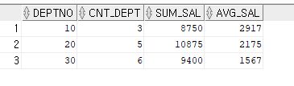
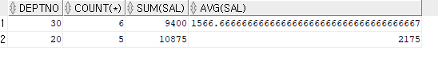

[TOC]


# 과제

1. 

GROUPBY를 하면 결과가 세로로 나온다. 세로를 가로로 출력하는 노가다 코딩을 해봐라. (GROUP BY와 DECODE 응용)

```SQL
SELECT 
    (SELECT COUNT(*) FROM EMP WHERE DEPTNO = 10) AS "10번부서",
    (SELECT COUNT(*) FROM EMP WHERE DEPTNO = 20) AS "20번부서",
    (SELECT COUNT(*) FROM EMP WHERE DEPTNO = 30) AS "30번부서"
FROM EMP WHERE ROWNUM = 1
ORDER BY DEPTNO;
```


```SQL
SELECT 
    SUM(NVL(DECODE(DEPTNO, 10, COUNT(*)), 0)) AS "10번부서",
    SUM(NVL(DECODE(DEPTNO, 20, COUNT(*)), 0)) AS "20번부서",
    SUM(NVL(DECODE(DEPTNO, 30, COUNT(*)), 0)) AS "30번부서"
FROM EMP
GROUP BY DEPTNO;
```


2. 모델링 관점에서 식별자가 무엇인지 설명해보라. (식별자의 정의와 특징)

+ 식별자: 식별자란 하나의 엔터티에 구성되어 있는 여러 개의 속성 중에 엔터티를 대표할 수 있는 속성을 의미한다. 하나의 엔터티에 반드시 하나의 유일한 식별자가 존재해야 한다.

+ 식별자의 특징


+ 불변성 : 식별자는 자식에게 고유하게 물려주는데, 변하게되면 자식을 찾을수가 없게된다. 


# GROUP BY - 그룹핑


+ GROUPBY도 DISTINCT처럼, 9i버전까진 sort방식이었기때문에 자동 정렬이 되다가 10g로 넘어가며 hash 방식으로 바뀌어 정렬이 안된다. 많은 데이터를 sort하게되면 컴퓨터 시스템이 비효율적으로 수행되기때문에 sort가 hash로 바뀌었다. 

+ 요구 : 중요하지 않다. 
+ SQL*PLUS : 우리가 쓰는 SQL DEV랑 비슷한 도구이지만, SQL DEV는 GUI, SQL PLUS는 CLI다. 아주 오래된 오라클은 SQL PLUS를 썼고, 도스 명령어 모드에서 SQL을 개발한다. 요즘은 거의 SQL DEV를 쓴다. 

#### 실습

```sql
SELECT   DEPTNO,COUNT(*),SUM(SAL),AVG(SAL)    
FROM EMP 
GROUP BY DEPTNO;
```


=> GROUPBY된별로 SELECT_LIST가 보여진다. 

```sql
SELECT JOB,COUNT(*),AVG(SAL)FROM EMP GROUP BY JOB;
```


```sql
SELECT    DEPTNO,COUNT(*),SUM(SAL),AVG(SAL)    
FROM EMP 
GROUP BY DEPTNO 
ORDER BY DEPTNO;
```


=> GROUP BY는 자동정렬이 안되니 정렬을 하려면 명시적으로 ORDER BY를 해줘야 한다.


```sql
SELECT COMM,COUNT(*) FROM EMP
GROUP BY COMM;
```


=> GROUP BY는 NULL도 하나의 카테고리로 묶는다. 


```sql
SELECT    DEPTNO, COUNT(*) AS CNT_DEPT, SUM(SAL) AS SUM_SAL, ROUND(AVG(SAL),0) AS AVG_SAL
FROM EMP
GROUP BY DEPTNO
ORDER BY DEPTNO,SUM_SAL;
```

=> AS와 ROUND를 활용




# HAVING


+ 실행순서 비교
  + 1. WHERE
    2. GROUP BY
    3. HAVING
    4. ORDER BY


#### 실습

```SQL
SELECT    DEPTNO,COUNT(*),SUM(SAL),AVG(SAL)    
FROM EMP GROUP BY DEPTNO;
```


```SQL
SELECT    DEPTNO,COUNT(*),SUM(SAL),AVG(SAL)    
FROM EMP GROUP BY DEPTNO      
HAVING    SUM(SAL) > 9000;
```



```SQL
SELECT    DEPTNO,COUNT(*),SUM(SAL),AVG(SAL)    
FROM EMP 
GROUP BY DEPTNO      
HAVING DEPTNO in (10,20);
```


```SQL
SELECT DEPTNO,COUNT(*),SUM(SAL),AVG(SAL)   
FROM EMP 
WHERE DEPTNO IN (10,20)
GROUP BY DEPTNO     
HAVING SUM(SAL) > 9000 
ORDER BY SUM(SAL);
```


# SEQUENCE


+ 데이터 질의어
  + QUERY (DATA)
  + DML(DATA를) : INSERT, DELETE, UPDATE 한다.
  + DDL(OBJECT를) : CREATE, ALTER, DROP 한다.
    + OBJECT : PROCEDURE, SEQUENCE, TABLE, FUNCTION... - CREATE로 만들 수 있는 모든것을 OBJECT라 한다. 


+ connect scott/tiger 부분 :  sql dev를 새로 키면 세션이 다르게 연결되기때문에 두 dev에서 같은 이름의 시퀀스문의 CURRENT VALUE를 호출하면 두번째 세션에서는 호출되지 않지만, NEXTVAL로 추가할시 첫번째 세션의 값에서 추가한다. OBJECT는 세션끼리 공유하기 때문. 이때의 OBJECT는 SEQUENCE다. 그래서 CURRVAL을 해보면 두 세션의 값이 다를수있지만 NEXTVAL은 전 세션에서 추가된 값에서 값을 추가한다. 메모리에서 세션으로 끌어오고, 그 값을 CURVAL을 통해 호출하기때문. 

#### 실습


```SQL
CREATE SEQUENCE   SCOTT.ORDER_SEQ
INCREMENT BY 	1
START WITH 		1
MAX VALUE 		999999999999
MINVALUE 		1
NOCYCLE 
CACHE 			30;
```

=> SCOTT.ORDER_SEQ는 사실 [SCOTT]ORDER_SEQ이다. 

​	[] 는 스키마를 의미하고, 스키마는 "~ 소유의"와, "생략 가능"을 뜻한다. 

=> INCREMENT BY 1 : 1씩 증가해라

=> START WITH : 1부터 시작

=> NOCYCLE : 최대값까지 도달하면 에러내고 죽어라. CYCLE일시 MINVALUE로 돌아감.

=> CACHE : 짱박아둔 메모리. 소프트웨어, 하드웨어에 모두 있다. 우리가 쓰는 노트북 메모리 안에도 캐쉬메모리가 있다. DBMS 서버도 캐쉬메모리를 관리한다. 무엇인지 찾아보고 용어사전에 정리하기. 소프트웨어 관점, 하드웨어 관점 각각 알아두기. 

CACHE 30은 메모리상에 30개의 공간을 미리 만든다는 뜻. NEXTVAL이 1씩 추가되면서 30개가 모두 채워지면, 30개를 다시 만든다. 

```SQL
SELECT ORDER_SEQ.CURRVAL FROM    DUAL;
```

CURRVAL : CURRENT VALUE (현재값)

=> 처음 시퀀스를 만들고 CURRENT VALUE를 호출하면 에러가 난다. NEXTVAL로 최소 한개 이상의 값이 저장되어야 세션 내에 호출할 값이 있기 때문에. 

```SQL
SELECT ORDER_SEQ.NEXTVAL FROM    DUAL;
SELECT ORDER_SEQ.CURRVAL FROM    DUAL;
SELECT ORDER_SEQ.CURRVAL FROM    DUAL;
ROLLBACK;
```

NEXTVAL : NEXT VALUE(다음값)

ROLLBACK : 취소 명령어

=> 이때의 rollback은 savepoint 등을 지정해주지 않아 초기화될지점이 없어 실행만 취소되고 currentval는 그대로 저장되어있다. 

```SQL
SELECT ORDER_SEQ.NEXTVAL FROM    DUAL;
SELECT ORDER_SEQ.NEXTVAL FROM    DUAL;
```

=> NEXTVAL이 호출될때마다 1씩 추가된다. 

```SQL
SELECT EMPNO,ENAME,ORDER_SEQ.NEXTVAL FROM EMP;
```

=> SEQ.NEXTVAL이 FROM EMP라 14번 호출되고, 호출될때마다 새로운 값이 나타난다.


<hr>


+ SCOTT. : 스키마. 안붙이면 현재 접속하고있는 계정으로 자동 붙여진다. 
+ ORDER 테이블명을 사용할 수 없는 이유 : ORDER이 예약어이기때문. 


<hr>


+ 실제 sequence는 insert 문에 쓰인다. 
+ 오라클은 auto-increment를 지원하지 않는다. 증분하고싶으면 별도의 시퀀스를 만들어야한다. 


```SQL

```


```SQL

```


```SQL

```


```SQL

```


```SQL

```


```SQL

```

