# 과제

1. OLTP vs OLAP(DSS) 용어를 정리해서 발표하기. 정의, 특징 비교.

https://techdifferences.com/difference-between-oltp-and-olap.html


2. 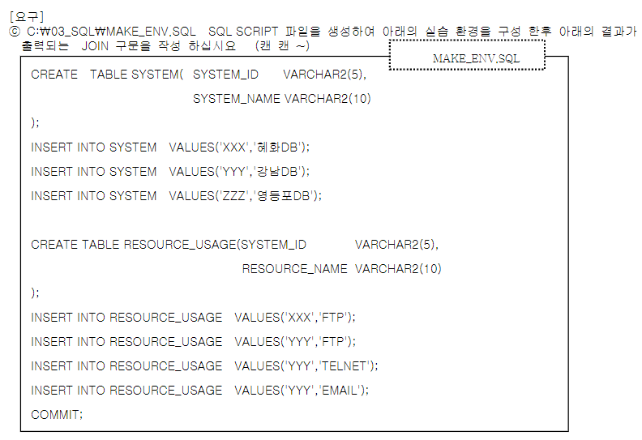

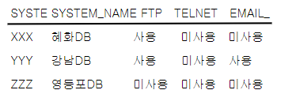

```SQL
SELECT S.SYSTEM_ID,S.SYSTEM_NAME,
       MAX(DECODE(R.RESOURCE_NAME, 'FTP', '사용', '미사용')) AS "FTP",
       MAX(DECODE(R.RESOURCE_NAME, 'TELNET', '사용', '미사용')) AS "TELNET",
       MAX(DECODE(R.RESOURCE_NAME, 'EMAIL', '사용', '미사용')) AS "EMAIL"
FROM SYSTEM13 S, RESOURCE_USAGE13 R
WHERE S.SYSTEM_ID = R.SYSTEM_ID(+)
GROUP BY S.SYSTEM_ID, S.SYSTEM_NAME
ORDER BY S.SYSTEM_ID;
```


+ SQL SCRIPT FILE의 장점
  + 1. TEXT FILE이라 어떤 편집기에서도 읽을 수 있다.
    2. N개의 SQL문을 저장하고 실행할 수 있다.
    3. 반복 실행할 수 있다. 

3. 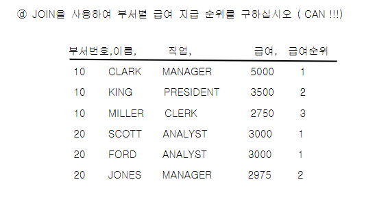

```SQL
SELECT A.DEPTNO AS 부서번호, A.ENAME AS 이름, A.JOB AS 직업, A.SAL AS 급여,
COUNT(DISTINCT B.SAL) AS "급여순위"
FROM EMP A, EMP B 
WHERE A.DEPTNO = B.DEPTNO
AND
A.SAL <= B.SAL 
GROUP BY A.DEPTNO, A.ENAME, A.JOB, A.SAL
ORDER BY A.DEPTNO ASC, A.SAL DESC;
```


3. RANK, DENSE_RANK 함수를 사용하여 ⓓ와 동일한 결과를 나타내는 SQL을 작성하십시오. 또한, 두 함수의 차이를 설명하시오. 

```SQL
-- RANK()
SELECT DEPTNO AS 부서번호, ENAME AS 이름, JOB AS 직업, SAL AS 급여, RANK() OVER(PARTITION BY DEPTNO ORDER BY SAL DESC) AS "급여순위"
FROM EMP 
GROUP BY DEPTNO, JOB, ENAME, SAL;

    -- DENSE_RANK()
SELECT DEPTNO AS 부서번호, ENAME AS 이름, JOB AS 직업, SAL AS 급여, DENSE_RANK() OVER(PARTITION BY DEPTNO ORDER BY SAL DESC) AS "급여순위"
FROM EMP 
GROUP BY DEPTNO, JOB, ENAME, SAL;
```


3. 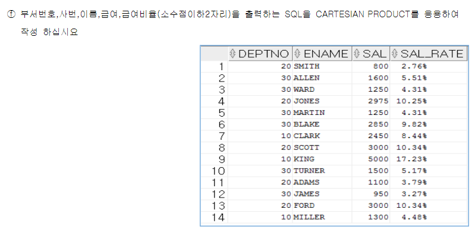

```SQL
SELECT DEPTNO, EMPNO, ENAME, SAL, TRUNC(SAL/SUM_SAL*100, 2) AS SAL_RATE
FROM EMP, (SELECT SUM(SAL) AS SUM_SAL FROM EMP);
```


# JOIN

+ JOIN : 데이터를 수평적으로 결합. 집합연산자는 수직적 결합. 


+ 관계형 db 이전에는 계층형과 망형 db가 있었으나, 데이터가 모두 포인터로 연결되서 속도는 빨랐지만 데이터 구조같은게 변경될시 수정이 너무 많았다. 

+ 관계형 db는 필요할때만 데이터끼리 관계를 맺어서 변경하긴 쉽지만 속도가 좀 느린데, 조인이 성능저하를 하는 주요 요인이다.

+ db는 조인문을 받았을때 optimizer가 innerjoin, nested join, sort 등 조인 알고리즘중에 가장 최적화처럼보이는 알고리즘을 고른다. 하지만 optimizer가 완벽하진 않아서 인간이 알고리즘을 결정해주는데, 그걸 sql 튜닝이라 한다. 튜닝을 잘 하면 조인을 써도 최적화된 알고리즘으로 수행하기때문에 성능이 개선된다. 

+ SDLC : software development life cycle (소프트웨어 개발주기) => 외우기.

  >1. 계획(기획) 
  >
  >  소프트웨어를 개발해야하는 타당성을 조사하기 위해. 프로젝트의 범위(scope) 선정.  범위를 먼저 선정해야 이 범위로부터 일정을 짤 수 있기 때문에. 
  >
  >2. 분석
  >
  >  WHAT을 도출. 무슨 시스템을 만들꺼야. 고객의 요구사항 분석. 보통 사람, 문서, 기존에 존재하는 시스템으로부터 요구사항을 추출한다.  기능, 성능, 보안에 대한 요구사항이 있다. ex) 게시판에 글을 등록할 수 있고, 수정할 수 있어야 한다 - 기능. ex) 클릭을 하면 3초이내에 결과가 나와야한다. - 성능. 이중에서도 기능 요구사항에 가장 큰 초점을 맞춰야 한다. 기능을 핵심기능, 주요기능, 부가기능으로 분류하고 나열해서 체계적으로 프로젝트를 해라. 
  >
  >ERD (ENTITY RELATION DIAGRAM)모델링은 분석단계에 해당되지만, 설계에 약간 걸쳐져있다. 모델링은 데이터에 대한 사용자 요구사항을 그림으로 그린것. 
  >
  >3. 설계
  >
  >  HOW를 도출. 
  >
  >  -------------------------------------- 여기까지 40%의 노력
  >
  >4. 개발(구현)
  >
  >  -------------------------------------- 개발은 20%의 노력
  >
  >5. 테스트
  >
  >  + 단위테스트 : 하나의 모듈을 테스트
  >  + 통합테스트 : 여러 모듈을 다 연동해서 테스트
  >  + 시스템테스트
  >  + 인수테스트
  >  + ....
  >
  >6. 이행(릴리즈)
  >
  >  환경을 이해해야한다. 규모있는 조직들은 세 개의 독립적인 환경이 있다. 환경 = 서버. 에러가 나면 빠르게 잡을 수 있도록.
  >
  >  + 개발환경
  >  + 테스트환경
  >  + 운영환경
  >
  >  이행은 개발환경에서 개발이 끝난 후 테스트환경으로 넘어가고, 테스트가 끝난 후 운영환경으로 넘어가는, 환경의 이동을 뜻한다. 
  >
  >7. 운영 & 유지보수
  >
  >-------------------------------------- 나머지 40%의 노력
  >
  >=> 의외로 테스트에 많은 노력이 들어간다. 그렇기때문에 프로젝트 할때도 내가 충분하게 테스트할 수 있는 시간을 확보해야한다. 
>
  


## EQUI-JOIN


```SQL
DESC EMP
```


```SQL
DESC DEPT
```


``` SQL
DESC SALGRADE
```


```SQL
SELECT DNAME,ENAME,JOB,SAL 
FROM EMP, DEPT
WHERE DEPTNO = DEPTNO;
```

=> WHERE절에서 테이블 구분을 안해줘서 실행 안됨.

```SQL
SELECT DNAME,ENAME,JOB,SAL 
FROM EMP, DEPT
WHERE EMP.DEPTNO = DEPT.DEPTNO;
```

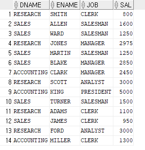

```SQL
SELECT DNAME,ENAME,JOB,SAL
FROM EMP, DEPT
WHERE EMP.DEPTNO = DEPT.DEPTNO AND EMP.JOB IN ('MANAGER','CLERK')
ORDER BY DNAME;
```

=> 이때의 DEPT.와 EMP.은 스키마가 아니라 테이블명을 붙여서 헷갈리지 않게 함. 

=> DBMS의 OPTIMIZER은 조인보다 조건절을 먼저 수행한다. 더 효율적이라. 필터링을 먼저 해야 데이터 집합이 줄어들기때문. 

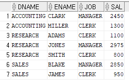

```SQL
SELECT DEPT.DNAME,EMP.ENAME,EMP.JOB,EMP.SAL 
FROM SCOTT.EMP,SCOTT.DEPT 
WHERE    EMP.DEPTNO = DEPT.DEPTNO;
```

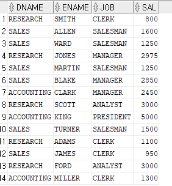

```SQL
SELECT D.DNAME,E.ENAME,E.JOB,E.SAL 
FROM EMP E,DEPT D
WHERE    E.DEPTNO = D.DEPTNO;
```


```SQL
SELECT D.DNAME,E.ENAME,E.JOB,E.SAL 
FROM      EMP E INNER JOIN DEPT D   ON   E.DEPTNO = D.DEPTNO;
```

=> ANSI 조인에선 조인 조건을 WHERE절대신 ON절에 표기한다.


```SQL
SELECT D.DNAME,E.ENAME,E.JOB,E.SAL 
FROM   EMP E INNER JOIN DEPT D   ON       E.DEPTNO = D.DEPTNO
WHERE   E.DEPTNO IN (10,20) AND D.DNAME = ‘RESEARCH’;
```

=> ON과 WHERE을 통해 조인절과 일반 필터링조건을 분리했다.

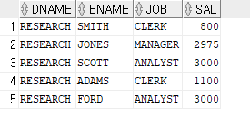

<hr>


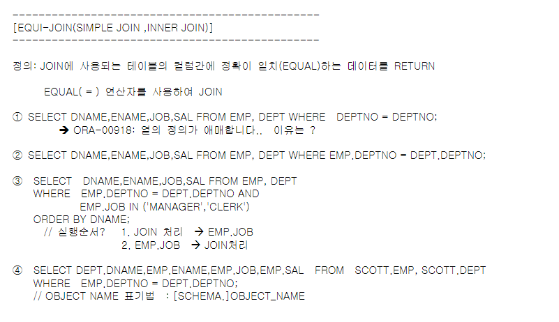


## NON EQUI-JOIN

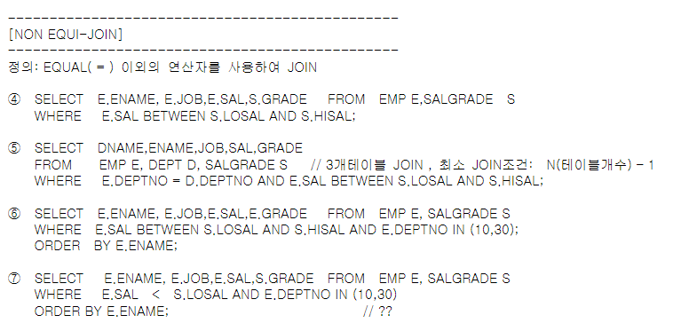

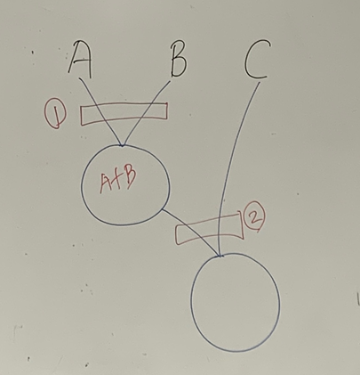

+ 조인은 두 데이터 집단간에만 가능하다. 세 집단의 경우는 먼저 OPTIMIZER가 두 놈을 골라 조인시킨다.  그 후 마지막 집단을 조인시킨다.

```SQL
SELECT  E.ENAME, E.JOB,E.SAL,S.GRADE
FROM    EMP E,SALGRADE S
WHERE   E.SAL BETWEEN S.LOSAL AND S.HISAL;
```

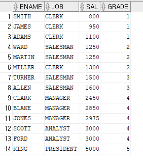


```SQL
SELECT 	DNAME,ENAME,JOB,SAL,GRADE 
FROM 	EMP E, DEPT D, SALGRADE S //3개테이블JOIN , 최소JOIN조건: N(테이블개수) –1
WHERE   E.DEPTNO = D.DEPTNO AND E.SAL BETWEEN S.LOSAL AND S.HISAL; 
```

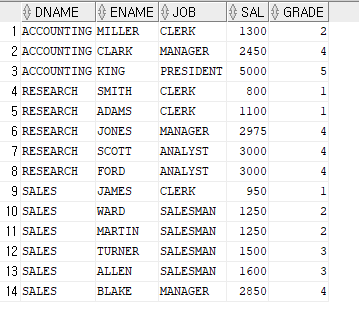

```SQL
SELECT 	E.ENAME, E.JOB,E.SAL,S.GRADE 
FROM    EMP E, SALGRADE S
WHERE 	E.SAL BETWEEN S.LOSAL AND S.HISAL AND E.DEPTNO IN (10,30);
ORDER   BY E.ENAME;
```

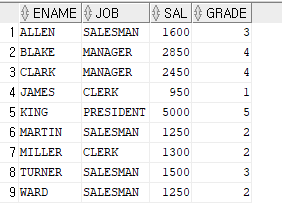

```SQL
SELECT      E.ENAME, E.JOB,E.SAL,S.GRADE    
FROM    	EMP E, SALGRADE S
WHERE      	E.SAL    <    S.LOSAL AND E.DEPTNO IN (10,30)
ORDER	 	BY E.ENAME;
```

=> 주의깊게 봐라. 자주하는 실수다. 직원들의 급여 등급을 알고싶은데 정확한 범위를 지정해주지않아서 LOSAL보다 작은 등급이 모두 출력됨. 그리고 LOSAL보다 작다는것이 조건이기때문에 진짜 등급도 나오지 않는다. 

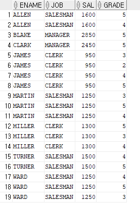


## OUTER-JOIN

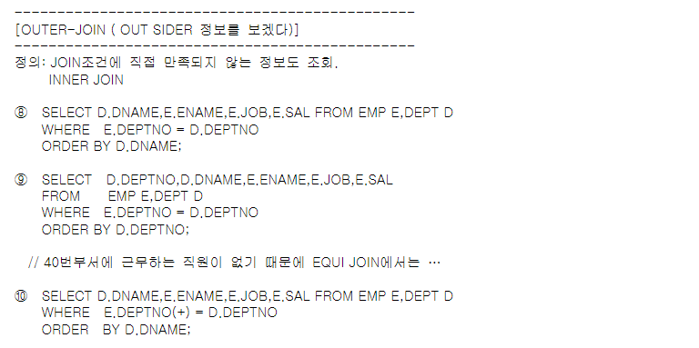

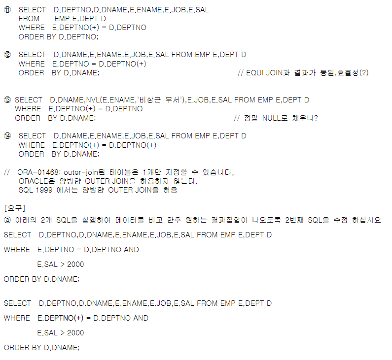

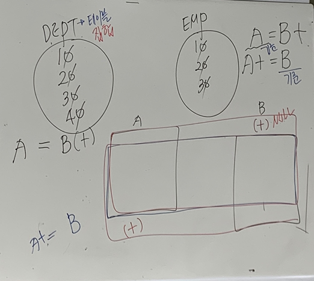

+ (+) 테이블의 값이 다른 테이블과 교집합이 아니더라도 모두 출력. 이 때 (+)테이블에는 있지만 다른 테이블에는 없는 값은 NULL로 채운다. 


#### 실습

```SQL
SELECT 	D.DNAME,E.ENAME,E.JOB,E.SAL 
FROM 	EMP E,DEPT D
WHERE   E.DEPTNO = D.DEPTNO
ORDER 	BY D.DNAME;
```


```SQL
SELECT  D.DEPTNO,D.DNAME,E.ENAME,E.JOB,E.SAL 
FROM    EMP E,DEPT D   
WHERE   E.DEPTNO = D.DEPTNO
ORDER 	BY D.DEPTNO;
```


```SQL
SELECT 	D.DNAME,E.ENAME,E.JOB,E.SAL FROM EMP E,DEPT D
WHERE 	E.DEPTNO(+) = D.DEPTNO ORDER    BY D.DNAME;
```


```SQL
SELECT   D.DEPTNO,D.DNAME,E.ENAME,E.JOB,E.SAL 
FROM     EMP E,DEPT D   
WHERE    E.DEPTNO(+)= D.DEPTNOORDER BY D.DEPTNO;
```


```SQL
SELECT 	D.DNAME,E.ENAME,E.JOB,E.SAL 
FROM 	EMP E,DEPT D
WHERE 	E.DEPTNO = D.DEPTNO(+)
ORDER   BY D.DNAME;
```

=> 이런 불필요한 OUTER JOIN은 안쓰는게 좋다.

```SQL
SELECT 	D.DNAME,NVL(E.ENAME,'비상근부서'),E.JOB,E.SAL 
FROM 	EMP E,DEPT DWHERE    E.DEPTNO(+) = D.DEPTNO
ORDER   BY D.DNAME;   
```


```SQL
SELECT 	D.DNAME,E.ENAME,E.JOB,E.SAL 
FROM 	EMP E,DEPT D
WHERE	E.DEPTNO(+)= D.DEPTNO(+)
ORDER   BY D.DNAME;
```

=> 오라클 dbms는 양방향 아우터조인을 지원하지 않는다.


## ANSI-SQL : LEFT OUTER JOIN, RIGHT OUTER JOIN, FULL OUTER JOIN

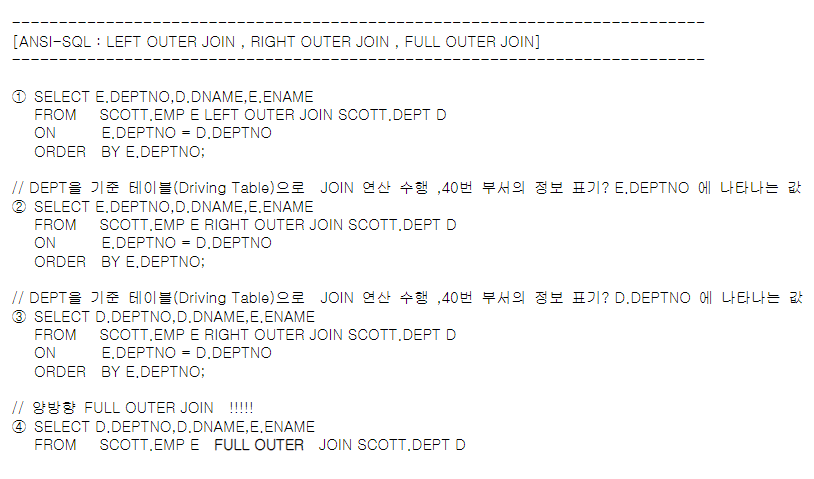


```SQL
SELECT 	E.DEPTNO,D.DNAME,E.ENAME 
FROM    SCOTT.EMP E LEFT OUTER JOIN SCOTT.DEPT D
ON 		E.DEPTNO = D.DEPTNO
ORDER   BY E.DEPTNO;
```

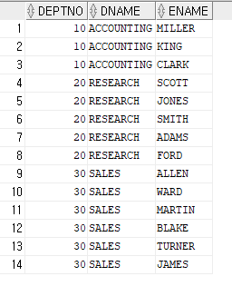

```SQL
SELECT 	E.DEPTNO,D.DNAME,E.ENAME 
FROM    SCOTT.EMP E RIGHT OUTER JOIN SCOTT.DEPT D
ON   	E.DEPTNO = D.DEPTNO
ORDER    BY E.DEPTNO;
```

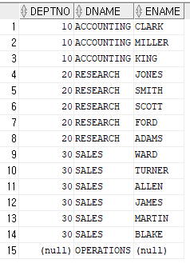

```SQL
SELECT 	D.DEPTNO,D.DNAME,E.ENAME 
FROM	SCOTT.EMP E RIGHT OUTER JOIN SCOTT.DEPT D
ON      E.DEPTNO = D.DEPTNO
ORDER    BY E.DEPTNO;
```

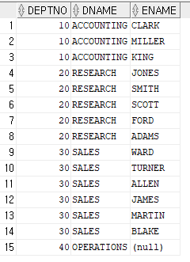

```SQL
SELECT 	D.DEPTNO,D.DNAME,E.ENAME 
FROM	SCOTT.EMP E FULL OUTER JOIN SCOTT.DEPT D
ON      E.DEPTNO = D.DEPTNO 
ORDER   BY E.DEPTNO;
```

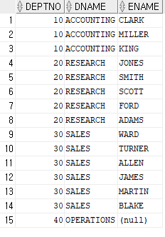

## SELF-JOIN

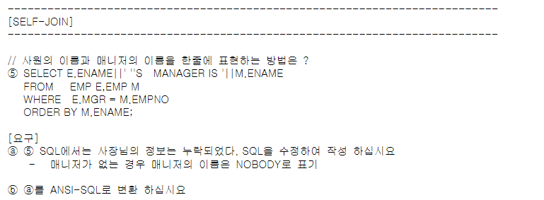


#### 실습

```SQL
SELECT E.ENAME||' ''S    MANAGER IS '||M.ENAME
FROM   EMP E,EMP M
WHERE  E.MGR = M.EMPNO
ORDER BY M.ENAME; 
```

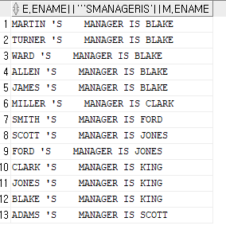

```SQL
SELECT E.ENAME||' ''S    MANAGER IS '||NVL(M.ENAME, 'UNKNOWN')
FROM   EMP E,EMP M
WHERE    E.MGR = M.EMPNO(+)
ORDER BY M.ENAME; 
```

=> 사장님의 경우 UNKNOWN으로 출력하도록 NVL과 OUTER-JOIN을 활용해서 짰다.

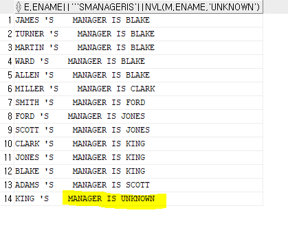


```SQL
SELECT E.ENAME||' ''S    MANAGER IS '||NVL(M.ENAME, 'UNKNOWN')
FROM   EMP E LEFT OUTER JOIN EMP M
ON    E.MGR = M.EMPNO
ORDER BY M.ENAME;
```

=> ANSI SQL로 바꾸면 이렇게 된다. 


## CARTESIAN PRODUCT

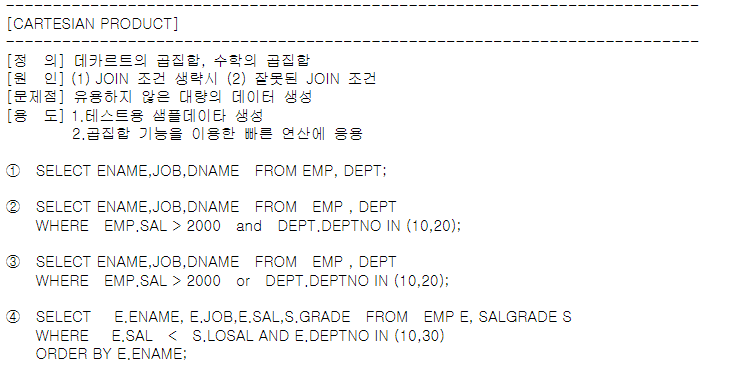

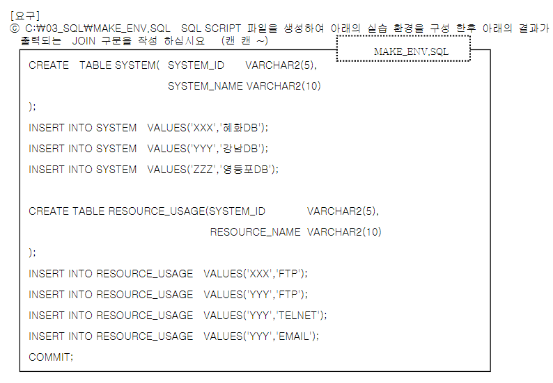

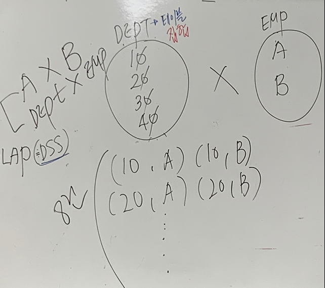

+ 의도하지 않았는데 조인을 했는데 카티전 프로덕트가 나왔다는건 조인문을 잘못 썼다는것이다. 


#### 실습

```SQL
SELECT	ENAME,JOB,DNAME
FROM 	EMP, DEPT; 
```

=> 조인이 없으니 곱집합한 개수만큼 데이터가 나옴. (14 * 4) 

=> 한 사람당 네개의 부서가 짝지어지며 56개의 행이 나옴.

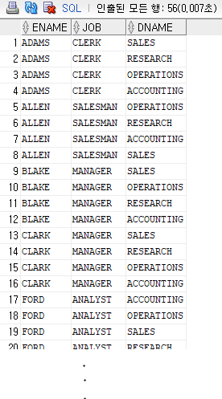

```SQL
SELECT 	ENAME,JOB,DNAME, SAL, DEPT.DEPTNO
FROM    EMP , DEPT 
WHERE 	EMP.SAL > 2000   and DEPT.DEPTNO IN (10,20)
ORDER   BY ENAME;  
```

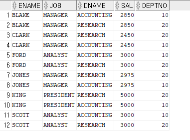


```SQL
SELECT 	ENAME,JOB,DNAME, SAL, DEPT.DEPTNO
FROM    EMP , DEPT 
WHERE 	EMP.SAL > 2000 OR DEPT.DEPTNO IN (10,20)
ORDER   BY ENAME;   
```


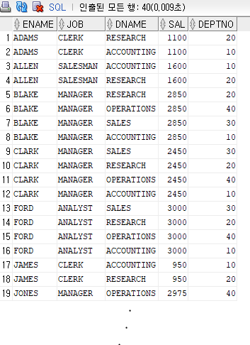

```SQL
SELECT	E.ENAME, E.JOB,E.SAL,S.GRADE, S.LOSAL, DEPTNO    
FROM    EMP E, SALGRADE S
WHERE 	E.SAL < S.LOSAL AND E.DEPTNO IN (10,30)
ORDER 	BY E.ENAME;
```

=> 잘못된 조인조건이 쓰였다.

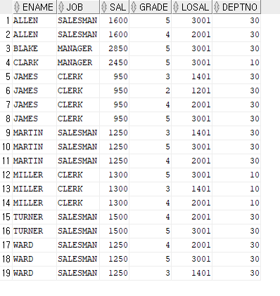


# SUBQUERY

+ SUBQUERY를 쓰는 이유 : 개발 효율적이라서. 

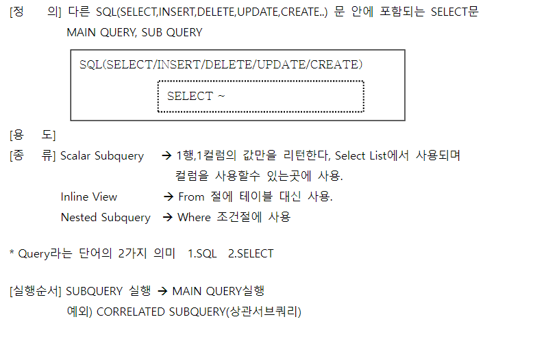

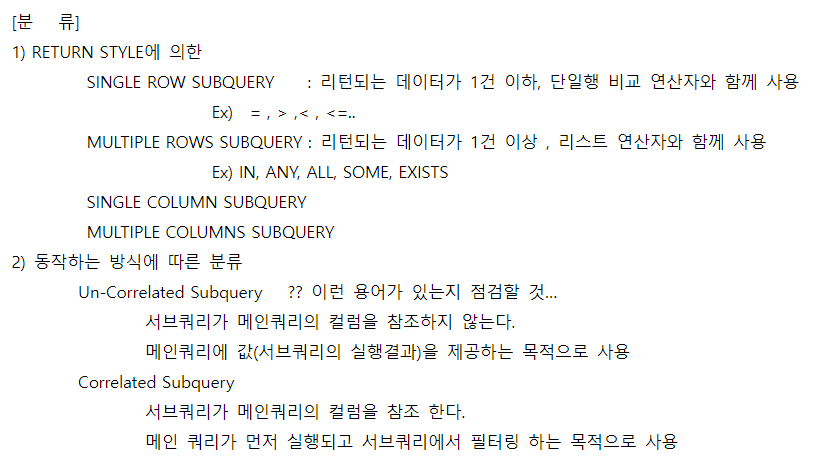


## SINGLE COLUMN, SINGLE ROW

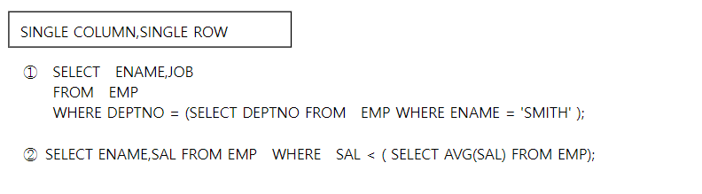

=> SINGLE COLUM SUBQUERY에서 서브쿼리가 리턴하는건 한건의 행이다. 

## SINGLE COLUMN, MULTIPLE ROW RETURN SUBQUERY

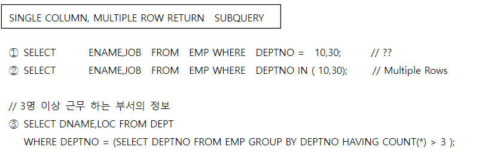

+ 1번 에러남. 복수개의 옵션이 오려면 IN 연산자가 와야함. 
+ 3번의 경우 서브쿼리에서 복수개의 행이 리턴되는데  DEPTNO = 로, = 연산자를 사용했으므로 에러남. IN연산자 사용해야함. 


## MULTIPLE COLUMN, MULTIPLE ROW RETURN

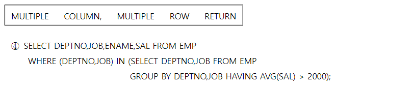

=> 복수개의 행을 리턴하니까 =이 아니라 IN 연산자를 써야한다.


## SCALAR SUBQUERY

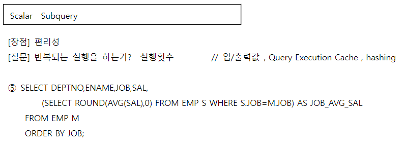

+ 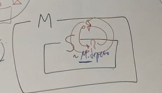


+ SCALAR : "한 개의 값을 갖고있는"이라는 뜻. 
+ SCALAR SUBQUERY : 한개의 칼럼 일치
+ 서브쿼리가 SELECT_LIST에 온다.  이런 서브쿼리를 SCALAR SUBQUERY라 한다. 한 개의 칼럼을 대체하는 서브쿼리. 
+ M.JOB : 메인 쿼리 데이터를 서브쿼리에서 사용함. 이런 쿼리를 상관서브쿼리라한다. 이럴 경우 서브쿼리가 단독으로 실행이 안되고, 메인 쿼리가 서브에 데이터를 넘겨주고, 서브쿼리가 처리를 해서 메인에 다시 던져준다. 이렇게 계속 상호참조한다. 
+ SCALAR 서브쿼리는 EMP 테이블의 개수인 14번 실행된다. 하지만 데이터 양이 많아지면 어마어마한 속도 저하가 발생한다. 


## CORRELATED SUBQUERY(상관서브쿼리)

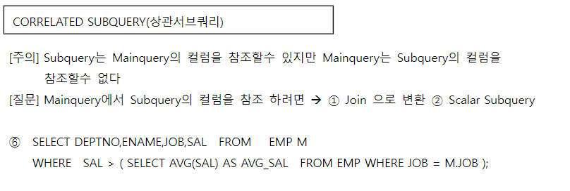

+ 직업별 평균급여보다 많이 받는 사람을 조회한다.


## INLINE VIEW (FROM 절에 사용된 SUBQUERY)

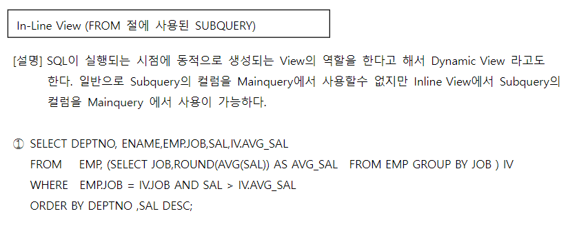

+ FROM의 서브쿼리가 실행되면 테이블이 아니라 결과집합이 만들어진다. 이렇게 생성된 결과집합과 EMP 테이블을 조인하겠다는것. 결과집합에 IV라는 이름을 붙이고 테이블처럼 쓰고있다. 
+ EMP는 정적으로 살아있지만, IV는 해당 쿼리가 끝날때까지만 살아있는 동적 테이블이다. 이것이 바로 서브쿼리의 장점중 하나이다. 활용성이 높다는 것. 

```SQL

```


```SQL

```


```SQL

```

