# IT 용어사전

+ CACHE


# 과제

1. SELECT ~ FOR UPDATE의 기능 및 트랜잭션 시작/종료를 설명하십시오.
2. OLAP, OLTP와 계정계, 정보계를 설명하라. 


# 개별 ID, PASSWORD

```SQL
SELECT*FROM DA13.EMP;
ALTER USER DA13 IDENTIFIED BY yellow94; -- 계정 비밀번호 바꾸기
SHOW USER; -- 현재 접속하고있는 계정 보기
```


```SQL
SELECT * FROM V$SESSION; -- DBA만 접속중인 세션을 모두 확인할 수 있다. 세션이 하고있는 쿼리, 기기 등을 다 볼 수 있다. 
```


# INSERT

;
```


```SQL
INSERT INTO DEPT(DEPTNO,DNAME,LOC) VALUES(51,'연구소2','대전');
```


```SQL
SELECT * FROM DEPT;
```

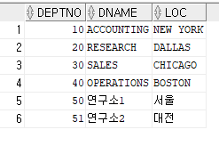

```SQL
INSERT INTO DEPT VALUES('중부영업점','대구');
```

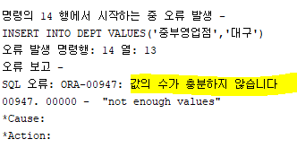

=> 세개의 칼럼이 VALUES로 들어와야하는데 두개만 들어와서 자동 NULL이 되지 않는다. 칼럼명을 안써주고 VALUE만 써줄경우 생략을 할시 자동으로 NULL이 되지 않는다.


```SQL
INSERT INTO DEPT(DNAME,LOC) VALUES('중부영업점','대구');
```

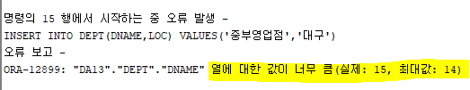

=> 칼럼도 두개, 값도 두개라 나머지 DEPTNO는 자동으로 NULL이 되지만, 이번에는 '중부영업점'의 길이가 최대값인 14보다 크다.


```SQL
ALTER TABLE DEPT MODIFY DNAME VARCHAR(20);
```

=> ALTER TABLE로 DNAME의 최대값을 20으로 늘려준후 다시 위 명령문 삽입시 성공적으로 삽입된다. 


```SQL
-- INSERT에 NULL삽입방법
	-- EXPLICIT
INSERT INTO DEPT(DEPTNO,DNAME,LOC) VALUES(52, '북부영업점',NULL); 
INSERT INTO DEPT(DEPTNO,DNAME,LOC) VALUES(53, '남부영업점','');
	-- IMPLICIT
INSERT INTO DEPT(DEPTNO,DNAME) VALUES(54,'서부영업점');
```


```SQL
SELECT DEPTNO,DNAME,NVL(LOC,'미지정지역') AS LOC FROM DEPT; 
COMMIT;
```


# UPDATE


+ WHERE절을 이용해서 특정 데이터를 찾아서 변경한다.
+ 11번은 한개의 COLUMN만, 12번은 두개의 COLUMN을 수정한다. 


+ COMMIT : 방금 수정한 데이터들을 영구히 저장하겠다. 
+ 3번 : WHERE절이 없다. SELECT문에서 WHERE절이 없으면 전체데이터를 보여줬다. UPDATE에서 WHERE절이 없으면 전체 데이터를 수정하는 것이다. 주의해야한다.
+ ROLLBACK의 원리에 대해 고민해보기. 


#### 실습

```SQL
UPDATE DEPT SET DNAME = '중부연구소' WHERE DEPTNO = 50;
UPDATE DEPT SET DNAME = '북서부연구소', LOC='인천' WHERE DEPTNO = 51;
```


```SQL
SELECT * FROM DEPT WHERE DEPTNO IN (50,51);
COMMIT;
```

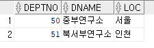

```SQL
UPDATE DEPT SET LOC='미개척지역';
SELECT * FROM DEPT;
```

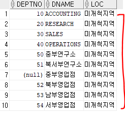

=> WHERE절이 안나오면 모든 행을 바꾼다.

```SQL
ROLLBACK;
SELECT * FROM DEPT;
```

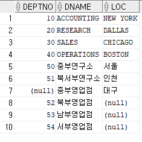

=> 롤백하면 마지막으로 커밋했던 시점으로 다시 돌아간다. 


# DELETE

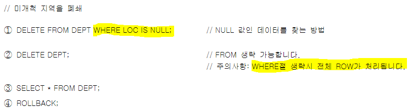


+ UPDATE처럼, DELETE도 데이터를 찾아서 삭제한다.


#### 실습

```SQL
DELETE FROM DEPT WHERE LOC IS NULL;
```

3개 행 이(가) 삭제되었습니다.

```SQL
DELETE DEPT;
```

7개 행 이(가) 삭제되었습니다.

WHERE절 없으면 전체 행이 삭제됨

```SQL
SELECT * FROM DEPT;
```

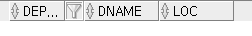

모든 행이 사라진것 확인

```SQL
ROLLBACK;
```


# MERGE (9i의 new feature)

+ MERGE : INSERT와 UPDATE의 합성. 같


# DML과 SUBQUERY

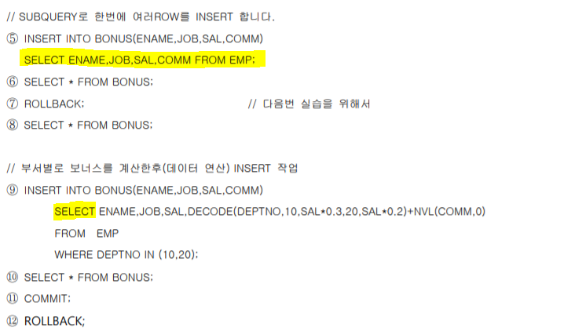


+ 5번 : VALUE절 대신 서브쿼리가 나옴. EMP테이블의 14개행이 한번에 BONUS로 들어간다. 
+ 9번 : VALUE절 대신 서브쿼리가 나왔는데, 서브쿼리에 DECODE와 NVL을 활용하고 WHERE로 조건까지 걸었다. 
+ 12번 : COMMIT을 이미 했기때문에 ROLLBACK이 안먹힌다. 


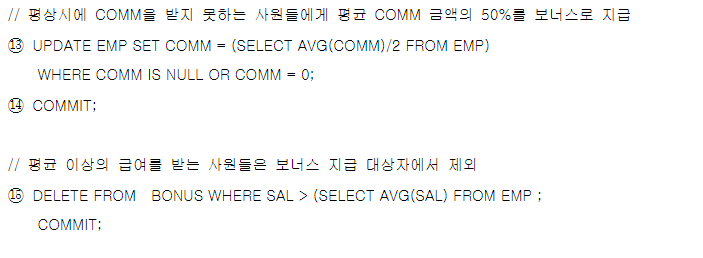

+ 13번 : null과 0은 다르다. 


#### 실습

```SQL
INSERT INTO BONUS(ENAME,JOB,SAL,COMM)
SELECT ENAME,JOB,SAL,COMM FROM EMP;

SELECT * FROM BONUS;
```

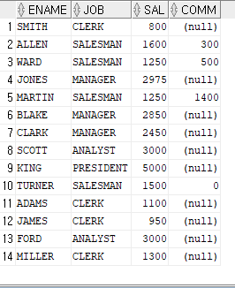

```SQL
INSERT INTO BONUS(ENAME, JOB, SAL, COMM)
    SELECT ENAME, JOB, SAL, DECODE(DEPTNO, 10, SAL*0.3, 20, SAL*0.2) + NVL(COMM, 0)
    FROM EMP
    WHERE DEPTNO IN (10,20);
```

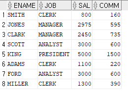

```SQL
COMMIT;
ROLLBACK;
```

=> COMMIT을 이미 했기때문에 아무리 ROLLBACK해도 전으로 돌아가지 않는다.


```SQL
UPDATE EMP SET COMM = (SELECT AVG(COMM)/2 FROM EMP)
WHERE COMM IS NULL OR COMM = 0;

SELECT * FROM EMP;
```

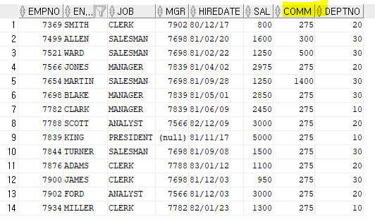

=> COMMISSION이 없던 사람들이 전체 COMMISSION 평균의 50%를 받게됨.


```SQL
DELETE FROM BONUS WHERE SAL > (SELECT AVG(SAL) FROM EMP);
```

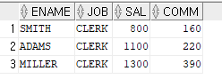


```SQL
COMMIT;
```


CF) DBA라하더라도 계정의 비밀번호를 볼 순 없다. 하지만 강제로 바꿔버릴순 있다.


# SCALAR SUBQUERY

같은 쿼리가 발생하면 실행하지 않고, 실행 결과를 재사용한다. 실행 결과를 재사용하는데 캐시가 어떻게 적용되는가? 

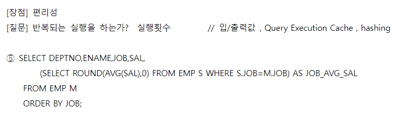

+ 만약 SCALAR SUBQUERY가 행마다 다 시행된다면 14번이 수행되게되고, 데이터가 14만건이라면 14만번 수행되게된다.
+ 하지만 SCALAR SUBQUERY는 연산의 결과를 CACHE 메모리에 저장해두었다가 JOB이 같은 아이가 나타나면 연산해두었던 해당 JOB의 JOB_AVG_SAL을 기억해두었다가 반환한다. 그렇기때문에 속도가 결코 느리지 않다. 
+ QUERY EXECUTION CACHING을 통해 쿼리 실행 결과를 캐쉬메모리에 저장해놓고 JOB이 같은것이 나왔을때 재활용한다.
+ 그래서 SCALAR SUBQUERY는 호출할때마다 실행되는게 아니라 캐쉬메모리를 불러준다. 4
+ QUERY EXECUTION CACHING 테이블은 곧 HASH TABLE이다.  HASH FUNCTION을 이용해 HASH TABLE에 있는 데이터의 위치를 검색하고 데이터를 집어넣고 빼는 역할을 한다. 
+ 만약 JOB이 CLERK인 사람의 평균을 구한다고 했을때, 서브쿼리의 S.EMP의 CLERK 한명이 메인쿼리의 M.EMP의 CLERK N명과 JOB이 같은지 비교하고, 모든 CLERK들과 AVG 함수를 수행한다. 그 평균값을 해쉬테이블에 저장해, S.EMP에서 다음 CLERK으로 넘어갈때 다시 M.EMP와 비교하지 않고 구해놓은 평균값을 가져다 쓴다. 


# JDBC-SQL 프로젝트

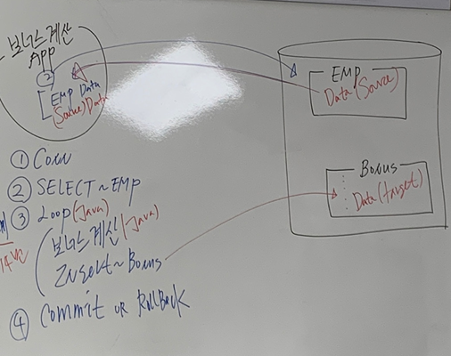

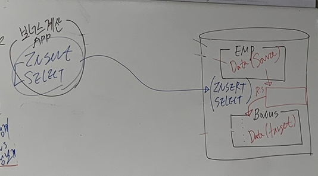

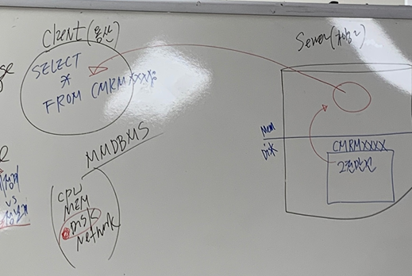


+ SELECT * FROM CMRMXXXX;를 실행했을때 DISK의 데이터를 메모리로 가져온 후, 네트워크를 타고 CLIENT에게 보내준다.
+ CPU, MEMORY, DISK, NETWORK중 CPU, MEMORY, NETWORK는 전자적 신호에 의해 움직이는반면 DISK는 모터로 움직여서 항상 문제를 일으킨다. 우리세대에선 점점 더 많이 SSD 메모리디스크를 채택하고있다. 그래도 여전히 서버 DISK는 모터가 회전하는 하드디스크를 쓴다. 너무 비싸서. 


# :star:TRANSACTION (거래, 처리)

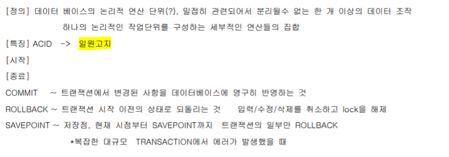


+ :apple:*transaction : a logical unit of work (하나의 논리적인 일의 단위)* - **시험문제**
  + 여러 DML 문장을 가지고 TRANSACTION을 구현한다. 

+ 모델링 3단계

  + 개념 모델링
  + 논리 모델링
  + 물리 모델링

+ :apple:*transaction의 특징 일원고지* - **시험문제**

  + 일관성 (시험에 안나옴)

  + 원자성 

    > all or nothing. 전부 아니면 전무. 더 쪼개질 수 없는 최소 단위 

  + 고립성

    > 더러운거 나만보겠다.

  + 지속성

    > 영구히 저장. 


---


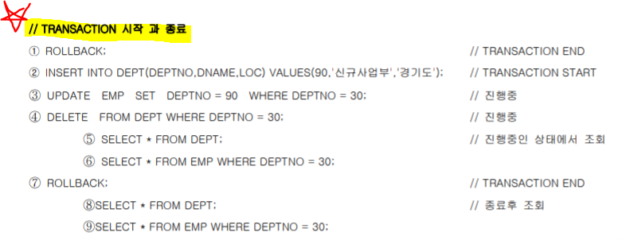


:apple:**transaction의 시작과 종료는 명확히 알고있어야한다.**

+ transaction의 시작 : 첫번째 실행가능한(executable), 변경가능한 sql 실행시.
  + 변경 가능하지 않은 명령어 : select(보여주기만 할 뿐)
+ transaction의 종료 
  + 명시적 종료
    + COMMIT
    + ROLLBACK
  + 암시적 정료

+ 1번 : ROLLBACK : TRANSACTION END
+ 2번 : INSERT : 변경가능한 SQL문이기때문에 TRANSACTION START
+ 3번, 4번. 5번, 6번: TRANSACTION이 진행중. 변경이 진행중인 상태에서 우리가 SELECT를 통해 조회할 수 있나? - **꼭 확인.**
+ 7번 : ROLLBACK : TRANSACTION START 이후에 생긴 모든 변경사항 취소후 TRANSACTION 종료. 
+ 8번, 9번 : 원래 데이터로 돌아가있음을 확인


#### 실습

```SQL
INSERT INTO DEPT(DEPTNO, DNAME, LOC) VALUES(90, '신규사업부', '경기도');
```


```SQL
UPDATE EMP SET DEPTNO = 90 WHERE DEPTNO = 30;
```

6개 행 이(가) 업데이트되었습니다.

```SQL
DELETE FROM DEPT WHERE DEPTNO = 30;
```

1 행 이(가) 삭제되었습니다.

```SQL
SELECT * FROM DEPT;
```

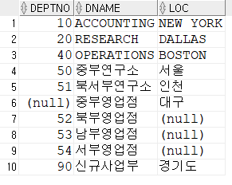

```SQL
SELECT * FROM EMP WHERE DEPTNO = 30;
```


```SQL
ROLLBACK;
```


```SQL
SELECT * FROM DEPT;
SELECT * FROM EMP WHERE DEPTNO = 30;
```

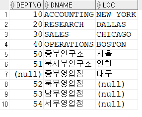

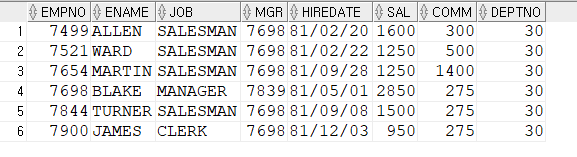

=> ROLLBACK으로 인해 UPDATE, DELETE 등이 취소된것을 확인.


---


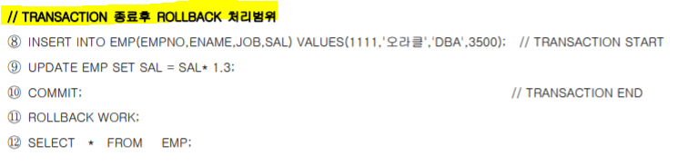


+ 8번 : 새로운 TRANSACTION START
+ 11번 : ROLLBACK WORK : WORK 생략 가능. ANSI 표준일 뿐. ROLLBACK이 수행되지 않는다. TRANSACTION이 10번의 COMMIT에 의해 종료됬기때문에. 
+ 12번 : TRANSACTION과 관련없다. SELECT는 *변경가능한 명령문*이 아니기 때문.


#### 실습

```SQL
INSERT INTO EMP(EMPNO,ENAME,JOB,SAL) VALUES(1111,'오라클','DBA',3500);
```

1 행 이(가) 삽입되었습니다.

```SQL
UPDATE EMP SET SAL = SAL* 1.3;
```

15개 행 이(가) 업데이트되었습니다.

```SQL
COMMIT;
```

커밋 완료.

```SQL
ROLLBACK WORK;
```

=> 이미 COMMIT을 했기때문에 ROLLBACK을 아무리해도 이전으로 돌아가지 않는다.

```SQL
SELECT * FROM EMP;
```

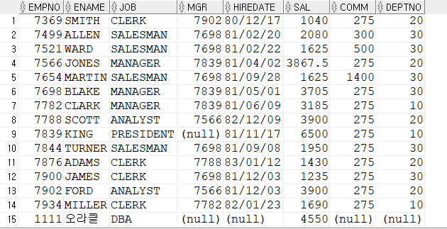

=> ROLLBACK이 실행되지 않고, 새로 INSERT한 오라클 행이 남아있는걸 확인.


---


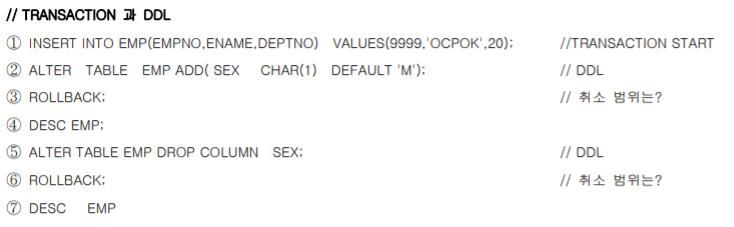


+ 1번 : INSERT - 첫번째 변경가능한 명령문
+ 2번 : ALTER - OBJECT의 구조를 변경함. 
  + CHAR : 고정기. 정해진 글자수가 있다.
  + DEFAULT : 성별에 아무 값이 없으면 기본적으로 M을 넣어라. 
+ 4번 : 테이블 구조가 ROLLBACK되었는지 확인.


#### 실습

```SQL
INSERT INTO EMP(EMPNO,ENAME,DEPTNO) VALUES(9999,'OCPOK',20);
```

1 행 이(가) 삽입되었습니다.

```SQL
ALTER TABLE EMP ADD( SEX CHAR(1) DEFAULT 'M');
```

Table EMP이(가) 변경되었습니다.

```SQL
ROLLBACK;
```

롤백 완료.

```SQL
DESC EMP;
```

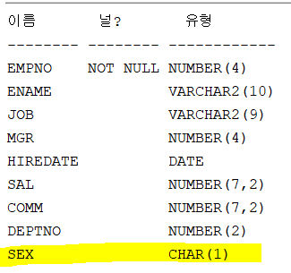

=> ROLLBACK이 안되는걸 확인. 왜? DDL구문이 시작될때 TRANSACTION은 COMMIT을 먼저 떄리면서 이전 TRANSACTION이 종료가 된다. 해당 DDL 구문이 성공적으로 수행되면 오라클이 우리 몰래 COMMIT을 또 때린다. 

=> DDL은 한 문장 자체가 하나의 트랜잭션을 생성. DML은 여러 문장을 묶어서 트랜잭션을 구성할 수 있다.

=> 즉, DDL문은 ROLLBACK이 안된다.

```SQL
ALTER TABLE EMP DROP COLUMN SEX;
```

Table EMP이(가) 변경되었습니다.

```SQL
ROLLBACK;
```

롤백 완료.

```SQL
DESC EMP
```

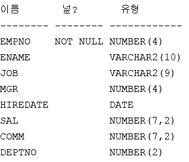

=> 마찬가지로 ALTER도 DDL이기때문에 ROLLBACK 안됨.


## :star:TRANSACTION +

### TRANSACTION의 원자성

+ A가 B에게 500만원을 계좌이체한다고 가정한다.

​								[**계좌이체**]											[**DBMS**]

+ 1. A = A - 500 (A의 계좌에서 500만원 인출) 	=> UPDATE

  2. B = B + 500 (B의 계좌에 500만원 입금)        => UPDATE

  3. A, B의 계좌에 500만원 입출금 기록              => INSERT

     

     만약 첫번째 UPDATE는 성공했으나 두번째 UPDATE는 실패했고, INSERT는 성공했다면 어쨋든 절차중에 하나가 실패했으므로 TRANSACTION 전체를 수행 취소한다. 이것이 바로 ALL OR NOTHING, TRANSACTION의 **"원자성"**이다. 


### TRANSACTION의 암시적 종료


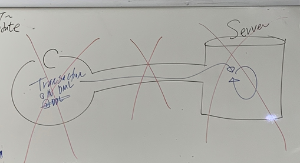


+ 만약 CLIENT가 SERVER에 TRANSACTION을 진행시켜놓은상태에서 CLIENT 프로그램이 비정상 종료를 했을때, DBMS는 이 TRANSACTION을 자동으로 ROLLBACK처리한다. 

+ TRANSACTION이 진행중인데 네트워크가 단절될때 또한 자동으로 ROLLBACK처리한다.
+ TRANSACTION 진행중에 SERVER가 비정상적인 종료를 할 때 또한 자동으로 ROLLBACK 처리한다. 


# :star:ROLLBACK LEVEL

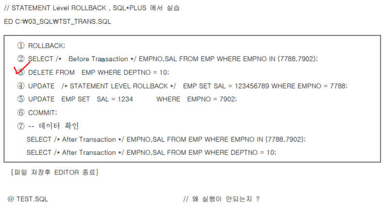

+ 3번 : TRANSACTION START
+ 4번 : 연봉이 1억 2천으로 UPDATE하고싶은데 DESC EMP해보면 SAL의 데이터타입이 NUMBER(7, 2)이다. 7자리수까지만 가능. 데이터모델링할때 중요하다. 쓸데없이 데이터 길이를 길게하면 쓸데없는 데이터가 들어올 수 있다.
+ 6번 : COMMMIT 후 트랜잭션이 제대로 제어되었을까? - 잘 되지 않았다. DELETE문 성공, 4번 UPDATE 실패, 5번 UPDATE 성공. 우리가 원하는대로 제어되진 않았다. 이를 잘 제어하기위해선 BEGIN, END로 묶어주는 PL/SQL을 사용해서 프로그래밍 언어의 힘을 빌려 TRANSACTION을 제어해야한다. 


#### 실습

```SQL
ROLLBACK;
SELECT /* before transaction */ EMPNO, SAL FROM EMP WHERE EMPNO IN (7788, 7902);
```

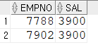

```SQL
DELETE FROM EMP WHERE DEPTNO = 10;
```

3개 행 이(가) 삭제되었습니다.

```SQL
UPDATE /* STATEMENT LEVEL ROLLBACK*/ EMP SET SAL = 123456789 WHERE EMPNO = 7788;
```

명령의 112 행에서 시작하는 중 오류 발생 -
UPDATE /* STATEMENT LEVEL ROLLBACK*/ EMP SET SAL = 123456789 WHERE EMPNO = 7788
오류 보고 -
ORA-01438: 이 열에 대해 지정된 전체 자릿수보다 큰 값이 허용됩니다.

=> 정해진 SAL의 길이보다 큰 값이 들어와 오류발생


```SQL
UPDATE EMP SET SAL = 1234 WHERE EMPNO = 7902;
```

1 행 이(가) 업데이트되었습니다.


```SQL
COMMIT;
```

커밋 완료.

```SQL
 -- 데이터 확인
SELECT /* After Transaction */ EMPNO, SAL FROM EMP WHERE EMPNO IN (7788, 7902);
```

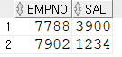

=> 7902 사원의 UPDATE문만 수행된것 확인.


```SQL
SELECT /* After Transaction */ EMPNO, SAL FROM EMP WHERE EMPNO = 10;
```

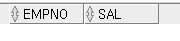

=> DELETE문은 정상 작동된것 확인


---


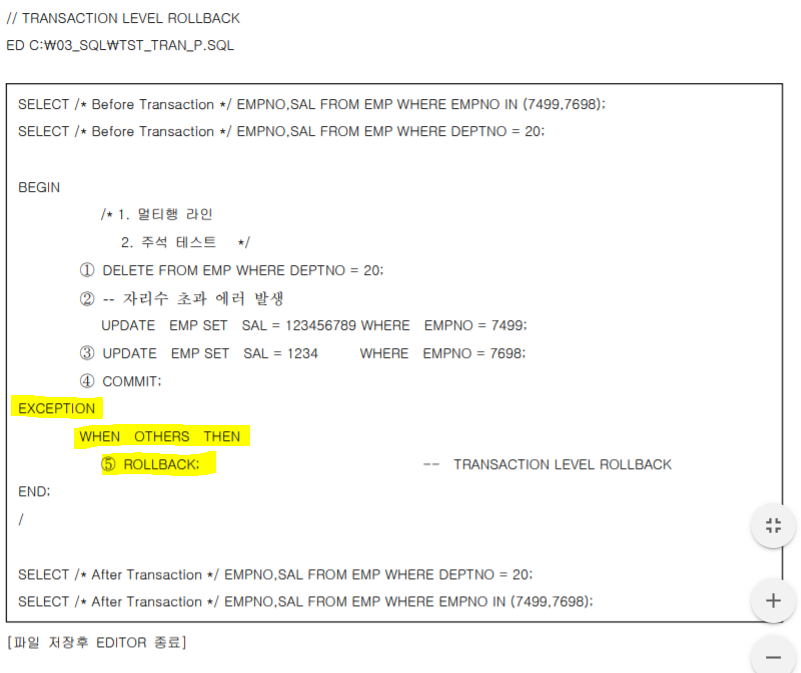


+ PL/SQL : Block으로 구조화된 언어다.

+ begin 부터 end까지로 구조화되었다. 

+ 1번 : TRANSACTION START

+ :apple:*EXCEPTION WHEN OTHERS THEN ROLLBACK;* 

  > SQL문만으로는 트랜잭션을 완벽히 제어할 수 없다. 프로그래밍 언어(PL/SQL)의 에러를 제어하는 기능을 사용했다. 이는 자바의 TRY CATCH 구문 예외처리와 비슷하다. 
  >
  > 2번에서 에러가 났으므로 그 밑을 수행하지 않고 EXCEPTION으로 가서 ROLLBACK을 수행한다. 
  >
  > 2번에서 에러가 나지 않으면 DELETE, UPDATE, UPDATE를 수행하고 COMMIT한다. 
  >
  > EXCEPTION으로 잡지 않을 경우 THROWS로 예외를 던질수도 있다. 마치 자바처럼. 


#### 실습

````SQL
BEGIN
    DELETE FROM EMP WHERE DEPTNO = 20;
    -- 자리수 초과 에러 발생
    UPDATE EMP SET SAL = 123456789 WHERE EMPNO = 7499;
    UPDATE EMP SET SAL = 1234 WHERE EMPNO = 7698;
    COMMIT;
EXCEPTION
    WHEN OTHERS THEN
    ROLLBACK;
END;
````

PL/SQL 프로시저가 성공적으로 완료되었습니다.

```SQL
SELECT /*After Transaction*/ EMPNO, SAL FROM EMP WHERE DEPTNO = 20;
```

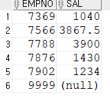

```SQL
SELECT /*After Transaction*/ EMPNO, SAL FROM EMP WHERE EMPNO IN (7499, 7698);
```

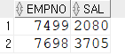

=> 어차피 첫번째 UPDATE에서 오류가나서 COMMIT되지않고 ROLLBACK됨.

=> 만약 EXCEPTION으로 잡아주지 않으면 블록 밖으로 예외를 던진다. 던지고 던지다 해결이 안되면 어플리케이션이 죽게되고, 그렇게되면 클라이언트 가 죽게된다.

=> DBMS가 자동으로 ROLLBACK하는건 좋지않고, 우리가 명확하게 제어해주는게 중요하다.


