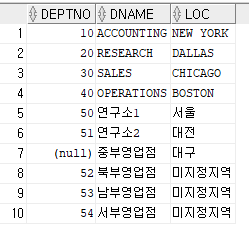
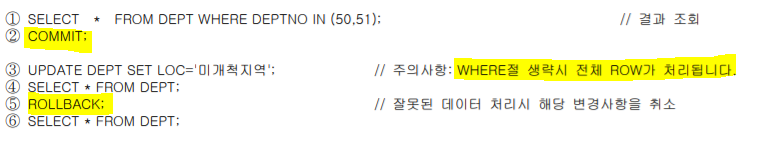
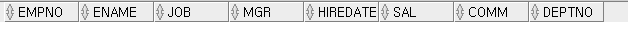

[toc]


# IT 용어사전

+ CACHE


# 과제

1. **SELECT ~ FOR UPDATE의 기능 및 트랜잭션 시작/종료를 설명하십시오.**

+ 데이터를 수정하려고 SELECT하는중이야~ 다른 사람들은 데이터에 손대지마! 

+ 동시성 제어를 위하여 특정 데이터(row)에 대해 배타적 lock을 거는 기능

+ 여기서 사용자 A와 사용자 B가 월E를 예매하려 동시에 데이터에 접근합니다. A가 잔여좌석 정보를 SELECT하고 예매를 완료하면서 잔여좌석은 1 줄어든 11로 UPDATE 하려합니다. 그런데 그 사이에 B 사용자 또한 예매를 위해 SELECT하였고 A와 마찬가지로 잔여좌석 12를 얻어 예매를 완료하면서 1 줄어든 11로 업데이트 합니다. 결론적으로는 두 명의 영화 예매가 진행되었지만 잔여좌석은 1만 줄어들게 되었습니다.

+ SELECT ~ FOR UPDATE를 실행하면 특정 세션이 데이터에 대해 수정을 할 때까지 LOCK이 걸려 다른 세션이 데이터에 접근할 수 없습니다.

  + ex) SELECT SEAT FROM MOVIE WHERE MOVIE_NUM = 4 FOR UPDATE;

+ 이번에는 A 사용자가 SELECT ~ FOR UPDATE를 실행하여 잔여 좌석정보를 SELECT 했고 해당 ROW는 다른 세션들이 접근할 수 없는 LOCK이 걸립니다. 이때 B가 SELECT로 접근하려 해도 A가 LOCK을 가지고 있기에 A가 LOCK을 풀어줄 때까지 대기상태에 빠집니다.

  이후 A가 잔여좌석 수를 UPDATE하면서 LOCK이 풀리고 B는 SELECT 및 UPDATE가 가능해집니다.

+ 중요한 것은 DBMS마다 Lock을 구현하는 방식과 세부적인 기능이 많이 다르다는 사실이다. 따라서 자신이 사용하고 있는 DBMS만의 독특한 Lock 메커니즘을 정확히 이해하지 못한 상태에선 결코 고품질 데이터베이스를 구축할 수 없다.

+ 1) 공유 Lock

  공유(Shared) Lock은 데이터를 읽고자 할 때 사용된다. 다른 공유 Lock과는 호환되지만 배타적 Lock과는 호환되지 않는다. ‘호환된다’는 말은 한 리소스에 두 개 이상의 Lock을 동시에 설정할 수 있음을 뜻한다. 다시 말해, 공유 Lock을 설정한 리소스에 다른 트랜잭션이 추가로 공유 Lock을 설정할 수는 있지만 배타적 Lock은 불가능하다. 따라서 자신이 읽고 있는 리소스를 다른 사용자가 동시에 읽을 수는 있어도 변경은 불가능하다. 반대로, 다른 사용자가 읽고 있는 리소스를 동시에 읽을 수는 있어도 변경 중인 리소스를 동시에 읽을 수는 없다.

  2) 배타적 Lock

  배타적(Exclusive) Lock은 데이터를 변경하고자 할 때 사용되며, 트랜잭션이 완료될 때까지 유지된다. 말 그대로 배타적이기 때문에 그 Lock이 해제될 때까지 다른 트랜잭션은 해당 리소스에 접근할 수 없다. 변경이 불가능할 뿐만 아니라 읽기도 불가능하다. 반대로, 다른 트랜잭션에 의해 Lock이 설정된 리소스는, 그것이 공유 Lock이든 배타적 Lock이든, 배타적 Lock을 동시에 설정할 수 없다.

  - 블로킹

  \- 블로킹(Blocking)은, Lock경합이 발생하여 특정 세션이 작업을 진행하지 못하고 멈춘 상태를 말한다. 공유 Lock끼리는 호환되기 때문에 블로킹이 발생하지 않는다. 블로킹 상태를 해소하는 방법은 커밋(또는 롤백)이다. - Lock에 의한 성능 저하를 최소화하는 방안. - 트랜잭션의 원자성을 훼손하지 않는 선에서 트랜잭션을 가능한 짧게 정의한다. Oracle은 데이터를 읽을 때 공유 Lock을 사용하지 않기 때문에 다른 DBMS에 비해 상대적으로 Lock경합이 적게 발생한다. - 같은 데이터를 갱신하는 트랜잭션이 동시에 수행되지 않도록 설계한다. - 사용자가 무한정 기다리지 않도록 적절한 프로그래밍 기법을 적용한다. Lock에 대한 대기시간 제한을 설정한다. - 트랜잭션 격리성 수준을 불필요하게 상향 조정하지 않는다. - SQL 문장이 가장 빠른 시간내에 처리되도록 한다.

  - 교착상태

  \- 교착상태(DeadLock)는 두 세션이 각각 Lock을 설정한 리소스를 서로 액세스하려고 마주보며 진행하는 상황을 말한다. 즉 둘 중 하나가 물러나지 않으면 교착상태를 풀 수 없다. - 테이블 접근 순서를 같게 처리하면 교착상태를 피할 수 있다.

+ 비관적 동시성 제어 / 낙관적 동시성 제어

  + 비관적 동시성 제어

    + ```
      - 비관적 동시성제어는 사용자들이 같은 데이터에 대해서 동시에 수정할 것이라고 가정한다. 따라서 데이터를 읽는 시점에 Lock을 걸고 트랜잭션이 완료될 때까지 이를 유지한다.
      ```

    낙관적 동시성 제어

    ​	사용자들이 같은 데이터를 동시에 수정하지 않을것이라고 가정한다. 따라서 데이터를 읽을때는 Lock을 설정하지 않는다.

    

2. **OLAP, OLTP와 계정계, 정보계를 설명하라.** 


### **1) 계정계 (Core Banking)**

은행의 전통적인 핵심 업무는 통장이 중심이 됩니다.
이 통장을 계좌, 계정이라고 합니다.
계정을 관리하는 시스템이 모여 있다보니 “계정계”라고 부릅니다.

한 사람이 여러 개의 통장을 만들 수도 있고,
돌아가신 분의 통장도 있기 때문에
기본 데이터가 1억건이 가뿐히 넘습니다.
통장별 거래기록을 포함하면 수백억건의 데이터가 기본적으로 있습니다.

계정계 데이터는 곧 돈과 거래기록이기 때문에,
“시스템장애”는 바로 금전적 피해로 이어집니다.
따라서 데이터를 2중, 3중으로 백업하며
시스템이 매우 보수적으로 운영됩니다.

계정계 시스템은
“공통업무, 수신업무, 신탁업무,
보험업무, 카드업무, 여신업무,
외환업무, 대행업무 시스템” 등으로 구성됩니다.
대부분 마스터테이블인 거대한 원장들이 있고,
다양한 업무를 처리하는 정형화된 트랜잭션들이 있습니다.

원장이란 오래된 용어로 “근원이 되는 장부”라는 뜻입니다.
옛날에는 현장에서 노트로 기록하고,
사무실로 돌아가서 메인 장부에 옮겨 적었거든요.

전산도입 이후에도 “원장”개념은 그대로 사용됩니다.
통장잔액이 중복관리되면 지급오류가 생길 수 있으니까요.

기본적으로 원장에 트랜잭션이 집중되는 구조이기 때문에,
안정적으로 트랜잭션을 처리하기 위한 미들웨어Middleware가 발달해 있습니다.

많은 은행들이 초기엔 IBM Mainframe 을 사용했으며,
2000년대 중반 Unix로 이전하였습니다.
Mainframe 시절엔 COBOL을 사용했지만,
차세대를 통해 대부분 C로 옮겨갑니다.
Java가 최초로 도입된 건 2013년 (전북은행)일 정도로 굉장히 보수적으로 운용됩니다.

반면, 기존시스템 부담이 적은 보험회사는 일찌감치 Java를 도입하기도 합니다.

### **2) 정보계**

정보계. 고객정보, 분석정보 등을 말합니다.
정보가 듬뿍 들어있어서 “정보계”라고 부릅니다.
거래활동 및 성과를 분석하고 측정하기 위한 목적으로 구축되었습니다.

주요시스템으로 데이터웨어하우스를 기반으로 하는
수익관리, 고객관계관리, 성과관리, 위험관리 시스템 등이 있습니다.
정보계는 단순히 궁금증을 해결하는 수준이 아니라,
영업정보에서 기업전략 정보까지 포함하기 때문에
“계정계”만큼 중요한 시스템입니다.

정보계는 1980년대 은행업무가 발전하면서 개념이 등장합니다.
우리나라에선 1993년 금융실명제 도입으로 위상이 급격히 올라갑니다.
한 사람이 몇개의 통장을 가지고 있는지 조회해야 했거든요.
이전에는 그렇게 할 수 없었습니다.
해당 통장이 없으면 돈을 뽑을 수도 없었죠.


기본적으로 정보연계, 통합조회, 통계분석 등을 많이 하기 때문에
관계형 데이터베이스 사용이 필수입니다.
분석을 위한 데이터 동기화기술도 많이 사용됩니다.

비교적 늦게 시작했기 때문에 Java 기반으로 구축된 곳이 많으며,
최근에는 빅데이터기술도 많이 검토되고 있습니다.


## **3) 기술적 특징들**

트랜잭션이 돈 처리를 의미하는 것이기 때문에 오류에 민감합니다.
소수점 처리에도 민감합니다.
0.01원 반올림오류가 1억원의 피해로 이어지기도 합니다.
오류가 일결산에서 확인이 안되고,
월결산이나 연결산에서 발견되기도 합니다.
수십억씩 이자지급이 된 이후라면 회수할 수도 없죠.

따라서 거래 쪽은 빠른 개발이나 배포보다는,
안정적인 개발과 배포를 중요하게 생각합니다.
금융분야는 IT문화도 전체적으로 그렇다고 볼 수 있습니다.


은행업무는 안정되어 있어 변화가 적고 데이터도 정형화되어 있습니다.
그래서 “프로세스설계”와 “데이터설계”가 매우 중요하게 다루어집니다.

기존 시스템을 쉽게 폐기할 수 없기 때문에,
계속 확장을 통해 기능을 구현하는 편입니다.
이기종 DB나 복잡하게 시스템이 얽혀 있는 N-Tier 환경이 대부분이죠.
그래서 ORM이 오래전부터 사용되었습니다.

인터넷 뱅킹이 24시간*365일로 운영되긴 하지만,
대부분 주간에는 금융거래 중심의 트랜잭션들이 일어나고,
야간에는 대형 배치처리, 시스템간 데이터 전송이 많이 일어납니다.

사소한 변경이 큰 금전적 피해로 이어질 수 있기 때문에,
수정사항이 있더라도 영향도를 체크한 후에 움직이는 편이며,
가능하면 시스템수정은 기피하는 경향이 있습니다.

유지보수가 중요하기 때문에 기술지원이 안정적인 솔루션들과,
피해를 책임질 수 있는 전문업체를 선호하는 경향이 있습니다.
그래서 신기술 도입이 더딥니다.

덩치는 큰데 빠르게 움직이고 싶은게 숙제입니다.
그래서 SOA 패턴을 제일 먼저 시도한 분야기도 합니다.

데이터 작업이 많고 처리 속도가 중요한 편이라,
서버작업에는 Oracle과 Pro*C 가 많이 사용됩니다.
최근에는 계정계를 제외하고는 Java가 많이 도입되어 있습니다.

꼭 필요하지 않으면 도전적인 기술을 사용하지 않기 때문에,
기술보다는 ‘은행 업무’를 얼마나 잘 이해하고 있느냐가
경력자 채용의 중요한 기준이 됩니다.
은행업무를 모르면 비즈니스 로직을 짤 수 없기 때문입니다.
(일일히 가르쳐 줄 수도 없고)


# 개별 ID, PASSWORD

```SQL
SELECT*FROM DA13.EMP;
ALTER USER DA13 IDENTIFIED BY yellow94; -- 계정 비밀번호 바꾸기
SHOW USER; -- 현재 접속하고있는 계정 보기
```


```SQL
SELECT * FROM V$SESSION; -- DBA만 접속중인 세션을 모두 확인할 수 있다. 세션이 하고있는 쿼리, 기기 등을 다 볼 수 있다. 
```


# INSERT

;
```


```SQL
INSERT INTO DEPT(DEPTNO,DNAME,LOC) VALUES(51,'연구소2','대전');
```


```SQL
SELECT * FROM DEPT;
```


```SQL
INSERT INTO DEPT VALUES('중부영업점','대구');
```


=> 세개의 칼럼이 VALUES로 들어와야하는데 두개만 들어와서 자동 NULL이 되지 않는다. 칼럼명을 안써주고 VALUE만 써줄경우 생략을 할시 자동으로 NULL이 되지 않는다.


```SQL
INSERT INTO DEPT(DNAME,LOC) VALUES('중부영업점','대구');
```


=> 칼럼도 두개, 값도 두개라 나머지 DEPTNO는 자동으로 NULL이 되지만, 이번에는 '중부영업점'의 길이가 최대값인 14보다 크다.


```SQL
ALTER TABLE DEPT MODIFY DNAME VARCHAR(20);
```

=> ALTER TABLE로 DNAME의 최대값을 20으로 늘려준후 다시 위 명령문 삽입시 성공적으로 삽입된다. 


```SQL
-- INSERT에 NULL삽입방법
	-- EXPLICIT
INSERT INTO DEPT(DEPTNO,DNAME,LOC) VALUES(52, '북부영업점',NULL); 
INSERT INTO DEPT(DEPTNO,DNAME,LOC) VALUES(53, '남부영업점','');
	-- IMPLICIT
INSERT INTO DEPT(DEPTNO,DNAME) VALUES(54,'서부영업점');
```


```SQL
SELECT DEPTNO,DNAME,NVL(LOC,'미지정지역') AS LOC FROM DEPT; 
COMMIT;
```




# UPDATE


+ WHERE절을 이용해서 특정 데이터를 찾아서 변경한다.
+ 11번은 한개의 COLUMN만, 12번은 두개의 COLUMN을 수정한다. 





+ COMMIT : 방금 수정한 데이터들을 영구히 저장하겠다. 
+ 3번 : WHERE절이 없다. SELECT문에서 WHERE절이 없으면 전체데이터를 보여줬다. UPDATE에서 WHERE절이 없으면 전체 데이터를 수정하는 것이다. 주의해야한다.
+ ROLLBACK의 원리에 대해 고민해보기. 


#### 실습

```SQL
UPDATE DEPT SET DNAME = '중부연구소' WHERE DEPTNO = 50;
UPDATE DEPT SET DNAME = '북서부연구소', LOC='인천' WHERE DEPTNO = 51;
```


```SQL
SELECT * FROM DEPT WHERE DEPTNO IN (50,51);
COMMIT;
```


```SQL
UPDATE DEPT SET LOC='미개척지역';
SELECT * FROM DEPT;
```


=> WHERE절이 안나오면 모든 행을 바꾼다.

```SQL
ROLLBACK;
SELECT * FROM DEPT;
```


=> 롤백하면 마지막으로 커밋했던 시점으로 다시 돌아간다. 


# DELETE


+ UPDATE처럼, DELETE도 데이터를 찾아서 삭제한다.


#### 실습

```SQL
DELETE FROM DEPT WHERE LOC IS NULL;
```

3개 행 이(가) 삭제되었습니다.

```SQL
DELETE DEPT;
```

7개 행 이(가) 삭제되었습니다.

WHERE절 없으면 전체 행이 삭제됨

```SQL
SELECT * FROM DEPT;
```


모든 행이 사라진것 확인

```SQL
ROLLBACK;
```


# MERGE (9i의 new feature)

+ MERGE : INSERT와 UPDATE의 합성. 같


# DML과 SUBQUERY


+ 5번 : VALUE절 대신 서브쿼리가 나옴. EMP테이블의 14개행이 한번에 BONUS로 들어간다. 
+ 9번 : VALUE절 대신 서브쿼리가 나왔는데, 서브쿼리에 DECODE와 NVL을 활용하고 WHERE로 조건까지 걸었다. 
+ 12번 : COMMIT을 이미 했기때문에 ROLLBACK이 안먹힌다. 


+ 13번 : null과 0은 다르다. 


#### 실습

```SQL
INSERT INTO BONUS(ENAME,JOB,SAL,COMM)
SELECT ENAME,JOB,SAL,COMM FROM EMP;

SELECT * FROM BONUS;
```


```SQL
INSERT INTO BONUS(ENAME, JOB, SAL, COMM)
    SELECT ENAME, JOB, SAL, DECODE(DEPTNO, 10, SAL*0.3, 20, SAL*0.2) + NVL(COMM, 0)
    FROM EMP
    WHERE DEPTNO IN (10,20);
```


```SQL
COMMIT;
ROLLBACK;
```

=> COMMIT을 이미 했기때문에 아무리 ROLLBACK해도 전으로 돌아가지 않는다.


```SQL
UPDATE EMP SET COMM = (SELECT AVG(COMM)/2 FROM EMP)
WHERE COMM IS NULL OR COMM = 0;

SELECT * FROM EMP;
```


=> COMMISSION이 없던 사람들이 전체 COMMISSION 평균의 50%를 받게됨.


```SQL
DELETE FROM BONUS WHERE SAL > (SELECT AVG(SAL) FROM EMP);
```


```SQL
COMMIT;
```


CF) DBA라하더라도 계정의 비밀번호를 볼 순 없다. 하지만 강제로 바꿔버릴순 있다.


# SCALAR SUBQUERY

같은 쿼리가 발생하면 실행하지 않고, 실행 결과를 재사용한다. 실행 결과를 재사용하는데 캐시가 어떻게 적용되는가? 


+ 만약 SCALAR SUBQUERY가 행마다 다 시행된다면 14번이 수행되게되고, 데이터가 14만건이라면 14만번 수행되게된다.
+ 하지만 SCALAR SUBQUERY는 연산의 결과를 CACHE 메모리에 저장해두었다가 JOB이 같은 아이가 나타나면 연산해두었던 해당 JOB의 JOB_AVG_SAL을 기억해두었다가 반환한다. 그렇기때문에 속도가 결코 느리지 않다. 
+ QUERY EXECUTION CACHING을 통해 쿼리 실행 결과를 캐쉬메모리에 저장해놓고 JOB이 같은것이 나왔을때 재활용한다.
+ 그래서 SCALAR SUBQUERY는 호출할때마다 실행되는게 아니라 캐쉬메모리를 불러준다. 4
+ QUERY EXECUTION CACHING 테이블은 곧 HASH TABLE이다.  HASH FUNCTION을 이용해 HASH TABLE에 있는 데이터의 위치를 검색하고 데이터를 집어넣고 빼는 역할을 한다. 
+ 만약 JOB이 CLERK인 사람의 평균을 구한다고 했을때, 서브쿼리의 S.EMP의 CLERK 한명이 메인쿼리의 M.EMP의 CLERK N명과 JOB이 같은지 비교하고, 모든 CLERK들과 AVG 함수를 수행한다. 그 평균값을 해쉬테이블에 저장해, S.EMP에서 다음 CLERK으로 넘어갈때 다시 M.EMP와 비교하지 않고 구해놓은 평균값을 가져다 쓴다. 


# JDBC-SQL 프로젝트


+ SELECT * FROM CMRMXXXX;를 실행했을때 DISK의 데이터를 메모리로 가져온 후, 네트워크를 타고 CLIENT에게 보내준다.
+ CPU, MEMORY, DISK, NETWORK중 CPU, MEMORY, NETWORK는 전자적 신호에 의해 움직이는반면 DISK는 모터로 움직여서 항상 문제를 일으킨다. 우리세대에선 점점 더 많이 SSD 메모리디스크를 채택하고있다. 그래도 여전히 서버 DISK는 모터가 회전하는 하드디스크를 쓴다. 너무 비싸서. 


# :star:TRANSACTION (거래, 처리)


+ :apple:*transaction : a logical unit of work (하나의 논리적인 일의 단위)* - **시험문제**
  
+ 여러 DML 문장을 가지고 TRANSACTION을 구현한다. 
  
+ 모델링 3단계

  + 개념 모델링
  + 논리 모델링
  + 물리 모델링

+ :apple:*transaction의 특징 일원고지* - **시험문제**

  + 일관성 (시험에 안나옴)

  + 원자성 

    > all or nothing. 전부 아니면 전무. 더 쪼개질 수 없는 최소 단위 

  + 고립성

    > 더러운거 나만보겠다.

  + 지속성

    > 영구히 저장. 


---


:apple:**transaction의 시작과 종료는 명확히 알고있어야한다.**

+ transaction의 시작 : 첫번째 실행가능한(executable), 변경가능한 sql 실행시.
  + 변경 가능하지 않은 명령어 : select(보여주기만 할 뿐)
+ transaction의 종료 
  + 명시적 종료
    + COMMIT
    + ROLLBACK
  + 암시적 정료

+ 1번 : ROLLBACK : TRANSACTION END
+ 2번 : INSERT : 변경가능한 SQL문이기때문에 TRANSACTION START
+ 3번, 4번. 5번, 6번: TRANSACTION이 진행중. 변경이 진행중인 상태에서 우리가 SELECT를 통해 조회할 수 있나? - **꼭 확인.**
+ 7번 : ROLLBACK : TRANSACTION START 이후에 생긴 모든 변경사항 취소후 TRANSACTION 종료. 
+ 8번, 9번 : 원래 데이터로 돌아가있음을 확인


#### 실습

```SQL
INSERT INTO DEPT(DEPTNO, DNAME, LOC) VALUES(90, '신규사업부', '경기도');
```


```SQL
UPDATE EMP SET DEPTNO = 90 WHERE DEPTNO = 30;
```

6개 행 이(가) 업데이트되었습니다.

```SQL
DELETE FROM DEPT WHERE DEPTNO = 30;
```

1 행 이(가) 삭제되었습니다.

```SQL
SELECT * FROM DEPT;
```


```SQL
SELECT * FROM EMP WHERE DEPTNO = 30;
```




```SQL
ROLLBACK;
```


```SQL
SELECT * FROM DEPT;
SELECT * FROM EMP WHERE DEPTNO = 30;
```


=> ROLLBACK으로 인해 UPDATE, DELETE 등이 취소된것을 확인.


---


+ 8번 : 새로운 TRANSACTION START
+ 11번 : ROLLBACK WORK : WORK 생략 가능. ANSI 표준일 뿐. ROLLBACK이 수행되지 않는다. TRANSACTION이 10번의 COMMIT에 의해 종료됬기때문에. 
+ 12번 : TRANSACTION과 관련없다. SELECT는 *변경가능한 명령문*이 아니기 때문.


#### 실습

```SQL
INSERT INTO EMP(EMPNO,ENAME,JOB,SAL) VALUES(1111,'오라클','DBA',3500);
```

1 행 이(가) 삽입되었습니다.

```SQL
UPDATE EMP SET SAL = SAL* 1.3;
```

15개 행 이(가) 업데이트되었습니다.

```SQL
COMMIT;
```

커밋 완료.

```SQL
ROLLBACK WORK;
```

=> 이미 COMMIT을 했기때문에 ROLLBACK을 아무리해도 이전으로 돌아가지 않는다.

```SQL
SELECT * FROM EMP;
```


=> ROLLBACK이 실행되지 않고, 새로 INSERT한 오라클 행이 남아있는걸 확인.


---


+ 1번 : INSERT - 첫번째 변경가능한 명령문
+ 2번 : ALTER - OBJECT의 구조를 변경함. 
  + CHAR : 고정기. 정해진 글자수가 있다.
  + DEFAULT : 성별에 아무 값이 없으면 기본적으로 M을 넣어라. 
+ 4번 : 테이블 구조가 ROLLBACK되었는지 확인.


#### 실습

```SQL
INSERT INTO EMP(EMPNO,ENAME,DEPTNO) VALUES(9999,'OCPOK',20);
```

1 행 이(가) 삽입되었습니다.

```SQL
ALTER TABLE EMP ADD( SEX CHAR(1) DEFAULT 'M');
```

Table EMP이(가) 변경되었습니다.

```SQL
ROLLBACK;
```

롤백 완료.

```SQL
DESC EMP;
```


=> ROLLBACK이 안되는걸 확인. 왜? DDL구문이 시작될때 TRANSACTION은 COMMIT을 먼저 떄리면서 이전 TRANSACTION이 종료가 된다. 해당 DDL 구문이 성공적으로 수행되면 오라클이 우리 몰래 COMMIT을 또 때린다. 

=> DDL은 한 문장 자체가 하나의 트랜잭션을 생성. DML은 여러 문장을 묶어서 트랜잭션을 구성할 수 있다.

=> 즉, DDL문은 ROLLBACK이 안된다.

```SQL
ALTER TABLE EMP DROP COLUMN SEX;
```

Table EMP이(가) 변경되었습니다.

```SQL
ROLLBACK;
```

롤백 완료.

```SQL
DESC EMP
```


=> 마찬가지로 ALTER도 DDL이기때문에 ROLLBACK 안됨.


## :star:TRANSACTION +

### TRANSACTION의 원자성

+ A가 B에게 500만원을 계좌이체한다고 가정한다.

​								[**계좌이체**]											[**DBMS**]

+ 1. A = A - 500 (A의 계좌에서 500만원 인출) 	=> UPDATE

  2. B = B + 500 (B의 계좌에 500만원 입금)        => UPDATE

  3. A, B의 계좌에 500만원 입출금 기록              => INSERT

     

     만약 첫번째 UPDATE는 성공했으나 두번째 UPDATE는 실패했고, INSERT는 성공했다면 어쨋든 절차중에 하나가 실패했으므로 TRANSACTION 전체를 수행 취소한다. 이것이 바로 ALL OR NOTHING, TRANSACTION의 **"원자성"**이다. 


### TRANSACTION의 암시적 종료


+ 만약 CLIENT가 SERVER에 TRANSACTION을 진행시켜놓은상태에서 CLIENT 프로그램이 비정상 종료를 했을때, DBMS는 이 TRANSACTION을 자동으로 ROLLBACK처리한다. 

+ TRANSACTION이 진행중인데 네트워크가 단절될때 또한 자동으로 ROLLBACK처리한다.
+ TRANSACTION 진행중에 SERVER가 비정상적인 종료를 할 때 또한 자동으로 ROLLBACK 처리한다. 


# :star:ROLLBACK LEVEL


+ 3번 : TRANSACTION START
+ 4번 : 연봉이 1억 2천으로 UPDATE하고싶은데 DESC EMP해보면 SAL의 데이터타입이 NUMBER(7, 2)이다. 7자리수까지만 가능. 데이터모델링할때 중요하다. 쓸데없이 데이터 길이를 길게하면 쓸데없는 데이터가 들어올 수 있다.
+ 6번 : COMMMIT 후 트랜잭션이 제대로 제어되었을까? - 잘 되지 않았다. DELETE문 성공, 4번 UPDATE 실패, 5번 UPDATE 성공. 우리가 원하는대로 제어되진 않았다. 이를 잘 제어하기위해선 BEGIN, END로 묶어주는 PL/SQL을 사용해서 프로그래밍 언어의 힘을 빌려 TRANSACTION을 제어해야한다. 


#### 실습

```SQL
ROLLBACK;
SELECT /* before transaction */ EMPNO, SAL FROM EMP WHERE EMPNO IN (7788, 7902);
```


```SQL
DELETE FROM EMP WHERE DEPTNO = 10;
```

3개 행 이(가) 삭제되었습니다.

```SQL
UPDATE /* STATEMENT LEVEL ROLLBACK*/ EMP SET SAL = 123456789 WHERE EMPNO = 7788;
```

명령의 112 행에서 시작하는 중 오류 발생 -
UPDATE /* STATEMENT LEVEL ROLLBACK*/ EMP SET SAL = 123456789 WHERE EMPNO = 7788
오류 보고 -
ORA-01438: 이 열에 대해 지정된 전체 자릿수보다 큰 값이 허용됩니다.

=> 정해진 SAL의 길이보다 큰 값이 들어와 오류발생

=> statement level rollback : 엄밀히 말하면 조건절에 해당하는 레코드가 예를들어 deptno = 10일 때, 이에 해당하는 행이 3개가 있다고 치자. 이 때 deptno = 10인 행들을 모두 바꿔주다가 마지막 세번째 행에서 문자 길이가 안맞아 오류가 났다. 이 때는 이미 바꿔준 처음의 두 행도 변경을 취소시키고 rollback해줘야한다. 이를 statement level rollback이라 하고, 아예 트랜잭션을 rollback해줘야하는 상황을 transaction roll back이라 한다. 


```SQL
UPDATE EMP SET SAL = 1234 WHERE EMPNO = 7902;
```

1 행 이(가) 업데이트되었습니다.


```SQL
COMMIT;
```

커밋 완료.

```SQL
 -- 데이터 확인
SELECT /* After Transaction */ EMPNO, SAL FROM EMP WHERE EMPNO IN (7788, 7902);
```


=> 7902 사원의 UPDATE문만 수행된것 확인.


```SQL
SELECT /* After Transaction */ EMPNO, SAL FROM EMP WHERE EMPNO = 10;
```


=> DELETE문은 정상 작동된것 확인


---


+ PL/SQL : Block으로 구조화된 언어다.

+ begin 부터 end까지로 구조화되었다. 

+ 1번 : TRANSACTION START

+ :apple:*EXCEPTION WHEN OTHERS THEN ROLLBACK;* 

  > SQL문만으로는 트랜잭션을 완벽히 제어할 수 없다. 프로그래밍 언어(PL/SQL)의 에러를 제어하는 기능을 사용했다. 이는 자바의 TRY CATCH 구문 예외처리와 비슷하다. 
  >
  > 2번에서 에러가 났으므로 그 밑을 수행하지 않고 EXCEPTION으로 가서 ROLLBACK을 수행한다. 
  >
  > 2번에서 에러가 나지 않으면 DELETE, UPDATE, UPDATE를 수행하고 COMMIT한다. 
  >
  > EXCEPTION으로 잡지 않을 경우 THROWS로 예외를 던질수도 있다. 마치 자바처럼. 
  >
  > 자바에서 예외처리를 catch로 '잡아준다'라고 표현하는것처럼, sql에서도 exception에서 예외를 완벽히 처리해줄순 없다. 그저, 잡아주고 프로그램을 지속시킬뿐. 그래서 exception에는 rollback말고도 다양한 방법이 올 수 있다. 
  >
  > 그렇다면 2번에서 에러가 발생해서 exception으로 넘어가 rollback이 되면 1번의 delete문은 그대로 반영이 될까? - pl/sql 시간에 더 배운다. 


#### 실습

````SQL
BEGIN
    DELETE FROM EMP WHERE DEPTNO = 20;
    -- 자리수 초과 에러 발생
    UPDATE EMP SET SAL = 123456789 WHERE EMPNO = 7499;
    UPDATE EMP SET SAL = 1234 WHERE EMPNO = 7698;
    COMMIT;
EXCEPTION
    WHEN OTHERS THEN
    ROLLBACK;
END;
````

PL/SQL 프로시저가 성공적으로 완료되었습니다.

```SQL
SELECT /*After Transaction*/ EMPNO, SAL FROM EMP WHERE DEPTNO = 20;
```


```SQL
SELECT /*After Transaction*/ EMPNO, SAL FROM EMP WHERE EMPNO IN (7499, 7698);
```


=> 어차피 첫번째 UPDATE에서 오류가나서 COMMIT되지않고 ROLLBACK됨.

=> 만약 EXCEPTION으로 잡아주지 않으면 블록 밖으로 예외를 던진다. 던지고 던지다 해결이 안되면 어플리케이션이 죽게되고, 그렇게되면 클라이언트 가 죽게된다.

=> DBMS가 자동으로 ROLLBACK하는건 좋지않고, 우리가 명확하게 제어해주는게 중요하다.


