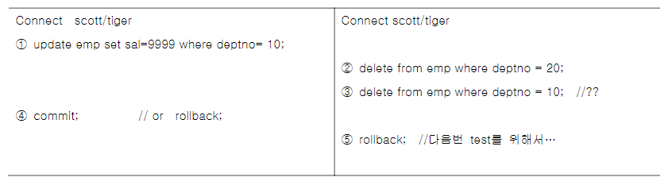

[TOC]


# IT 용어사전

+ LOG


# TRANSACTION과 읽기일관성(READ CONSISTENCY)


```SQL
SELECT * FROM V$STAT;
```

권한이 없음을 확인.

< SESSION 1>

```SQL
/*(1)*/
UPDATE EMP SET SAL = 0 WHERE DEPTNO = 20;
```


```SQL
/*(3)*/
SELECT DEPTNO, ENAME, SAL FROM EMP
WHERE DEPTNO = 20;
```


=> 변경된것 확인

```SQL
/*(4)*/
COMMIT;
```


```SQL
/*(6) 3번 재실행 */
```


< SESSION 2>

```SQL
/*(2)*/
SELECT DEPTNO, ENAME, SAL FROM EMP 
WHERE DEPTNO = 20;
```


```SQL
/*(5) 위 쿼리 재실행 */
```


=> SESSION 1에서 COMMIT하니 SESSION2에도 반영됨

=> 변경이 진행되는 불안정한 상태의 데이터는 계정이 아니라 변경을 한 세션만 볼 수 있다. 내 세션을 제외한 다른 세션은 변경 전의 데이터를 본다. 

=> :apple:**트랜잭션의 고립성** : 변경이 진행중인 데이터는 나 이외에는 볼 수 없다.


## UPDATE가 수행되는 로직 


+ *CPU : 연산하는놈*
  + CPU가 연산하려면 데이터는 반드시 메모리에 있어야한다.
  + 메모리까지 올라온 SCOTT의 SAL을 CPU가 가지고 SCOTT의 SAL은 3000이 아니라 3억이야! 라고 연산한다. 
  + 그렇기때문에 CPU 안에는 연산하는놈도 필요하지만 메모리도 필요하다. 이를 CPU CACHE라고 한다.  
+ *메모리 : 잠깐 저장하는놈*
  + SCOTT의 SAL을 가지고 CPU에서 연산하기위해서 DISK에 있던 데이터가 메모리로 올라온다. (PHYSICAL READ - 디스크에서 메모리로 읽어온 것, 끌어온 것)
  + 이때의 SCOTT의 SAL 3000은 변경 전 데이터. 오라클은 이를 BEFORE IMAGE라고 부른다. DBMS는 이 데이터를 변경하기전에 어딘가 다른 메모리 공간에 복사해놓은 후에 데이터를 3억으로 변경한다. 이때의 SCOTT의 3억은 AFTER IMAGE라고 부른다. 변경 후 데이터. 
+ *DISK : 데이터가 저장되는 곳*
  + EX) SCOTT의 SAL은 3000
  + DISK에서 메모리로 넘겨주기위해 DISK CACHE가 존재한다. 

=> 위의 TRANSACTION 코드에서, 나는 변경되고있는 AFTER IMAGE를 보지만, 다른이들은 변경 전 데이터인 BEFORE IMAGE를 보고있다.

=> 만약 내가 ROLLBACK을 한다 : 메모리에 어딘가에 복사해놓은 변경 전 데이터를 쓰게된다. 이렇게 오라클은 ROLLBACK을 통해 **"읽기 일관성(READ CONSISTENCY)"**을 지원한다. 이것이 ROLLBACK의 기본 원리. 이 행위를 UNDO라고 한다. '취소'의 의미.  

=> 만약 COMMIT을 한다 : 메모리의 변경전 데이터와 어딘가에 복사한 데이터의 관계는 끊기지만, 복사해놓은 데이터는 사라지지 않고 디스크 어딘가에 남아 후에 쓰일일이 있으면 쓰인다. 


+ 만약, 미처 SCOTT SAL이 3억으로 변경한것이 디스크까지 반영되기 전에 DBMS가 죽었다고 하더라 COMMIT 또는 ROLLBACK이 된 데이터는 어떠한 상황이 생겨도 DBMS에 반영된다. 그래서 디스크에 SAL은 DBMS를 다시 켰을때 3억이 되있다. 해당 트랜잭션은 보호가 되기 때문에. 
+ 어제 얘기해주신, 트랜잭션 중에 클라이언트, 네트워크, 서버중에 하나가 죽는 경우는 자동으로 트랜잭션이 ROLLBACK되는 경우였고, 위의 경우는 COMMIT과 ROLLBACK을 내가 때린 직후를 의미한다. 
+ DDL과 DCL은 한개의 문장이 한개의 트랜잭션을 형성해서 문장을 시작하기 전에 COMMIT을 먼저 때리고 시작하고, 성공적으로 끝날경우에도 COMMIT을 때린다. 그래서 이 두 문장은 이미 COMMIT이 끝나버리기때문에 우리는 시뮬레이션을 해볼수가 없다. 
+ Q. 어떻게 비정상적으로 종료될때 DISK가 3천에서 3억으로 변하냐?! 
  + 디스크에는 데이터를 실제적으로 저장하는 DATA FILE 공간 외에도 REDO LOG FILE가 있다. REDO, 즉, 다시 한다는 말이다. 
  + IT의 모든 하드웨어, 소프트웨어는 LOG를 남긴다. 왜? 문제가 생기면 저장해놨던 로그를 보고 문제의 원인과 발생 시간을 파악할 수 있다. 보통은 공통된 파일에 여러명의 로그를 통합해 기록한다. 모든 개발자가 다른 장소에 로그를 남기면 양이 너무 많아지니까. 
  + REDO LOG FILE의 용도는 다시 하기위해 기록으로 남기는 파일이다. DBMS가 망가지면 복구하기위한 파일이다. "커밋이 완료되었습니다" 메세지를 받은것은 변경파일이 DISK에 저장되었습니다- 가 아니라, REDO LOG FILE에 SCOTT의 SAL이 3000에서 3억으로 바뀌었고 이게 COMMIT되었습니다 라는 내용이 기록되고 난 다음에 우리에게 보여지는 것이다. 그렇기 때문에 "커밋이 완료되었습니다" 메세지를 받자마자 DBMS가 꺼져도 다시 켰을때 REDO LOG FILE에서 변경 내용이 불러와져 DISK에 씌워지는것이다. 이것이 데이터 베이스의 복구의 원리이다. 
+ DATA BUFFER CACHE : 메모리에 데이터가 캐슁되있으면 DBMS는 DISK에서 메모리로 데이터를 올리는 PHYSICAL READ를 하지 않아도 된다. 로지컬 리드가 발생하는 것. 
+ LOGICAL READ : 메모리에 있는 데이터를 읽어 내보내는것. PHYSICAL READ보다 더 효율적이다.

+ DBMS는 가변길이 레코드를 지원하기 때문에 레코드마다 길이가 모두 다르다. 왜? 
  + DATE (고정길이 7BYTE)
  + NUMBER (가변)
  + CHAR (고정)
  + VARCHAR2 (가변)
  + => 이렇게 데이터타입들의 길이가 모두 달라 칼럼별로 길이가 다르고, 결국 레코드가 가변길이가 되게 된다. 만약 내가 DATE와 CHAR 타입만 테이블에 쓴다고 하면 레코드 길이가 고정길이겠지만, 테이블을 만들다보면 다른 가변길이 데이터 타입들을 모두 써야한다. 

# HASH

+ 네이버는 왜 암호화 알고리즘을 HASH로 쓸까? 일반 암호화 알고리즘은 KEY를 알면 암호화한걸 다시 디크립트할 수 있기때문에. KEY가 공개되면 난리가 난다. KEY를 잘 관리하는게 정말 중요하다. 그래서 HASH를 이용해서 암호화를 하는것이다. HASH는 단방향밖에 안되서 암호화된 문자를 가지고 디크립트를 할수가 없다. 
+ 현재는 양자컴퓨팅이 나와서 이러한 암호화된 문자의 보완성도 흔들리고있다. 디크립트하는게 더 빨라져서. 많은 연산을 빨리 수행할 수 있다. 


# TRANSACTION과 ROW LEVEL LOCK



+ 우리가 일상생활에서 LOCK을 하는 이유 : 방해받지 않고 하던거 하려고. 
+ LOCK의 문제점 : 동시사용성이 떨어진다. 나 혼자만 쓰겠다. 내가 LOCK을 많이하면 다른이들은 앞에서 기다려야 한다. 
+ ROW LEVEL LOCK : means that only the **row** that is accessed by an application will be locked. Hence, all other **rows** that belong to the same page are free and can be used by other applications. The Database Engine can also **lock** the page on which the **row** that has to be locked is stored.
+ 트랜잭션을 종료하면 LOCK은 자동해제된다. 
+ :apple:ROW LEVEL LOCK은 INSERT가 아니라 DELETE나 UPDATE에서만 작동됨. 왜? INSERT는 새로운 데이터를 집어넣는것이고, DELETE와 UPDATE는 원래 있는 데이터를 건드리는거니까. 


+ 1번 : 내가 변경하려고 하는 DEPTNO가 10인 ROW들에 우리도 모르게 LOCK을 걸고 SAL을 수정한다. 
+ 2번 : 데이터를 지우기전에 20번부서에 해당하는 ROW들에 LOCK을 건다.
+ 3번 : 실행되기전에 이미 1번에서 같은 데이터를 수정하고있기때문에 무한대로 기다리며 멈춤현상이 일어날것이다.
+ 4번 : 트랜잭션이 종료되니 LOCK은 자동으로 풀린다. 3번의 DELETE가 LOCK이 풀렸으니 실행되게된다. 


#### 실습

< SESSION 1>

```SQL
/*(1)*/
UPDATE EMP SET SAL = 9999 WHERE DEPTNO = 10;
```

3개 행 이(가) 업데이트되었습니다.

< SESSION 2 >

```SQL
/*(2)*/
DELETE FROM EMP WHERE DEPTNO = 20;
```

5개 행 이(가) 삭제되었습니다.

```SQL
/*(3)*/
DELETE FROM EMP WHERE DEPTNO = 10;
```

3개 행 이(가) 삭제되었습니다.

< SESSION 1>

```SQL
/*(4)*/
COMMIT;
```

< SESSION 2>

```SQL
/*(5)*/
ROLLBACK;
```


# SELECT * FOR UPDATE (ROW LEVEL LOCK)


+ 1번에서 UPDATE를 위한 SELECT문을 시행했기때문에 LOCK이 걸려서 3번에서 접근할 수 없게되어 무한저어 기다리게됨. 


#### 실습

< SESSION 2>

```SQL
DELETE FROM EMP WHERE DEPTNO = 10;
```

3개 행 이(가) 삭제되었습니다.

< SESSION 1>

```SQL
SELECT * FROM EMP WHERE DEPTNO = 10 FOR UPDATE;
```

위에서 LOCK을 걸어서 무한정 기다리게된다.


#### 실습

< SESSION 1>

```SQL
DELETE FROM EMP WHERE DEPTNO = 10;
```

3개 행 이(가) 삭제되었습니다.

< SESSION 2>

```SQL
SELECT * FROM EMP WHERE DEPTNO = 10 FOR UPDATE;
```

10초동안 기다리면 

ORA-30006: 리소스 사용 중. WAIT 시간 초과로 획득이 만료됨
30006. 00000 -  "resource busy; acquire with WAIT timeout expired"
*Cause:    The requested resource is busy.
*Action:   Retry the operation later.

에러가 뜬다. 


