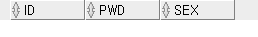

#### 200514


# DATA TYPE의 종류


+ long : 2g

+ clob (Character Large Object) : 4G, 가변길이

+ BINARY : 영상같은 데이터
  + BLOB (Binary Large Object)
    + BLOB같은 큰 사이즈의 영상(?) 데이터를 DB에 넣을 일이 있을까?
    + 예전에는 개인을 인증하는게 아이디, 비밀번호였으나 세월이 지나며 홍채, 지문 등이었다. 후에는 사진 찍어서 본인 인증할수도 있을것이다. 그런것을 같이 집어넣을수있는것이 BINARY 타입이다. 
    + 하지만 이런 큰 바이너리파일을 비용이 비싼 DBMS에서 관리하진 않는다. 우리가 영화를 그냥 하드디스크에 저장하고 관리하는것처럼. 

+ ROWID : 

  + >**ROWID** is a pseudocolumn that uniquely defines a single row in a database table. The term pseudocolumn is used because you can refer to **ROWID** in the WHERE clauses of a query as you would refer to a column stored in your database; the difference is you cannot insert, update, or delete **ROWID** values.

  + INDEX (색인) : QUICK SEARCH를 위해 존재한다. 

    + EX) 이것이 자바다 책에서 TRY CATCH 구문을 찾고자할떄, 뒤에 색인을 찾아본다.
      + 색인은 정렬되어있다.
      + 페이지 번호가 있다.
      + 페이지 번호를 찾아 그 페이지로 직접 가서 실제 글을 본다.
    + 탐색을 쉽게 해주기때문에 대량의 데이터를 다룰땐 인덱스를 꼭 알아야한다.
    + 네이버 아이디와 패스워드로 로그인할때도 마찬가지. 몇천만건의 로그인 데이터중에 나의 아이디와 패스워드의 정보를 인덱스로 찾는다.


# CHAR


+ 메모리에 올라올떄도 해당 공간만큼 올라온다. 
+ SMITH가 입력된경우 20BYTE중 5바이트가 SMITH로 저장되고 나머지가 공백문자로 채워진다. 


# VARCHAR2


+ SEX		        CHAR(1)

+ SEX                VARCHAR2(1)

+ ADDRESS      CHAR(100) => *CHAR에서의 100은 할당의 의미*

+ ADDRESS      VARCHAR2(100) => *VARCHAR2에서의 100은 최대의 의미*

  + VARCHAR2의 첫번째 공간에는 LENGTH BYTE라고 하는 숨은 공간이 있는데, 그곳에 들어온 문자의 길이가 저장되어 가변길이를 만들어준다.
  + EX) ADDRESS에 SEOUL이 들어갔을떄 CHAR엔 SEOUL의 5BYTE + 공백문자 95BYTE, VARCHAR2엔 5가 저장됨. LENGTH BYTE는 DBMS가 생성해서 문자 길이를 저장하지만, 사람 눈엔 보이지 않고, LENGTH 함수를 써도 처리되지 않는다. 
  + SEX는 CHAR이 유리하고, ADDRESS는 VARCHAR2가 더 유리하다. SEX는 M과 F 둘 중 하나지만, ADDRESS는 주소의 길이가 달라질 수 있기 때문에. SEX를 VARCHAR2를 쓰면 앞에 LENGTH BYTE가 붙어 1바이트가 더 늘어나기때문에 덜 효율적이다. 
  + 블록을 많이 썼다는건 단순히 하드디스크만 많이 썼다는게 아니라, 메모리와 CPU 자원을 많이 썼다는 이야기이다. 
  + 요즘 대세가 VARCHAR2라고해서 모든 문자 칼럼을 VARCHAR2로 쓰곤 하는데, 사실 잘 아는 사람은 이렇게 CHAR과 VARCHAR2의 차이를 알고 다양하게 쓴다. 

  

# NUMBER

  


+ 소숫점자리를 표시 안하고 AGE NUMBER(3) 처럼 쓸 경우 : 실수와 정수가 모두 올 수 있다. 유연해보이지만, 좋은 방식이 아니다. 칼럼의 정확한 자리수와 형식을 지키는것이 데이터의 무결성 제약사항을 지키는데 도움이 된다. 자유도를 더 주기보다는 쓰레기 데이터를 버리고 유효한 데이터만 들어올 수 있도록 하기위해. 
  + INTEGRITY CONSTRAINTS : 무결성 제약사항


# 테이블 생성

```sql
DROP TABLE CUSTOMER;
CREATE TABLE CUSTOMER(
    ID      VARCHAR2(8),
    PWD     CHAR(8),
    SEX     CHAR(1)
};

SELECT * FROM TAB;
DESC CUSTOMER

INSERT INTO CUSTOMER VALUES('XMAN', 'XMAN', 'M');
INSERT INTO CUSTOMER(ID, PWD, SEX) VALUES('ORACLE', 'OCM', 'F');
COMMIT;

INSERT INTO CUSTOMER(ID, PWD, SEX) VALUES('NULL1', 'ZMAN', NULL);
INSERT INTO CUSTOMER(ID, PWD, SEX) VALUES('NULL2', 'YMAN', '');
INSERT INTO CUSTOMER(ID, PWD) VALUES('NULL3', 'LMAN');
```


  


## 고정길이 가변길이 비교


+ 13번 : 사용자가 만약 아이디에 모르고 공백을 추가한다면?
+ 14번 : 가변길이 = 고정길이 사이에 = 연산자로 비교할 수 있을까?


```SQL
SELECT ID, LENGTH(ID), VSIZE(ID), PWD, LENGTH(PWD), VSIZE(PWD) FROM CUSTOMER;
```


=> PWD는 CHAR(8) 타입이라 나머지가 공백문자로 채워져 할당받은 8바이트가 모두 길이로 출력된다.


```SQL
SELECT ID, REPLACE(ID, ' ', '?'), PWD, REPLACE(PWD, ' ', '?') FROM CUSTOMER;
```


=> ID는 VARCHAR2라 공백문자가 없기때문에 REPLACE되지 않고, CHAR인 PWD는 REPLACE된다.


### VARCHAR


```SQL
SELECT * FROM CUSTOMER WHERE ID = 'XMAN ';
```


=> ID가 VARCHAR 타입이라서 공백을 포함해서 검색하면 나오지 않음.

=> 공백문자도 엄연히 ASCII 코드값을 갖고있는 데이터다. ID와 'XMAN '은 엄연히 다른 문자다. 


```SQL
SELECT * FROM CUSTOMER WHERE ID = PWD;
```


=> VARCHAR인 ID, CHAR인 PWD를 이콜 연산자로 비교검색할 수 없다. 

=> 가변길이 = 고정길이 연산이 일어날때 가변길이가 고정길이보다 우선순위가 있다. 만약 고정길이가 우선이라면 가변길이가 고정길이로 바껴서 데이터가 튀어나왔어야하는데, 데이터가 나오지 않았다. 근데 가변길이가 우선이라 고정길이를 가변길이로 바꼈고, 있는 그대로 비교했을때 데이터가 달랐기때문에 데이터가 검색되지 않았다.

=> PWD가 VARCHAR로 바뀌면서 PWD 뒤에 포함되었던 공백까지 VARCHAR로 변환됨. 즉, 'XMAN    '이 그대로 VARCHAR이 되어 ID인 'XMAN' != 'XMAN     ' 이기때문에 검색이 안된다. 


```SQL
SELECT * FROM CUSTOMER WHERE ID = SUBSTR('XMAN', 1, 2) || SUBSTR('XMAN', 3, 2);
```


### CHAR


```SQL
SELECT * FROM CUSTOMER WHERE PWD = 'XMAN ';
```


=> CHAR타입은 공백이 들어가있기때문에 검색이 가능함. 

=> PWD를 비교할떈 우항에 나오는 문자의 공백을 얼만큼 주던 4개로 맞춘후 검색한다.

=> 이때 늘리는 패딩을 BLANK PADDING이라 한다.

IF) 'XMAN ㅁ ㅁ ㅁ ㅁ ' = 'XMAN ㅁ ㅁ'

​	일경우, 우항에 두개의 BLANK PADDING을 늘려 형을 맞춰준후 비교한다.

​	'XMAN ㅁ ㅁ ㅁ ㅁ ' = 'XMAN ㅁ ㅁ ㅁ ㅁ ㅁ ㅁ ㅁ '

​	일경우, 좌항에 세개의 BLANK PADDING을 늘려 형을 맞춰준후 비교한다.

​	이는 LVALUE, RVALUE와 비슷한 맥락이다. LVALUE는 웬만하면 변경하지 않는게 좋지만, 두번째의 경우 부득이하게 바꾸게 된다.

​	CHAR(8)로 애초에 선언했는데 어떻게 늘어날 수 있을까? 비교연산을 할때 컴퓨터는 DISK의 변수를 메모리로 끌고와 CPU에서 연산을 한다. 


```SQL
SELECT * FROM CUSTOMER WHERE PWD = SUBSTR('XMAN', 1, 2) || SUBSTR('XMAN', 3, 2);
```



=> SUBSTRING은 VARCHAR 타입을 반환하는데 PWD는 고정길이의 CHAR이라서 고정길이가 가변길이로 형변환이 일어나 검색결과가 나오지 않는다. 


```SQL
SELECT * FROM CUSTOMER WHERE PWD LIKE SUBSTR('XMAN', 1, 2) || SUBSTR('XMAN', 3, 2) || '%';
```


=> 하지만 LIKE의 경우 %를 붙였기 때문에 'XMAN'으로 시작하는 모든 문자를 검색한다. 


## 숫자 DATA TYPE


+ 6번 : 첫번째 123.5 가능. 두번째 123.5 불가능 (실수자리수를 초과함), 세번째 123.5 가능
+ 7번 : AGE에 123,123살 입력하려함. 정수 세자리까지이기때문에 불가능.
+ 8번 : 정수자리수를 초과함.
+ 9번 : 소숫점 이하 자리수를 초과함. (정수자리수를 초과할때랑 DBMS의 반응이 다름.)
+ 10번 : 숫자 변수에 문자를 입력시 어떤 일이 벌어질까?
+ 11번 : 입력값에 나이가 빠졌는데 입력시 특정 칼럼을 생략할땐 암시적으로 NULL을 삽입하지만, 해당 변수에 DEFAULT값이 있다면 NULL 대신에 DEFAULT 값을 물고 들어간다. 


```SQL
-- 테이블 생성
DROP   TABLE  TST_NUMBER;
CREATE TABLE  TST_NUMBER(
    NUM     NUMBER,
    AGE     NUMBER(3)  DEFAULT 18,
    TAX     NUMBER(7,2)
);
```


```SQL
INSERT INTO TST_NUMBER  VALUES(123.5,123.5,123.5);
```

1 행 이(가) 삽입되었습니다.

```SQL
INSERT INTO TST_NUMBER  VALUES(123,  123,123);
```

1 행 이(가) 삽입되었습니다.

```SQL
INSERT INTO TST_NUMBER  VALUES(123,  12345,123);
```

명령의 46 행에서 시작하는 중 오류 발생 -
INSERT INTO TST_NUMBER  VALUES(123,  12345,123)
오류 보고 -
ORA-01438: 이 열에 대해 지정된 전체 자릿수보다 큰 값이 허용됩니다.

```SQL
INSERT INTO TST_NUMBER  VALUES(123,  123,123.56789);
```

1 행 이(가) 삽입되었습니다.

```SQL
INSERT INTO TST_NUMBER  VALUES(123,  '123',123.56789);
```

1 행 이(가) 삽입되었습니다.

```SQL
INSERT INTO TST_NUMBER(NUM, TAX)   VALUES(456,456);
```

1 행 이(가) 삽입되었습니다. => 디폴트값 삽입


```SQL
SELECT  * FROM TST_NUMBER;
```


## 날짜 DATE TYPE


+ LOG_DATE는 저렇게 DEFAULT로 많이 쓴다. 
+ 사람들은 날짜정보를 저장할때 무조건 DATE 타입이라고 생각한다. 하지만 위에선 VARCHAR2로 했다. 예를들어 '20140516' 이렇게 문자열로 저장해도 된다. 자기가 필요한 타입에 맞춰 저장하면 되는것.
  + 1. DATE
    2. 문자 : 저장공간을 DATE보다 많이 차지한다.


```sql
DROP   TABLE TST_DATE;
```


```sql
CREATE TABLE TST_DATE(
    CHAR_HIREDATE	VARCHAR2(8),
    DATE_HIREDATE	DATE,
    LOG_DATE		DATE 	DEFAULT  SYSDATE);
```

Table TST_DATE이(가) 생성되었습니다.

```sql
INSERT INTO TST_DATE(CHAR_HIREDATE,DATE_HIREDATE)  VALUES(TO_CHAR(SYSDATE,'YYYYMMDD'),SYSDATE);
```

1 행 이(가) 삽입되었습니다.

```sql
INSERT INTO TST_DATE(CHAR_HIREDATE,DATE_HIREDATE)  VALUES('19990921',TO_DATE('990921','YYMMDD'));
```

1 행 이(가) 삽입되었습니다.

```sql
SELECT * FROM TST_DATE;
```


## ALTER


```SQL
ALTER TABLE TST_DATE ADD(
    NAME    VARCHAR2(20),
    AGE     NUMBER(3)
);
```

Table TST_DATE이(가) 변경되었습니다.

```SQL
DESC TST_DATE
```


```SQL
ALTER TABLE TST_DATE DROP COLUMN AGE;
DESC TST_DATE
```


## DROP


+ 주의 : DROP은 ROLLBACK이 안된다.


```SQL
SELECT * FROM TAB;
```


```SQL
DROP TABLE TST_DATE;
```

Table TST_DATE이(가) 삭제되었습니다.


```SQL
DESC TST_DATE
```

ORA-04043: TST_DATE 객체가 존재하지 않습니다.


## SUBQUERY에 의한 table 생성


+ 7번 : 기존 테이블을 이용해서 새로운 테이블 만들기

```SQL
CREATE TABLE EMP_CTAS AS SELECT * FROM EMP;
```


```SQL
DESC EMP_CTAS
```


```SQL
DROP TABLE EMP_CTAS_J;

CREATE TABLE EMP_CTAS_J
AS SELECT EMPNO, ENAME, DEPT.DNAME, SAL * 12 AS ANNUAL_SAL
FROM EMP, DEPT
WHERE EMP.DEPTNO = DEPT.DEPTNO AND EMP.DEPTNO IN (10, 20);
```

Table EMP_CTAS_J이(가) 생성되었습니다.

```SQL
DESC EMP_CTAS_J
```


```SQL
SELECT * FROM EMP_CTAS_J;
```


