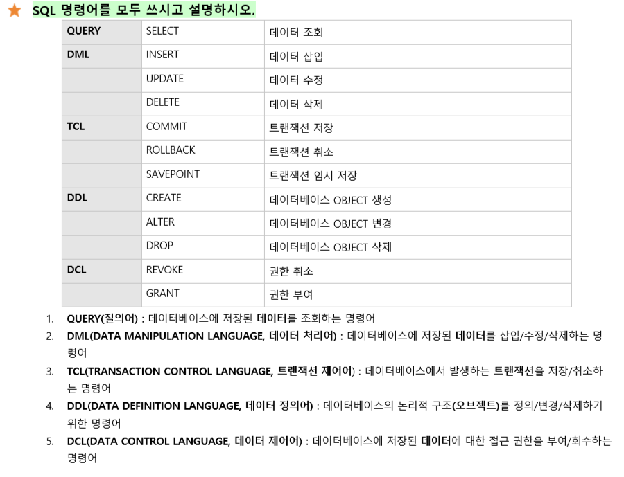
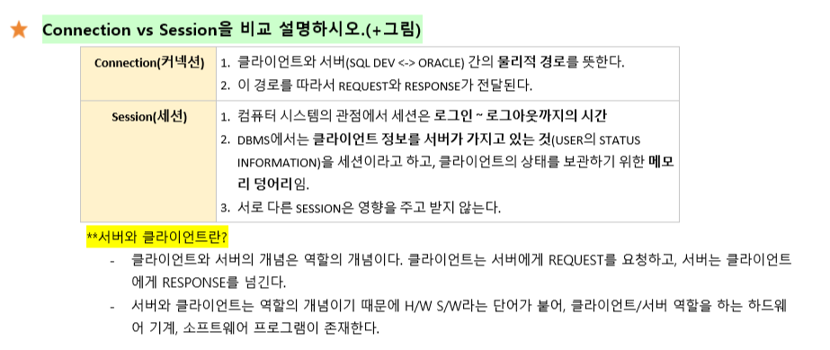
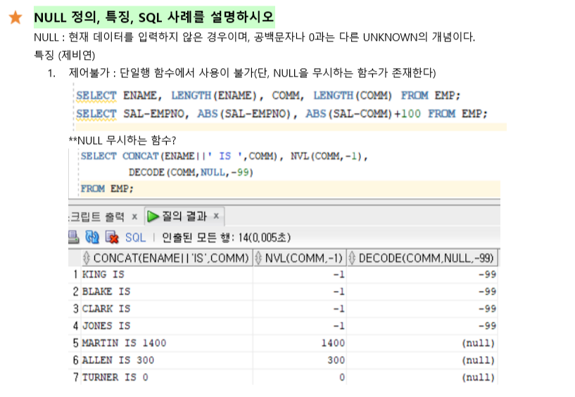
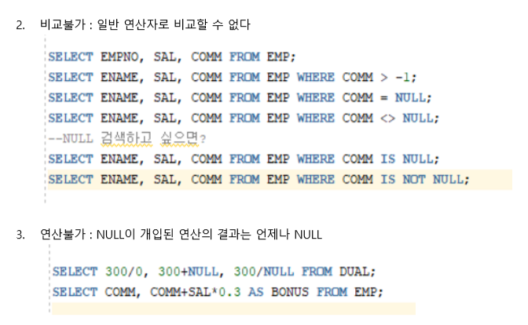
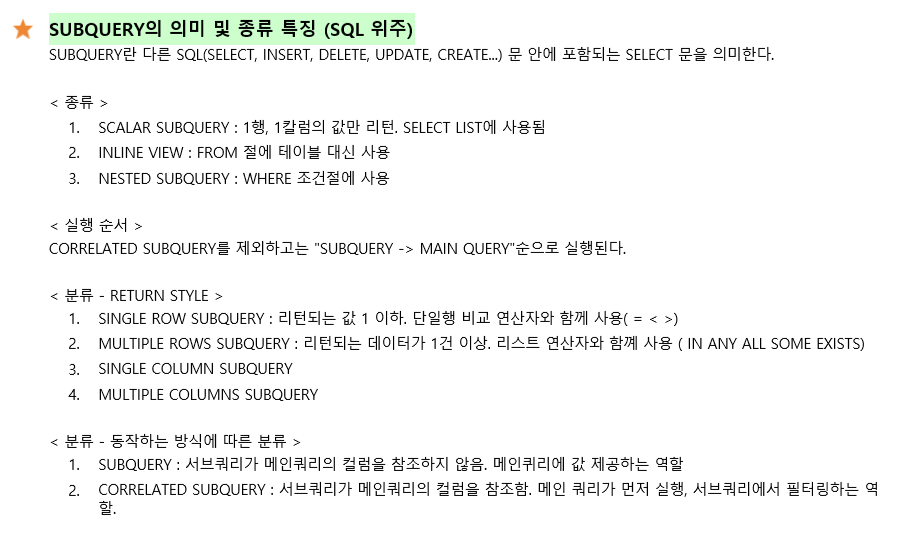
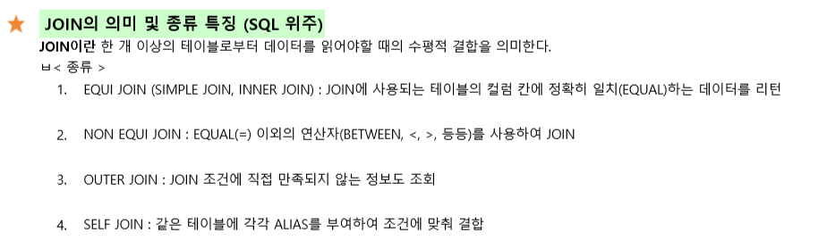

[TOC]

# 시험문제

## SQL의 주요 특징 4가지를 쓰고 자세히 설명하시오. 

1. 관계형 DBMS에 접근하는 유일한 언어

   > 관계형 DBMS에 접근하는 유일한 언어가 SQL이기때문에 DBMS 관련 업무를 수행하는 모든 사람들은 SQL을 통해서만 업무를 수행할 수 있다.
   >
   > - 개발자는 SQL을 사용하여 개발
   > - DBA는 SQL을 사용하여 DBMS를 관리
   > - 모델러는 SQL을 사용하여 물리적 모델을  DBMS 내에 생성
   > - 튜너는 SQL을 사용하여 튜닝 업무를 수행
   > - SQL은 DBMS 관련 모든 분야에서 사용

   

2. ANSI-SQL

   > ANSI(American National Standars Institute)는 미국 산업 표준화 기구이다. rdbms 관련 연구소/기업들이 SQL을 채택하고, 각기 자신만의 고유한 SQL 기능을 추가하여 다양화되자 표준 SQL 제정의 필요에 따라 1986년에 ANSI-SQL을 최초로 제정했다. 
   >
   > + ANSI-SQL의 장점
   >   + SQL을 한번만 배우면 모든 RDBMS에서 사용할 수 있다.
   >   + ORACLE RDBMS에서 개발된 솔루션(프로그램)을 IBM RDBMS로 쉽게 옮길 수 있다.

   

3. ENGLISH-LIKE

   > + ENGLISH-LIKE의 2가지 특징
   >   + SQL 명령어의 문법적인 구조나 의미가 영어 문맥과 유사하다.
   >   + SQL 명령어는 대문자와 소문자를 구분하지 않지만, 데이터는 대소문자를 구분한다.

   

4. 비절차적 언어

   > 절차적 언어에서 개발자가 HOW를 정의한다면, 비절차적 언어는 WHAT을 말한다. 

## SQL 명령어를 모두 쓰시고 설명하시오. (다섯가지 분류표)

## DBMS관점에서 CONNECTION과 SESSION을 그리고 비교 설명하시오(그림)

## 절차적, 비절차적 언어의 특징 및 대표적인 언어를 예를들어 설명하시오.

1. 절차적 : JAVA

   > 개발자(사용자)가 처리 절차(처리 순서/방법)을 처음부터 끝까지 정해주어야 하는 언어로, COBOL, C, JAVA가 대표적 언어이다. (HOW)

2. 비절차적 : SQL

   > 개발자(사용자)가 처리 절차(처리 순서/방법)을 지정하지 않고, 원하는 결과(WHAT)을 정의하여 요청하는 언어로 SQL이 대표적인 언어이다. 
   >
   > SQL 이전의 계층형, 망형 데이터베이스는 절차적인 어플리케이션 프로그래밍을 통해서 데이터 조회 및 처리를 수행해야했다. 이로 인해 기업 내의 다양한 데이터 사용자는 IT 조직의 지원을 받아서 개발해야 데이터를 활용할 수 있었다. 
   >
   > 관계형 데이터베이스는 업무 담당자, 비즈니즈 담당자 등 비 IT 조직의 구성원들도 쉽게 데이터를 활용할 수 있도록 비절차적인 SQL을 제공하여 누구나 쉽게 데이터를 활용할 수 있도록 되었다. 

   

## 트랜잭션의 정의, 시작과 종료 시점, 특징(일원고지중 원자성과 고립성을 설명)

트랜잭션의 정의 : A Logical unit of work => 논리적인 일의 단위

`계좌이체` 라는 트랜잭션, 하나의 논리적인 일의 단위

A -> B 한테 500만원을 `계좌이체`한다고 했을때

1. A의 계좌에서 500만원 인출         `UPDATE`
2. B의 계좌에 500만원 입금                `UPDATE`
3. A가 B한테 송금한 사실을 기록        `INSERT`

언제 시작?

트랜잭션은 **첫번째 실행(변경) 가능한(Executable) SQL 실행 시 시작**

언제 종료?

트랜잭션 종료는 명시적 종료와 암시적 종료가 있음

명시적 종료 **(1) Commit (2) Rollback**

암시적 종료 **(1) DDL, DCL 종료 시 (2) 비정상 종료 시**

비정상 종료의 3가지?

(1) CLIENT 프로그램의 비정상 종료

(2) 네트워크 단절로 인한 비정상 종료

(3) DBMS 비정상 종료

특징 네가지 : **일원고지**

일관성    : 트랜잭션이 실행을 성공적으로 완료하면 언제나 일관성 있는 데이터베이스 상태로 유지하는 것

​	내가 500만원을 입금했는데 상대한테 500만원이 안가면 데이터가 일관적이지 않게된다. 

**원자성**    :  

`ALL OR NOTHING`,

트랜잭션과 관련된 작업들이 부분적으로 실행되다가 중단되지 않는 것을 보장

pl/sql

**고립성**    : 

트랜잭션 진행 중에 변경된 데이터는 취소(ROLLBACK)나 저장(COMMIT) 될 수 있는 데이터이기 때문에 트랜잭션을 수행중인 현재 세션에서는 조회가 가능하고, 다른 세션에서는 변경이 진행중인 데이터를 조회할 수 없고, 변경 이전의 상태 데이터 조회가 가능하다. 

**지속성**    : 

`commit과 rollback`,  성공적으로 수행된 트랜잭션에서 변경한 데이터가 영구히 저장되는 것 

​		CF) STATEMENT LEVEL LOCK, 예외처리, 트랜잭션과 읽기 일관성(READ CONSISTENCY), ROW LEVEL LOCK, TABLE LEVEL LOCK, 배타적 LOCK, 공유 LOCK

## 쿼리작성 4문제 (조인, 서브쿼리, 기본적인 함수)

1. 실습과 과제 제대로 이해하면 다 쓸수있다. 꼬아서 낸것 없다. 손코딩 할줄알아야한다.

   + 문자함수
   + 숫자함수
   + 날짜함수
   + :star:형변환함수
   + 그룹행함수
   + groupby
   + having

   

## NULL의 정의, NULL이 안되는 세 가지 (제비연)이 무엇인지 설명하고 사례를 SQL로 보여라. 

## 테이블을 설명하시오.

+ 테이블은 2차원의 데이터 구조로, ROW와 COLUMN으로 이루어져있다. 
+ ROW는 테이블에서 가로행을 의미하고 RECORD, TUPLE이라고도 부른다. COLUMN은 테이블의 세로행을 의미하고, ATTRIBUTE, 변수, FEATURE라고도 부른다.

## SUBQUERY

## JOIN

-----------------------------------------------------------------------------------------

2. 클라이언트와 서버를 그리고 개념과 차이를 서술하시오
3. 테이블을 설명하시오
4. 트랜잭션의 정의와 특징을 설명하시오
+ 조인
+ SQL DDL, DML, DCL...
+ CONNECT와 SESSION을 그리고 설명하시오.
+ TRANSACTION의 특징과 일원고지
+ DB VS DBMS의 차이

+ 10문제중 5문제는 설명하시오
+ 나머지는 SQL 작성

---

< 손코딩 >

[ SUBQUERY ]

+ EMP 테이블의 DEPTNO, ENAME, JOB, SAL, 직업별 평균 급여를 구하시오.
+ 가장 급여가 높은 다섯명의 EMPNO, ENAME, SAL을 구하시오.
+ 직업별 급여의 평균보다 높은 급여를 받는 사원의 DEPTNO, ENAME, JOB, SAL, AVG_SAL을 구하시오.
+ 전체 사원의 평균 급여보다 덜받는 사원의 ENAME과 SAL을 구하시오. 
+ SMITH 사원과 부서번호가 같은 사원들의 ENAME과 JOB을 구하고, 이것이 어떤 쿼리인지 말하시오.
+ 직원들의 평균 급여보다 적은 급여를 받는 사원의 ENAME과 SAL을 구하고 이것이 어떤 서브쿼리인지 말하시오.
+ 평균 급여가 2000보다 많은 부서 번호와 직업을 가진 사원의 DEPTNO, JOB, ENAME, SAL을 구하시오. 

[ JOIN ]

( EQUI-JOIN )

+ DNAME, ENAME, JOB, SAL을 EQUI-JOIN을 통해 구하시오.
+ 직업이 MANAGER이거나 CLERK인 사람들의 DNAME, ENAME, JOB, SAL을 EQUI-JOIN을 통해 구하고 DNAME으로 정렬하시오.

( NON-EQUI-JOIN )

+ 부서 급여 등급(SALGRADE)의 최저값과 최대값 사이에 있는 사원들의 DNAME, ENAME, JOB, SAL, GRADE를 구하시오. 
+ 부서 번호가 10이거나 30이면서 급여 등급의 최저값과 최고값 사이의 급여를 받는 사원의 ENAME, JOB, SAL, GRADE를 구하고 ENAME으로 정렬하시오.
+ 부서 번호가 10이거나 30이면서 급여가 급여등급의 최저값보다 작은 사원의 ENAME, JOB, SAL, GRADE를 구하고 ENAME으로 정렬하시오. 

( OUTER-JOIN )

+ DNAME, ENAME, JOB, SAL을 구하되, EMP 테이블의 DEPTNO를 모두 포함시키고 DNAME으로 정렬시키시오.
+ 급여가 2000이 넘는 사원의 ENAME, JOB, SAL과, DEPT 테이블에서 DNAME을 구하고 DNAME으로 정렬하시오.
+ DNAME, ENAME, JOB, SAL을 출력하되 ENAME값에 NULL이 있을경우 '비상근 부서'로 바꾸고, EMP테이블의 DEPTNO를 공통되지 않아도 모두 출력하고 DNAME으로 정렬하시오.

( SELF-JOIN )

+ 사원의 이름과 해당 사원을 관리하는 매니저의 이름을 구하고 매니저의 이름으로 정렬하시오.
+ 사원의 이름과 해당 사원을 관리하는 매니저의 이름을 구하되, 매니저가 없는 사원의 경우 'NOBODY'를 할당해 구하고 ENAME으로 정렬하시오.

( ANSI-JOIN )

+ DNAME, ENAME, JOB, SAL을 INNER JOIN 하시오.
+ 10번이나 20번 부서에 있으면서 부서 이름이 'RESEARCH'인 사원의 DNAME, ENAME, JOB, SAL을 구하시오.
+ EMP 테이블을 기준으로 DEPT 테이블과 OUTER JOIN하여 DEPTNO, DNAME, ENAME을 구하고 DEPTNO로 정렬하시오.
+ EMP와 DEPT 테이블을 FULL OUTER JOIN을 하고 DEPTNO, DNAME, ENAME을 출력하되 DEPTNO로 정렬하시오. 