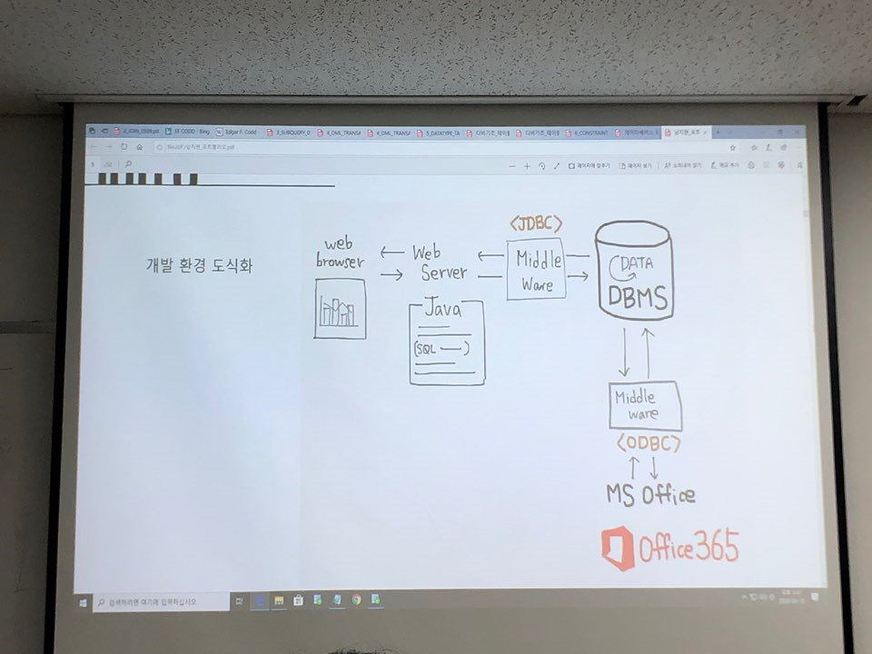

# 주말과제

+ 일요일 12시 전까지 이메일로 제출
+ 가상데이터의 customer 데이터 활용 (540만건)
+ 고객 데이터 내에서 분석 주제를 자유롭게 정하라. 
+ excel과 오라클 dbms는 연동이 된다. (ODBC 방식) 연동시켜서 EXCEL에서 차트그리기. EXCEL에서 쿼리를 날려서 DBMS에서 데이터를 받아 EXCEL 차트를 이용해 시각화를 해라. 
+ R과 DBMS도 연결이 된다. (JDBC 방식) DBMS에서 데이터를 가져다가...
+ R로 DBMS랑 CONNECTION을 맺고, R에서도 SQL 쿼리를 날릴수있다. 실제 기업에서는 R을 DBMS와 붙여서 많이들 한다. 하둡을 붙이기도 한다. 각자의 분석 주제로 R에서 분석과 시각화해라. 동료들이 R 시각화 템플릿을 제공해줄거니 거기에 쿼리만 넣어라. 
+ 지금 중요한건 어떤 주제로 데이터분석을 할것인지, 분석 주제를 쿼리로 어떻게 뽑아올것인지 배우는게 중요하다.
+ JAVA에서도 DB CONNECTION을 맺고 JAVASCRIPT나 JAVA LIBRARY를 써서 차트를 그려라. 

=> 앞으로의 프로젝트에 이러한 과정을 설명하면 좋다.

+ ODBC, JDBC의 공통점 : DBC(DATABASE CONNECTIVITY). 
  + ODBC : OPEN DATABASE CONNECTIVITY (MS)
    + 주로 MS 툴을 DB와 연결할때
  + JDBC : JAVA DATABASE CONNECTIVITY
    + 자바와 DB를 연결할때 
+ 주의 : 하나의 주제를 가지고 자바, R, 엑셀에서 시각화할것. 
+ GOOGLE CHART, JSON...
+ 데이터는 여러번의 마스킹을 거쳤기때문에 데이터간 차이가 별로 안난다. 이를 극복해보기위해 다양한 시도를 했으면 좋겠다. 